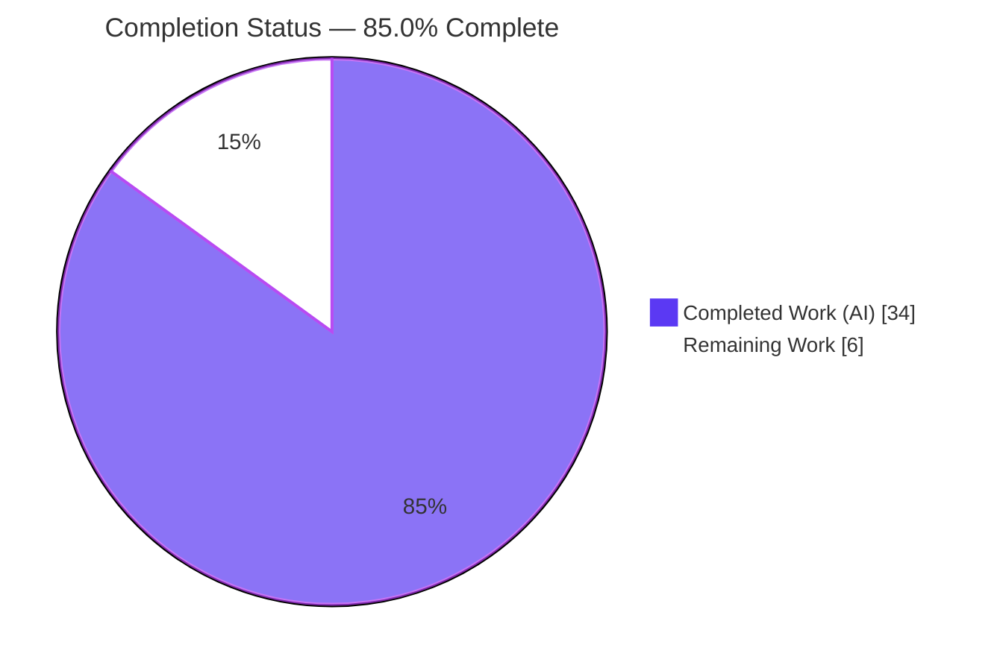
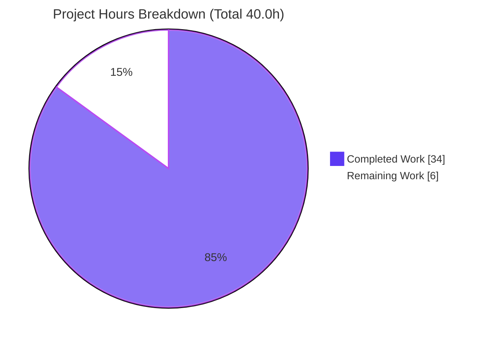
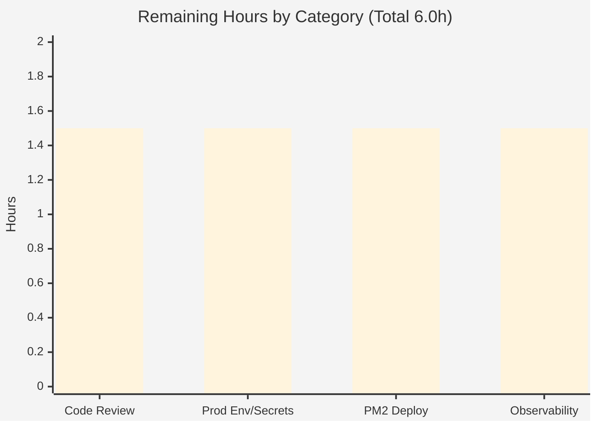

# Blitzy Project Guide

> **Project:** Enhancement of a minimal Node.js HTTP server into a production-ready Express.js application
> **Branch:** `blitzy-3e49607a-09cc-4ae9-9313-f5422c07ae8e` · **HEAD:** `0b6b731` · **Runtime:** Node.js v22.23.1 / npm 11.1.0
> **Overall Completion:** **85.0%** (34.0h completed / 40.0h total · 6.0h remaining)

---

## 1. Executive Summary

### 1.1 Project Overview

This project transforms a single 14-line raw Node.js `http` server into a structured, production-ready **Express.js 5** application. It introduces a routing layer (`GET /`, `GET /health`), an ordered middleware pipeline (security headers, compression, body parsers, HTTP logging, 404 and centralized error handling), externalized environment configuration via `dotenv`, structured Winston logging, and PM2 cluster-mode process management with graceful shutdown. The target users are the operators and developers who run and deploy this backend HTTP service. The defining constraint — preserving the original `Hello, World!\n` root response byte-for-byte — is met exactly. The technical scope is contained to the Node.js/Express portion of the repository; unrelated fixtures are left untouched per the minimal-changes rule.

### 1.2 Completion Status



| Metric | Hours |
| --- | --- |
| **Total Hours** | **40.0** |
| Completed Hours (AI) | 34.0 |
| Completed Hours (Manual) | 0.0 |
| **Completed Hours (AI + Manual)** | **34.0** |
| **Remaining Hours** | **6.0** |
| **Percent Complete** | **85.0%** |

> Completion is computed on AAP-scoped hours only (PA1): `34.0 / (34.0 + 6.0) = 85.0%`. All 34.0 completed hours were delivered autonomously by Blitzy agents; the 6.0 remaining hours are human-gated path-to-production work.

### 1.3 Key Accomplishments

- ✅ **Framework migration complete** — `src/app.js` instantiates `express()` and is hosted by `http.createServer(app)` in a thin `server.js` bootstrap.
- ✅ **Routing** — `GET /` preserves `Hello, World!\n` (text/plain, byte-exact 14 bytes) and `GET /health` returns a JSON liveness payload.
- ✅ **Ordered middleware pipeline** — helmet → compression → `express.json` → `express.urlencoded` → morgan→winston → router → 404 → centralized error handler.
- ✅ **Environment configuration** — `src/config/index.js` loads `dotenv` and exposes typed `PORT`/`HOST`/`NODE_ENV`/`LOG_LEVEL` with safe defaults; committed `.env.example` template.
- ✅ **Structured logging** — Winston JSON logger with a morgan write-stream so HTTP access logs share the structured sink.
- ✅ **PM2 production prep** — `ecosystem.config.js` (cluster mode, per-env blocks, log routing, graceful timing), 4 npm lifecycle scripts, and SIGTERM/SIGINT graceful shutdown.
- ✅ **Security hardening** — a MAJOR CWE-532 sensitive-data-in-logs defect was resolved autonomously (D14/D15/D17): query strings and body snippets are redacted from both responses and logs.
- ✅ **Explainability deliverable** — `docs/decision-log.md` with 17 decisions (D1–D17) and a 100%-coverage bidirectional `http`→Express traceability matrix.
- ✅ **Clean dependency graph** — `npm ci` reproduces the lockfile; `npm audit` reports 0 vulnerabilities; all 7 packages pinned to exact AAP versions.

### 1.4 Critical Unresolved Issues

| Issue | Impact | Owner | ETA |
| --- | --- | --- | --- |
| _None — no blocking issues identified_ | The application compiles, installs cleanly, runs correctly, and all AAP-scoped deliverables are committed and validated. | — | — |

> The single MAJOR issue found during autonomous review (CWE-532 sensitive-data-in-logs) was **already resolved** in-branch (commits `88975f2`, `0b6b731`; decisions D14/D15/D17) and re-verified live.

### 1.5 Access Issues

| System / Resource | Type of Access | Issue Description | Resolution Status | Owner |
| --- | --- | --- | --- | --- |
| _None_ | — | No access issues identified. The repository, Node.js/npm toolchain, and PM2 were all fully accessible during autonomous implementation and validation. | N/A | — |

**No access issues identified.** Note that the deliverable "prepares for" production deployment; no external production host, registry, or secret store is required to complete the AAP-scoped work.

### 1.6 Recommended Next Steps

1. **[High]** Conduct human code review and sign-off of the Express migration (8 JS files / 324 hand-written LOC + config + decision log).
2. **[High]** Provision the production environment and inject real configuration/secrets on the target host (`NODE_ENV=production`, real `HOST`/`PORT`/`LOG_LEVEL`; never commit `.env`).
3. **[Medium]** Execute the PM2 production deployment and run a cluster smoke test; enable boot persistence with `pm2 save` + `pm2 startup`; pin `instances` to the container CPU quota.
4. **[Medium]** Wire production observability and log rotation (pm2-logrotate or external rotation; forward Winston JSON to an aggregator; alert on restarts/health).

---

## 2. Project Hours Breakdown

### 2.1 Completed Work Detail

| Component | Hours | Description |
| --- | --- | --- |
| Express framework migration | 5.0 | `src/app.js` Express factory + `server.js` refactored into a thin bootstrap hosting the app via `http.createServer(app)` (AAP R1). |
| Routing layer | 1.5 | `src/routes/index.js` `express.Router` — `GET /` (Hello World preserved) + `GET /health` (AAP R2). |
| Middleware pipeline + 404 + error handler | 3.5 | Ordered helmet/compression/body-parsers/morgan pipeline in `app.js`; `notFound.js` (arity 3) + centralized `errorHandler.js` (arity 4) (AAP R3). |
| Security hardening (D14/D15/D16/D17) | 4.0 | Error/log sanitization, CWE-532 query & body-snippet redaction, dotenv quiet banner — code-review + acceptance-driven fixes. |
| Environment configuration | 2.5 | `src/config/index.js` (dotenv + typed settings) + `.env` + committed `.env.example` (AAP R4). |
| Structured logging | 3.0 | `src/config/logger.js` Winston JSON logger + morgan `.stream.write` adapter (AAP R5). |
| PM2 production tooling | 3.5 | `ecosystem.config.js` (cluster, env/env_production, log routing, kill_timeout) + npm scripts + graceful shutdown (AAP R6). |
| Dependency management | 2.0 | `package.json` dependencies/scripts/`main` reconciliation + `package-lock.json` regeneration. |
| VCS hygiene | 0.5 | `.gitignore` (node_modules, `.env`, logs). |
| README documentation | 2.0 | Install / run / environment / PM2 deployment instructions. |
| Decision log + traceability matrix | 2.5 | `docs/decision-log.md` — 17 decisions (D1–D17) + 100%-coverage bidirectional matrix (Explainability rule). |
| Autonomous validation & QA | 4.0 | Five production-readiness gates, runtime end-to-end checks, security probes, evidence capture. |
| **Total Completed** | **34.0** | Matches Completed Hours in Section 1.2. |

### 2.2 Remaining Work Detail

| Category | Hours | Priority |
| --- | --- | --- |
| Human code review & sign-off of the Express migration | 1.5 | High |
| Production environment provisioning + real secrets/config on target host | 1.5 | High |
| Execute PM2 production deployment + cluster smoke test + boot persistence | 1.5 | Medium |
| Production monitoring/observability & log rotation wiring | 1.5 | Medium |
| **Total Remaining** | **6.0** | Matches Remaining Hours in Section 1.2 and Section 7 pie chart. |

> **Out-of-AAP-scope future enhancements (NOT counted in the 40.0h total):** automated test suite (T1), TLS/HTTPS termination (S2), CORS/rate-limiting (S4), CI/CD pipeline & Dockerfile (I2), deeper `/health` readiness checks (O3). These are explicitly excluded by AAP §0.5.2 and listed for backlog awareness only.

### 2.3 Basis of Estimate

Estimates use the PA2 framework against a **small** codebase (324 hand-written LOC across 13 files; `package-lock.json` +2512 lines is auto-generated). Completed hours reflect the actual implementation, four rounds of security hardening, and comprehensive autonomous validation evidenced across 12 agent commits. Remaining hours reflect **only** the standard path-to-production activities a human must perform, since the AAP explicitly "prepares for" deployment (§0.7.2) rather than deploying. Confidence: **High** for completed work (verified live) and **High** for remaining work (well-defined, bounded human tasks).

---

## 3. Test Results

> **Integrity note:** This project has **no automated unit-test suite** — the `test` script is an intentional placeholder (`echo "Error: no test specified" && exit 1`) that the AAP explicitly **retains unchanged** (§0.7.1 minimal-changes) and lists a test framework as **out of scope** (§0.5.2). Adding tests would violate the minimal-changes rule. Consequently, the rows below aggregate the **Blitzy autonomous validation checks** actually executed (Final Validator Gate 1–5 + independent Phase 5 re-verification) — every entry originates from Blitzy's autonomous validation logs for this project. No unit-test coverage instrumentation exists, so code-coverage % is reported as N/A; functional coverage of endpoints/features is 100%.

| Test Category | Framework / Tool | Total Tests | Passed | Failed | Coverage % | Notes |
| --- | --- | --- | --- | --- | --- | --- |
| Static Compilation | `node --check` | 8 | 8 | 0 | N/A | All 8 in-scope JS files parse cleanly. |
| Dependency & Security Audit | `npm ci` / `npm ls` / `npm audit` | 3 | 3 | 0 | N/A | Reproducible install; clean tree; **0 vulnerabilities**; exact AAP versions. |
| Functional / API (Runtime) | curl + Node runtime | 5 | 5 | 0 | 100% endpoints | `GET /` (byte-exact 14-byte Hello World), `GET /health` (JSON), 404 JSON, malformed-JSON→sanitized 400, env overrides honored. |
| Security Hardening (Runtime) | curl + log inspection | 3 | 3 | 0 | N/A | helmet headers present; gzip compression engaged (5000B→41B); CWE-532 redaction (`?token=SECRET` stripped from logs). |
| Process Lifecycle (Runtime) | signals + PM2 | 3 | 3 | 0 | N/A | SIGTERM & SIGINT graceful shutdown (port freed); PM2 cluster online + HTTP served through cluster. |
| Unit / Integration Suite | _none (out of scope)_ | 0 | 0 | 0 | N/A | Intentional placeholder retained per AAP §0.5.2/§0.7.1; no test files/runner exist. |
| **Total** | — | **22** | **22** | **0** | — | 100% pass across all autonomous validation checks. |

---

## 4. Runtime Validation & UI Verification

**UI Verification:** Not applicable — the deliverable is a headless backend HTTP service with no graphical interface (AAP §0.3).

**Runtime health (re-verified live during this assessment):**

- ✅ **Server boot** — `node server.js` starts and emits structured Winston JSON (`{"level":"info","message":"Server running at http://127.0.0.1:3000/"}`); no dotenv banner (D16).
- ✅ **`GET /`** — HTTP 200, `Content-Type: text/plain`, body byte-exact `Hello, World!\n` (verified with `od -c`, `wc -c` = 14).
- ✅ **`GET /health`** — HTTP 200, JSON `{"status":"ok","uptime":<seconds>}`.
- ✅ **Unknown route** — HTTP 404, JSON `{"error":"Not Found"}` via `notFound` → `errorHandler`.
- ✅ **Malformed JSON POST** — HTTP 400, JSON `{"error":"Bad Request"}`; no secret/query leak in response or logs (only safe `type:"entity.parse.failed"` logged; `?token=SECRET` redacted to `url:"/"`).
- ✅ **Security headers (helmet)** — CSP, HSTS, X-Content-Type-Options, X-Frame-Options, Referrer-Policy, Cross-Origin-* all present.
- ✅ **Compression** — gzip engaged (`Vary: Accept-Encoding`); sub-threshold payloads correctly not compressed.
- ✅ **Environment overrides** — `PORT`, `HOST`, `LOG_LEVEL` all honored (`LOG_LEVEL=warn` suppresses info logs).
- ✅ **Graceful shutdown** — SIGTERM/SIGINT log "closing HTTP server" → "HTTP server closed", call `server.close()`, exit 0, free the port.
- ✅ **PM2 cluster** — `ecosystem.config.js` loads; cluster mode online; HTTP served through the cluster; logs routed to `logs/`; clean teardown.

**API integration:** No external service integrations exist in scope (no database, auth provider, or third-party API) — nothing to integrate or mock (AAP §0.5.2).

---

## 5. Compliance & Quality Review

| Benchmark / AAP Deliverable | Status | Progress | Notes |
| --- | --- | --- | --- |
| Express framework introduced (R1) | ✅ Pass | 100% | `express()` in `app.js`, hosted by `http.createServer(app)`. |
| Routing with Hello World preserved (R2) | ✅ Pass | 100% | `GET /` byte-exact; `GET /health` added. |
| Ordered middleware pipeline (R3) | ✅ Pass | 100% | helmet→compression→parsers→morgan→router→404→errorHandler. |
| Environment configuration (R4) | ✅ Pass | 100% | dotenv + typed config; `.env.example` committed. |
| Structured logging (R5) | ✅ Pass | 100% | Winston JSON + morgan stream; replaces `console.log`. |
| PM2 production prep (R6) | ✅ Pass | 100% | ecosystem cluster + scripts + graceful shutdown. |
| Exact dependency versions (§0.6.1) | ✅ Pass | 100% | 7 packages pinned; `npm ci` reproducible; 0 vulnerabilities. |
| Explainability rule | ✅ Pass | 100% | Decision log D1–D17 + 100%-coverage bidirectional matrix; no rationale in code comments. |
| Hello World rule | ✅ Pass | 100% | Byte-identical `Hello, World!\n` (14 bytes) preserved. |
| Minimal-changes rule | ✅ Pass | 100% | 14 in-scope files, 0 deletions; out-of-scope fixtures untouched; test placeholder retained. |
| Zero-placeholder policy | ✅ Pass | 100% | No TODO/FIXME/stub markers in any in-scope file. |
| Security — sensitive data in logs (CWE-532) | ✅ Pass (fixed) | 100% | Resolved via D14/D15/D17; verified no query/body/secret leak. |
| Automated test suite | ⚠ N/A (by scope) | — | Explicitly out of scope (§0.5.2); intentional failing placeholder retained. |

**Fixes applied during autonomous validation:** dependency version pinning (`86eb796`), centralized error-handler sanitization (`4cf2b6e`), query-string redaction in access logs + dotenv quiet (`88975f2`), and stopping raw body-parser message logging for 4xx (`0b6b731`).

**Minor cosmetic observation (non-blocking):** the `README.md` H1 heading reads `hao-backprop-test` while `package.json` `name` is `hello_world`; this is a title-string mismatch only, does not affect any AAP requirement or functionality, and can be aligned at the reviewer's discretion.

---

## 6. Risk Assessment

| Risk | Category | Severity | Probability | Mitigation | Status |
| --- | --- | --- | --- | --- | --- |
| No automated test suite; regressions could go undetected | Technical | Medium | Medium | AAP-excluded by design; comprehensive runtime validation performed; add tests post-review | Accepted (by scope) |
| Express 5.x major-version breaking changes vs 4.x | Technical | Low | Low | Validated end-to-end on a greenfield app | Mitigated |
| PM2 `instances:'max'` spawns one worker per host core (64) vs container quota (4) | Technical | Low | Medium | Set explicit `instances` to the container CPU quota in production | Open (tuning) |
| `.env` secrets must be injected securely on host (never committed) | Security | Medium | Low | `.gitignore` excludes `.env`; `.env.example` is the template; use a secrets manager | Mitigated (design) / Open (ops) |
| No HTTPS/TLS termination | Security | Medium | Medium | Intended to run behind a TLS-terminating reverse proxy/load balancer | Accepted (by scope) |
| Sensitive data in logs (CWE-532) | Security | Major | — | Query & body-snippet redaction (D14/D15/D17); verified no leak | **Resolved** |
| No explicit CORS policy / rate limiting beyond helmet defaults | Security | Low | Low | Add if the service is publicly exposed | Accepted (by scope) |
| Logs written to relative `./logs`; requires correct working directory | Operational | Low | Low | PM2 ecosystem sets relative paths; start PM2 from project root | Open (ops note) |
| No log rotation configured | Operational | Low | Medium | Add pm2-logrotate or external rotation | Open (remaining task) |
| `/health` is a shallow liveness probe (status + uptime only) | Operational | Low | Low | Sufficient for a domain-less service; extend if dependencies are added | Accepted |
| Actual production deployment not yet executed | Integration | Medium | Planned | Run `npm run pm2:start` on target + smoke test | Open (remaining task) |
| No CI/CD pipeline | Integration | Low | Low | Deploy manually or add a pipeline later | Accepted (by scope) |

---

## 7. Visual Project Status

**Project hours — completed vs remaining:**



**Remaining hours by category (Section 2.2):**



> **Color legend:** Completed = Dark Blue `#5B39F3` · Remaining = White `#FFFFFF` (outlined in Violet-Black `#B23AF2`). The pie chart "Remaining Work" value (6) equals the Section 1.2 Remaining Hours and the Section 2.2 Hours total.

---

## 8. Summary & Recommendations

The Express.js migration described in the AAP is **fully implemented, committed, and validated**. Every AAP-scoped requirement — framework introduction, routing, the middleware pipeline, environment configuration, structured logging, and PM2 production preparation — is complete, and the mandated `Hello, World!\n` response is preserved byte-for-byte. Dependencies install reproducibly with zero vulnerabilities at exact pinned versions, all in-scope files pass static checks, and comprehensive runtime validation (including a resolved CWE-532 security finding) confirms correct behavior end-to-end.

The project is **85.0% complete** (34.0h of 40.0h). The remaining **6.0h is exclusively human-gated path-to-production work**: code review and sign-off, production environment provisioning and secret injection, actual PM2 deployment with a cluster smoke test, and production observability/log-rotation wiring. This is legitimately remaining because the AAP explicitly stops at "prepare for deployment" and does not deploy.

**Critical path to production:** (1) human code review → (2) provision environment + inject secrets → (3) execute PM2 deployment + smoke test → (4) wire observability. **Success metrics:** `GET /` returns `Hello, World!\n` through the production cluster; `GET /health` returns HTTP 200 JSON; graceful zero-downtime reloads succeed; logs contain no sensitive data.

**Production readiness:** The codebase is **production-ready from a code perspective** — no blocking defects, clean dependency graph, validated runtime behavior. It is **not yet deployed**; production readiness of the running service depends on completing the 6.0h of human path-to-production tasks above. Recommended tuning before go-live: pin PM2 `instances` to the container CPU quota rather than `'max'`.

| Metric | Value |
| --- | --- |
| AAP-scoped completion | 85.0% |
| Blocking issues | 0 |
| Open security findings | 0 (CWE-532 resolved) |
| Vulnerabilities (`npm audit`) | 0 |
| In-scope files delivered | 15 / 15 |
| Autonomous validation checks passed | 22 / 22 |

---

## 9. Development Guide

> All commands below were executed and verified live on this host (Node v22.23.1, npm 11.1.0). Run them from the repository root.

### 9.1 System Prerequisites

- **Node.js** `>= 18` (tested on **v22.23.1** LTS)
- **npm** (bundled with Node.js; tested on **11.1.0**)
- **PM2** — provided as a devDependency (`7.0.3`); no global install required (use `npx pm2` or the npm scripts). Optionally install globally: `npm install -g pm2`.
- OS: any Linux/macOS/Windows environment that runs Node.js. No database, cache, or message queue is required.

### 9.2 Environment Setup

```bash
# 1. (Optional) Create a local .env from the committed template.
#    Safe defaults apply if you skip this step.
cp .env.example .env
```

Environment variables (all optional; safe defaults shown):

| Variable | Description | Default |
| --- | --- | --- |
| `PORT` | TCP port the server listens on | `3000` |
| `HOST` | Host / interface to bind | `127.0.0.1` |
| `NODE_ENV` | Application environment (`development` \| `production`) | `development` |
| `LOG_LEVEL` | Winston log level (`error`\|`warn`\|`info`\|`http`\|`debug`, …) | `info` |

### 9.3 Dependency Installation

```bash
# Reproducible install from the committed lockfile (recommended)
npm ci

# — or — a standard install
npm install
```

Expected: dependencies install with **0 vulnerabilities**. Verify:

```bash
npm ls --depth=0        # expect exactly 7 packages at exact versions
npm audit --omit=dev    # expect: found 0 vulnerabilities
```

### 9.4 Application Startup

```bash
# Development / production-style single-process start (foreground)
npm start          # equivalent to: node server.js
npm run dev        # alias of the above
```

Expected startup log (structured Winston JSON):

```json
{"level":"info","message":"Server running at http://127.0.0.1:3000/","timestamp":"..."}
```

### 9.5 Verification Steps

```bash
# Root route — byte-exact "Hello, World!\n" (14 bytes), text/plain, HTTP 200
curl -i http://127.0.0.1:3000/
curl -s http://127.0.0.1:3000/ | od -c      # -> H e l l o ,   W o r l d !  \n

# Health endpoint — HTTP 200 JSON
curl -s http://127.0.0.1:3000/health         # -> {"status":"ok","uptime":<seconds>}

# Unknown route — HTTP 404 JSON
curl -s http://127.0.0.1:3000/nope           # -> {"error":"Not Found"}

# Malformed JSON — sanitized HTTP 400 (no secret/query leak in body or logs)
curl -s -X POST -H "Content-Type: application/json" --data '{bad' \
  "http://127.0.0.1:3000/?token=SECRET"      # -> {"error":"Bad Request"}

# Security headers (helmet)
curl -sI http://127.0.0.1:3000/ | grep -iE "content-security-policy|strict-transport|x-frame-options|x-content-type-options"
```

### 9.6 Production Deployment with PM2

```bash
# Start in production (cluster mode); runs: pm2 start ecosystem.config.js --env production
npm run pm2:start

# Zero-downtime reload
npm run pm2:reload

# Stop the app
npm run pm2:stop

# Tail logs
npm run pm2:logs

# Persist across reboots (run once on the target host)
npx pm2 save
npx pm2 startup   # then run the printed command
```

> **Tuning:** `ecosystem.config.js` uses `instances: 'max'`, which spawns one worker per host CPU core. In a CPU-limited container, set an explicit integer (e.g. `instances: 4`) matching the container's CPU quota.

### 9.7 Example Usage

```bash
$ curl -s http://127.0.0.1:3000/
Hello, World!

$ curl -s http://127.0.0.1:3000/health
{"status":"ok","uptime":12.34}
```

### 9.8 Troubleshooting

- **`EADDRINUSE` (port already in use):** another process holds the port. Start on a different port: `PORT=3100 npm start`, or stop the conflicting process.
- **Server does not stop from a backgrounded shell:** when backgrounding with an inline env prefix (`PORT=3100 node server.js &`), the shell's `$!` may capture a wrapping subshell rather than the Node process. Prefer running `npm start` in the foreground, or use PM2 for process management, or resolve the true PID (e.g. via the listening port) before signalling. The app's SIGTERM/SIGINT handling itself is correct and frees the port on shutdown.
- **No dotenv banner appears:** expected — dotenv is loaded with `{ quiet: true }` (D16) so all process output remains structured Winston JSON.
- **PM2 spawns more workers than expected:** `instances: 'max'` follows host core count; pin it to the container CPU quota (see §9.6 Tuning).
- **Logs not written:** logs go to `./logs` (relative). Ensure the process (or PM2) starts from the repository root.

---

## 10. Appendices

### A. Command Reference

| Command | Purpose |
| --- | --- |
| `npm ci` | Reproducible dependency install from lockfile |
| `npm install` | Standard dependency install |
| `npm start` / `npm run dev` | Start the server (`node server.js`) |
| `npm test` | Intentional placeholder — exits 1 (no suite in scope) |
| `npm run pm2:start` | `pm2 start ecosystem.config.js --env production` (cluster) |
| `npm run pm2:reload` | Zero-downtime cluster reload |
| `npm run pm2:stop` | Stop the PM2 app |
| `npm run pm2:logs` | Tail PM2 logs |
| `node --check <file>` | Static syntax check |
| `npm audit --omit=dev` | Production vulnerability audit |

### B. Port Reference

| Port | Service | Configurable via |
| --- | --- | --- |
| `3000` | HTTP server (default) | `PORT` env var / PM2 env blocks |

### C. Key File Locations

| Path | Role |
| --- | --- |
| `server.js` | Entry bootstrap — hosts Express on `http`, graceful shutdown |
| `src/app.js` | Express application factory + middleware pipeline |
| `src/config/index.js` | Typed environment configuration (dotenv) |
| `src/config/logger.js` | Winston logger + morgan write-stream |
| `src/routes/index.js` | Router — `GET /`, `GET /health` |
| `src/middleware/notFound.js` | 404 handler (arity 3) |
| `src/middleware/errorHandler.js` | Centralized error handler (arity 4, sanitizing) |
| `ecosystem.config.js` | PM2 cluster/process definition |
| `.env.example` | Committed environment template |
| `.gitignore` | Ignores `node_modules/`, `.env`, `logs/`, `*.log` |
| `docs/decision-log.md` | Decision log (D1–D17) + traceability matrix |
| `package.json` / `package-lock.json` | Manifest + locked dependency graph |
| `README.md` | Install / run / deploy documentation |

### D. Technology Versions

| Technology | Version | Type |
| --- | --- | --- |
| Node.js | 22.23.1 (`>= 18` required) | Runtime |
| npm | 11.1.0 | Package manager |
| express | 5.2.1 | dependency |
| dotenv | 17.4.2 | dependency |
| morgan | 1.11.0 | dependency |
| winston | 3.19.0 | dependency |
| helmet | 8.2.0 | dependency |
| compression | 1.8.1 | dependency |
| pm2 | 7.0.3 | devDependency |

### E. Environment Variable Reference

| Variable | Default | Consumed by |
| --- | --- | --- |
| `PORT` | `3000` | `src/config/index.js` → `server.listen` |
| `HOST` | `127.0.0.1` (`0.0.0.0` in `env_production`) | `src/config/index.js` → `server.listen` |
| `NODE_ENV` | `development` (`production` in `env_production`) | `src/config/index.js`, PM2 |
| `LOG_LEVEL` | `info` | `src/config/logger.js` (Winston level) |

### F. Developer Tools Guide

- **PM2** — process manager for clustered production execution; driven via the `pm2:*` npm scripts and `ecosystem.config.js`. Use `npx pm2 monit` for a live dashboard, `npx pm2 ls` for status.
- **npm** — dependency management and lifecycle scripts. Use `npm ci` in CI/production for reproducible installs.
- **node --check** — fast static syntax validation of any JS file without executing it.
- **curl / od** — used for endpoint verification and byte-exact response inspection (see §9.5).

### G. Glossary

| Term | Definition |
| --- | --- |
| **AAP** | Agent Action Plan — the authoritative project specification. |
| **CWE-532** | Common Weakness Enumeration: insertion of sensitive information into log files (resolved here via redaction). |
| **Cluster mode** | PM2 execution model running multiple worker processes across CPU cores behind a shared port. |
| **Graceful shutdown** | Closing the HTTP server on SIGTERM/SIGINT to drain in-flight connections before exit. |
| **Liveness probe** | `GET /health` endpoint returning status + uptime for monitoring. |
| **Middleware pipeline** | Ordered chain of Express functions processing each request/response. |
| **Path-to-production** | Standard activities (review, provisioning, deployment, observability) required to run AAP deliverables in production. |

---

_End of Blitzy Project Guide._