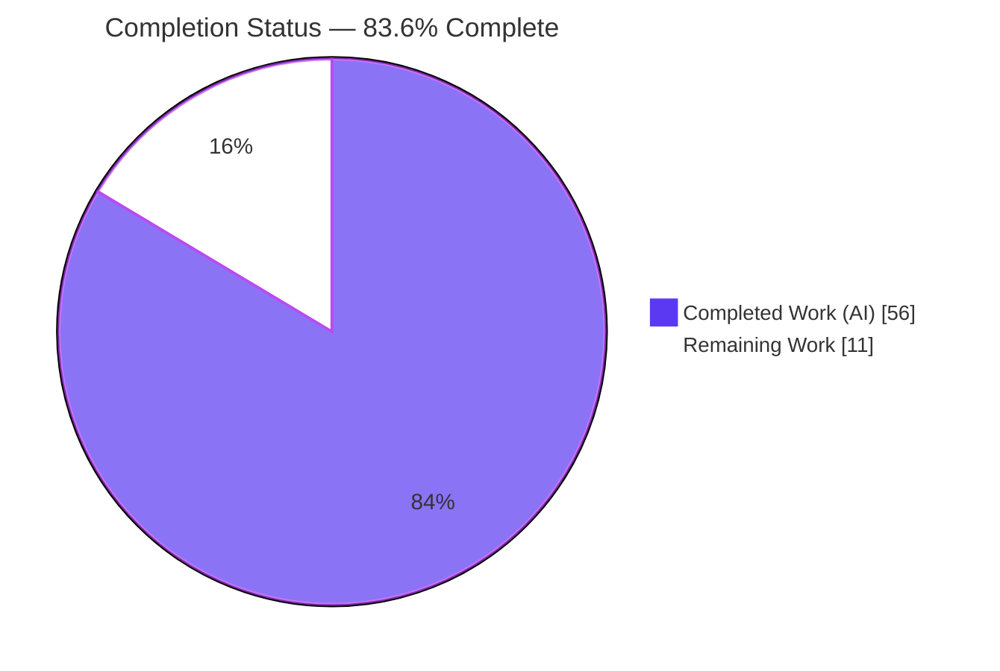
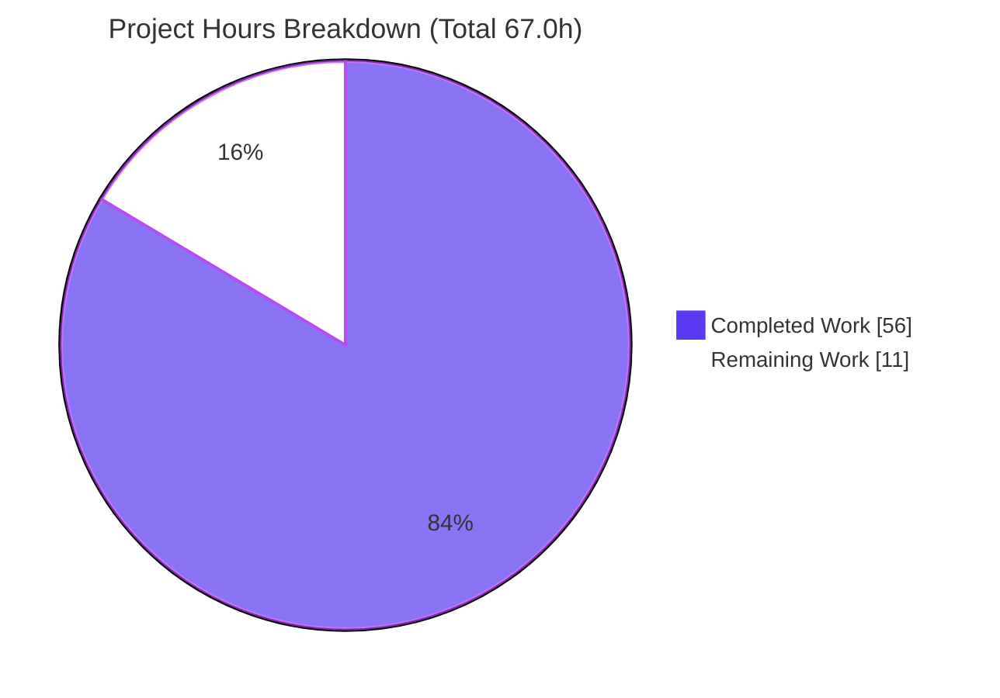
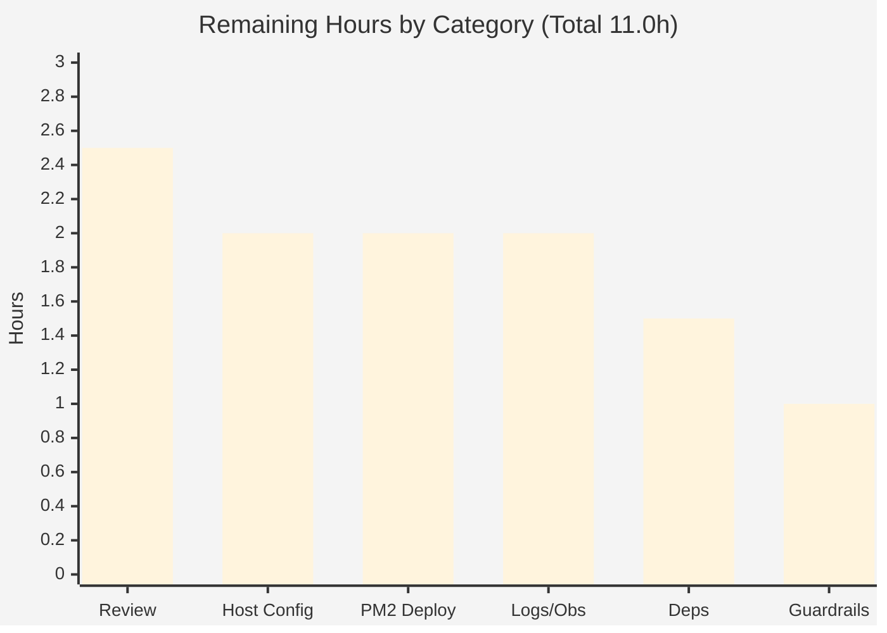

# Blitzy Project Guide

> **Project:** Enhancement of a minimal Node.js HTTP server into a production-ready Express.js application
> **Branch:** `blitzy-3e49607a-09cc-4ae9-9313-f5422c07ae8e` · **HEAD:** `d010976` · **Runtime:** Node.js v22.23.2 / npm 11.18.0
> **Overall Completion:** **83.6%** (56.0h completed / 67.0h total · 11.0h remaining)

---

# 1. Executive Summary

## 1.1 Project Overview

This project converts a 14-line Node.js `http` server into a production-ready **Express.js 5** service for the developers and operators who run it. It adds a router (`GET /`, `GET /health`), an ordered middleware pipeline (security headers, compression, body parsers, access logging, 404 and centralized error handling), `dotenv` configuration, structured Winston logging, and PM2 cluster deployment with bounded graceful shutdown. The original `Hello, World!\n` response is preserved byte-for-byte. A follow-up request hardened the server lifecycle, error responses and log routing, and completed the operator documentation, without widening scope. Unrelated repository fixtures are untouched.

## 1.2 Completion Status


```mermaid
%%{init: {'theme':'base','themeVariables':{'pie1':'#5B39F3','pie2':'#FFFFFF','pieStrokeColor':'#B23AF2','pieStrokeWidth':'2px','pieOuterStrokeWidth':'2px','pieTitleTextSize':'18px','pieSectionTextSize':'15px','pieLegendTextSize':'14px'}}}%%
pie showData title Completion Status — 83.6% Complete
    "Completed Work (AI)" : 56
    "Remaining Work" : 11
```

| Metric | Hours |
| --- | --- |
| **Total Hours** | **67.0** |
| Completed Hours (AI) | 56.0 |
| Completed Hours (Manual) | 0.0 |
| **Completed Hours (AI + Manual)** | **56.0** |
| **Remaining Hours** | **11.0** |
| **Percent Complete** | **83.6%** |

> `56.0 / (56.0 + 11.0) = 83.6%`. Every AAP deliverable is implemented and verified; the 11.0 remaining hours are path-to-production work that needs the target host.

## 1.3 Key Accomplishments

- ✅ Express 5.2.1 app (`src/app.js`) hosted by a thin `server.js` bootstrap.
- ✅ `GET /` returns byte-identical `Hello, World!\n`; `GET /health` returns liveness JSON.
- ✅ Ordered middleware with JSON 404/400/413/415/500 responses and status normalization.
- ✅ `PORT`/`HOST`/`NODE_ENV`/`LOG_LEVEL` configuration with defaults and `.env.example`.
- ✅ NDJSON logging: errors on stderr, no query strings or 4xx bodies logged.
- ✅ PM2 cluster: zero-downtime reload (719/719 requests) and shutdown inside `kill_timeout`.
- ✅ Decision log D1–D32 with a complete bidirectional traceability matrix.
- ✅ 61 of 61 verification checks pass; `npm ci` reproduces all exact pins.

## 1.4 Critical Unresolved Issues

None of the 6 requested capabilities is incomplete. **11 items remain open: 9 accepted with a caveat and 2 never exercised.** None blocks the code; the production-deployment item gates go-live.

| Issue | Impact | Owner | ETA |
| --- | --- | --- | --- |
| Process lifecycle (3, accepted): SIGTERM on a loaded direct run resets 0–7 of 300 connections; final log lines drop if the log reader stalls over 500 ms; `npm start` does not forward signals to `node` | Rare dropped connections or an orphaned process outside PM2 | Ops | Before go-live |
| Logging coverage (2, accepted): body-parser rejections (400/413/415) have no access-log line; requests Node rejects before Express (e.g. 431) are not logged | Access-log metrics undercount failed requests | Ops | Post-launch |
| Configuration validation (2, accepted): an unknown `LOG_LEVEL` silences all output; `PORT=0` or `PORT=abc` falls back to 3000 | A typo blanks every log or binds an unexpected port | Dev | Before go-live |
| Error responses (1, accepted): every 5xx body is the generic `Internal Server Error`, including 503 | Clients cannot tell 5xx causes apart from the body | Dev | Post-launch |
| Dependency advisories (1, accepted): morgan 1.11.0 and transitive qs (2 moderate, runtime); pm2, js-yaml, ip-address (3 high, dev-only) | Quoted headers can spoof fields inside an access-log line | Security | Before go-live |
| Never exercised (2): production start on `0.0.0.0:3000` with `instances: 'max'`; the Node 18.0/18.1 drain fallback | Behaviour on the real host is unproven | Ops | Before go-live |

## 1.5 Access Issues

| System / Resource | Type of Access | Issue Description | Resolution Status | Owner |
| --- | --- | --- | --- | --- |
| _None_ | — | Repository, npm registry (install and audit) and local PM2 were all reachable. | N/A | — |

**No access issues identified.** A production host is needed only for the path-to-production tasks.

## 1.6 Recommended Next Steps

1. **[High]** Review and sign off the behaviour changes in Section 5.2: routing 404s, error-status normalization and output handling in `server.js`.
2. **[High]** Configure the production host: integer `instances`, `env_production` host and port, and a firewall or TLS reverse proxy.
3. **[Medium]** Deploy with `npm ci --include=dev` and `npm run pm2:start`, smoke-test, rehearse a reload, then `pm2 save` and `pm2 startup`.
4. **[Medium]** Decide on the morgan 1.12.1 upgrade and add log rotation for `./logs`.

---

# 2. Project Hours Breakdown

## 2.1 Completed Work Detail

| Component | Hours | Description |
| --- | --- | --- |
| Express framework migration | 5.0 | `src/app.js` Express app plus `server.js` bootstrap hosting it via `http.createServer(app)` (AAP R1). |
| Routing layer | 1.5 | `src/routes/index.js` `express.Router` — `GET /` (Hello World preserved) and `GET /health` (AAP R2). |
| Middleware pipeline + 404 + error handler | 3.5 | Ordered helmet/compression/body-parser/morgan pipeline; `notFound.js` and centralized `errorHandler.js` (AAP R3). |
| Log and error-response sanitization | 4.0 | Query-string redaction in error and access logs, reason-phrase-only 4xx bodies, no 4xx body snippets, quiet dotenv (D14–D17). |
| Environment configuration | 2.5 | `src/config/index.js` (dotenv + typed settings), `.env`, committed `.env.example` (AAP R4). |
| Structured logging | 3.0 | `src/config/logger.js` Winston JSON logger and morgan stream adapter (AAP R5). |
| PM2 production tooling | 3.5 | `ecosystem.config.js` (cluster, env blocks, log routing, `kill_timeout`), four `pm2:*` scripts, signal handling (AAP R6). |
| Dependency management | 2.0 | `package.json` exact pins, scripts and `main`; regenerated `package-lock.json` (lockfileVersion 3). |
| VCS hygiene | 0.5 | `.gitignore` (`node_modules/`, `.env`, `logs/`, `*.log`). |
| README documentation | 2.0 | Install, run, environment and PM2 deployment instructions. |
| Decision log + traceability matrix | 2.5 | `docs/decision-log.md` D1–D17 and the bidirectional `http`→Express matrix (Explainability rule). |
| Build validation | 4.0 | Static checks, runtime endpoint checks, security probes. |
| Server lifecycle hardening | 8.0 | Structured listen errors (including synchronous bad-port throws), idempotent signals, 4000 ms forced exit, ≤500 ms log flush, in-flight keep-alive drain, EPIPE tolerance (D18, D31, D32). |
| Error-status normalization and headers-sent handling | 2.0 | Integer 400–599 or 500; sanitized log then socket destroy after partial writes (D19). |
| Log routing and header redaction | 2.0 | Error level to stderr (D20); referrer and user-agent cut at `?` (D15). |
| README operator documentation | 3.0 | `npm ci`, endpoint and error tables, configuration precedence, exposure caveat, Logging, PM2 and Testing sections. |
| Decision-log completion | 3.0 | D18–D32 and matrix rows for the catch-all, implicit methods, manifests and README. |
| Lifecycle, logging and PM2 runtime validation | 4.0 | Signal, listen-error, keep-alive, EPIPE, error-handler harness and PM2 reload verification. |
| **Total Completed** | **56.0** | Matches Completed Hours in Section 1.2. |

## 2.2 Remaining Work Detail

| Category | Hours | Priority |
| --- | --- | --- |
| Code review and sign-off of delivered behaviour changes (Section 5.2 DV1–DV5, DV8) | 2.5 | High |
| Production host configuration: integer `instances`, `env_production` HOST/PORT, firewall and TLS reverse proxy, `trust proxy` decision | 2.0 | High |
| PM2 deployment on the target host: smoke test, reload drill, `pm2 save` + `pm2 startup` | 2.0 | Medium |
| Log rotation and production observability (rotation for `./logs`, log shipping, alerts on restarts and `error.log`) | 2.0 | Medium |
| Dependency advisory decision: morgan 1.12.1, pm2/js-yaml, re-audit, update pins and D3/D6/D28 (DV6) | 1.5 | Medium |
| Operational guardrails for accepted caveats: `LOG_LEVEL`/`PORT` validation decision, supervise `node server.js` directly, Node engines floor (DV7) | 1.0 | Low |
| **Total Remaining** | **11.0** | Matches Remaining Hours in Section 1.2 and the Section 7 pie chart. |

> **Outside AAP scope, not counted:** automated test suite, CI/CD pipeline and Dockerfile, CORS and rate limiting, deeper readiness checks on `/health`. AAP §0.5.2 excludes them; they are listed for backlog awareness only.

## 2.3 Basis of Estimate

Estimates follow the PA2 framework for a **small** codebase: +541/−14 hand-written lines across 17 commits (the regenerated `package-lock.json` adds 2,512 generated lines). Completed hours cover the original build (34.0h) and the follow-up hardening of `server.js`, `errorHandler.js`, `logger.js`, `README.md`, `.env.example` and `docs/decision-log.md` (22.0h, +247/−17 lines). Remaining hours are path-to-production tasks only, because the AAP "prepares for" deployment (§0.7.2) rather than deploying. Confidence: **High** for completed work (verified first-hand); **Medium** for remaining work, which depends on the target host.

---

# 3. Test Results

Every row below was executed on Node 22.23.2 against the current tree (isolated ports and PM2 home). There is no automated unit or integration suite: `npm test` is the AAP-retained placeholder and exits 1 with `Error: no test specified`. No coverage tooling is configured.

| Area / Category | Framework | Tests | Passed | Failed | Coverage | What This Proves |
| --- | --- | --- | --- | --- | --- | --- |
| Static syntax and module load | `node --check`, `require` | 9 | 9 | 0 | N/A | All 8 JS files parse; the app and PM2 config load |
| Install and dependency pins | `npm ci`, `npm ls` | 2 | 2 | 0 | N/A | The lockfile reproduces 203 packages with all 7 AAP pins exact |
| Dependency audit | `npm audit` | 2 | 2 | 0 | N/A | Nothing beyond the accepted baseline (2 moderate runtime; 5 total) |
| HTTP routing and error responses | curl, `od -c` | 11 | 11 | 0 | N/A | Byte-identical root, `/health`, HEAD/OPTIONS and 404/400/413/415 JSON behave as documented |
| Structured logging and redaction | curl + stream capture | 3 | 3 | 0 | N/A | Errors only on stderr, info only on stdout, no query, header or body secret logged |
| Process lifecycle | bash signals, keep-alive client | 9 | 9 | 0 | N/A | Clean exit 0, listen errors exit 1, 4 s forced exit, in-flight drain, EPIPE tolerance |
| Error-handler contract | Node harness on real middleware | 16 | 16 | 0 | N/A | Valid 4xx/5xx kept, invalid statuses become 500, partial responses terminate without a crash |
| PM2 cluster | PM2 7.0.3 | 9 | 9 | 0 | N/A | Cluster start, zero-downtime reload (719/719), split log files, clean stop |

**Total: 61 executed, 61 passed, 0 failed.** The audit commands exit 1 because of the accepted advisories; they pass in the sense that no advisory exceeds the baseline recorded in D1, D3 and D6.

**Not Covered — test before release:**

- No automated regression suite exists (excluded by AAP §0.5.2); all evidence above comes from scripted runtime checks.
- The Node 18.0/18.1 fallback in `server.js` `onResponseFinish` (no `server.closeIdleConnections`); only Node 22 is installed. Test on 18.0 or raise the engines floor.
- Production start through `npm run pm2:start` (`0.0.0.0:3000`, `instances: 'max'`), `pm2 save`/`pm2 startup`, and operation behind a reverse proxy.
- `EACCES` listen failures (this host allows unprivileged binds) and the `server.close()` error branch, which only fault injection reaches.
- The global `npm install -g pm2@7.0.3` path and `npm ci --omit=dev` behaviour on the target host.

---

# 4. Runtime Validation & UI Verification

No UI exists; the deliverable is a headless HTTP service (AAP §0.3). Every flow below was driven against the running server.

- ✅ **Startup** — `node server.js`, `npm start` and `npm run dev` bind the configured host and port and log one JSON banner; shell variables override `.env`.
- ✅ **Root route** — 200, `text/plain; charset=utf-8`, 14-byte `Hello, World!\n`, helmet headers present, no `X-Powered-By`.
- ✅ **Health and implicit methods** — `/health` 200 JSON; `HEAD /` 200 with no body; `OPTIONS /` 200 `GET, HEAD`.
- ✅ **Error responses** — 404 unmatched path or method, 400 malformed JSON, 413 over 102400 bytes, 415 unsupported charset, all `{"error": ...}`.
- ✅ **Logging** — NDJSON; errors on stderr, other levels on stdout; URL, referrer and user-agent cut at `?`; zero secrets across probes.
- ✅ **Graceful shutdown** — SIGTERM/SIGINT exit 0 in 6–8 ms; an in-flight keep-alive request drains and exits 0 at 1031 ms; a stuck connection forces exit 1 at 4011 ms.
- ✅ **Listen failures** — `EADDRINUSE` and `PORT=65536` log one JSON line and exit 1; the running instance keeps serving.
- ✅ **Output robustness** — with stdout piped into a reader that exits (`EPIPE`), the server keeps serving and exits 0 on SIGTERM.
- ✅ **PM2 cluster** — 2 workers online in production mode; reload in 805 ms with 0 failed requests; `logs/error.log` holds only error lines.
- ⚠ **Never exercised** — production start on `0.0.0.0:3000` with `instances: 'max'`, boot persistence, and reverse-proxy operation. There are no external integrations.

---

# 5. Compliance & Quality Review

## 5.1 Compliance Matrix

| Benchmark / AAP Deliverable | Status | Progress | Evidence |
| --- | --- | --- | --- |
| Express framework introduced (R1) | ✅ Pass | 100% | `src/app.js`; `server.js:71` `http.createServer(app)` |
| Routing with Hello World preserved (R2, Hello World rule) | ✅ Pass | 100% | `src/routes/index.js:3-10`; `od -c` byte match |
| Middleware pipeline and error handling (R3) | ✅ Pass | 100% | `src/app.js:13-23`; error-handler harness 16/16 |
| Environment configuration (R4) | ✅ Pass | 100% | `src/config/index.js`; `.env.example` |
| Structured logging (R5) | ✅ Pass | 100% | `src/config/logger.js`; stdout/stderr split verified |
| PM2 production preparation (R6) | ✅ Pass | 100% | `ecosystem.config.js`; reload 719/0 |
| Manifests, exact pins, lockfile v3 (R7) | ✅ Pass | 100% | `package.json`; `npm ls --depth=0` |
| `.gitignore` and README (R8–R9) | ✅ Pass | 100% | `.gitignore`; `README.md` |
| Explainability rule: decision log and matrix (R10) | ✅ Pass | 100% | `docs/decision-log.md` D1–D32; no code comments |
| Minimal-changes rule | ✅ Pass (interpreted) | 100% | Fixtures and `server - Copy.js` untouched; see 5.2 DV3–DV5 |
| Zero-placeholder policy | ✅ Pass | 100% | No TODO/FIXME markers in any in-scope file |
| Dependency security baseline | ⚠ Accepted risk | — | 2 moderate runtime, 3 high dev-only (D1, D3, D6) |

## 5.2 AAP & Rule Divergences and Gaps

| # | What the AAP/Rule Required | What Was Delivered Instead | Why It Diverged | Impact | Remediation |
| --- | --- | --- | --- | --- | --- |
| DV1 | Root route sends `Content-Type: text/plain` (matrix rows 6–7) | `text/plain; charset=utf-8` plus helmet headers, ETag, `Vary`; body identical (D29) | Express appends charset; helmet is AAP decision D4 | Low: exact-string header matchers only | Confirm acceptable |
| DV2 | Preserve public interfaces (Rule 3) | Catch-all replaced: only GET/HEAD `/` and `/health` succeed; others 404 (D30) | Required by "add routing" | Medium for callers of other paths or methods | Confirm no consumer relies on the catch-all |
| DV3 | `{ error }` with `err.status \|\| 500` (§0.4.1) | Integer 400–599 or 500; socket destroyed after partial writes (D19) | **Sanctioned** — "Improve PR without expanding scope" | Low: `statusCode`-only errors become 500 | Sign off |
| DV4 | `logger.js` imports `winston`, `./index` (§0.4.5) | Also imports `morgan` for token overrides (D15) | `src/app.js` held unchanged by the follow-up instruction | None functional | None |
| DV5 | SIGTERM/SIGINT → `server.close()` → exit (§0.3.4) | Exit-1 paths, 4 s forced exit, 500 ms flush wrapper, keep-alive drain, EPIPE tolerance, errors on stderr | **Sanctioned** — follow-up instruction; D18, D20, D31, D32 | Process-wide stream patching | Re-verify on PM2 upgrades |
| DV6 | Exact pins (§0.6.1); no dependency changes | Pins kept with known advisories (2 moderate runtime, 3 high dev-only) | Pins and minimal-changes rule outrank upgrades | Log-field spoofing possible | Decide on morgan 1.12.1 |
| DV7 | Production-ready behaviour (§0.1.1) | Eight edge behaviours accepted as delivered (Section 1.4) | Changing them adds unrequested behaviour | Operational blind spots | Operational decisions (2.2) |
| DV8 | README description update (§0.4.3); readiness timing (§0.2.2) | H1 still `hao-backprop-test`; `kill_timeout` only, no `wait_ready` | Kept by the follow-up file list | Cosmetic / none observed | Optional reviewer choice |

**DV1 — Root-route headers.** The plan's traceability matrix maps the original `res.setHeader('Content-Type','text/plain')` to `res.type('text/plain')`, implying an identical header. Express 5 appends `; charset=utf-8` to string bodies, and the AAP's own decision D4 adds helmet and compression, so `GET /` now also sends twelve security headers, a weak ETag and `Vary: Accept-Encoding`, and no longer sends `X-Powered-By`. Status 200, `Content-Length: 14` and the body bytes are identical, confirmed with `od -c`. D29 in `docs/decision-log.md` records the deviation. Only clients matching Content-Type by exact string are affected; confirm none exist.

**DV2 — Catch-all replaced by routing.** The original server answered every method and path with `200 Hello, World!\n`. The AAP mandates a router, so only `GET`/`HEAD /` and `GET`/`HEAD /health` succeed; `OPTIONS` on those paths returns `200 GET, HEAD`, `/HEALTH` and `/health/` are aliases, and everything else returns `404 {"error":"Not Found"}` (`src/routes/index.js`, `src/middleware/notFound.js`). Bodies the parsers reject receive 400, 413 or 415 before routing. D30 and Source → Target row 10 record this. Because Rule 3 asks to maintain public interfaces, any client calling `POST /` or another path now breaks; confirm no consumer depends on the catch-all.

**DV3 — Error-status contract (Sanctioned).** AAP §0.4.1 specifies a JSON `{ error }` body with `err.status || 500`. `src/middleware/errorHandler.js:9-11` uses `err.status` only when it is an integer from 400 to 599, ignores `err.statusCode`, and maps everything else (200, 302, 600, `'404'`, 400.5) to 500. When headers are already sent (lines 27-30) it logs the sanitized entry and destroys the socket instead of Express's documented `next(err)`, which would print the unredacted stack. These answer the instruction "Improve PR without expanding scope" and are recorded in D19. Every real error status behaves as before; confirm `statusCode`-only errors may become 500.

**DV4 — Extra import in the logger.** AAP §0.4.5 lists the dependencies of `src/config/logger.js` as `winston` and `./index`. The module also requires `morgan` (`src/config/logger.js:1,17-18`) to override the `referrer` and `user-agent` tokens so each is cut at its first `?`, which keeps query secrets out of access logs even when a header value contains quotes. The override could not live in `src/app.js`, because the follow-up instruction confined edits to six named files and left `src/app.js` unchanged. morgan is already a direct dependency, so no package was added; D15 records the decision. No action is needed beyond review.

**DV5 — Lifecycle behaviour beyond the AAP (Sanctioned).** AAP §0.3.4 requires SIGTERM/SIGINT handlers that call `server.close()` before exit. `server.js` also logs listen errors as one JSON line and exits 1, ignores repeated signals, forces exit 1 after 4000 ms, wraps `process.stdout.write`/`process.stderr.write` to wait up to 500 ms for log output (lines 13-36), closes keep-alive connections as in-flight responses finish, and ignores `EPIPE`. `src/config/logger.js:12` moves error-level output to stderr. These answer the follow-up instruction and are recorded in D18, D20, D31 and D32; Rule 3's "maintain side effects" was read as protecting the original server, not the new logger. Re-verify the stream wrapper before upgrading PM2.

**DV6 — Dependency advisories accepted.** AAP §0.6.1 pins morgan 1.11.0 and pm2 7.0.3 exactly, and both the minimal-changes rule and the follow-up instruction forbid dependency changes. `npm audit --omit=dev` therefore lists 2 moderate advisories (morgan log forging and log injection; transitive qs 6.15.3 via express and body-parser), and the full audit lists 5, adding 3 high findings in the dev-only pm2, js-yaml and ip-address tree. D1, D3, D6 and D28 record them as accepted risk. In practice a quoted User-Agent can spoof fields inside one JSON access line. morgan 1.12.1 closes both morgan advisories; pm2 7.0.4 closes only part of its set. A human must decide whether to move the pins.

**DV7 — Accepted runtime caveats.** Eight edge behaviours were observed and left as delivered, because changing them would add behaviour the plan does not require or touch files the follow-up instruction kept unchanged. Body-parser rejections have no access-log line (the AAP orders parsers before morgan); an unknown `LOG_LEVEL` silences all output; `PORT=0` or `PORT=abc` falls back to 3000 (the AAP mandates `parseInt(PORT, 10) || 3000`); requests Node rejects before Express are not logged; every 5xx body is generic (D14); SIGTERM on a loaded direct run can reset a few connections; log lines drop behind a reader stalled over 500 ms; and `npm start` does not forward signals. Section 2.2 carries the operational decisions.

**DV8 — Minor documentation and configuration gaps.** AAP §0.4.3 asks for a project description update in `README.md`. The description is new, but the H1 still reads `hao-backprop-test` while `package.json` names the package `hello_world`. AAP §0.2.2 mentions complementing graceful shutdown with PM2 `wait_ready`/`listen_timeout`; `ecosystem.config.js` sets `kill_timeout: 5000`, which the §0.4.2 file list requires, but no readiness signalling, and the follow-up instruction kept that file unchanged. Reloads still served 719 of 719 requests. Renaming the H1 and adding readiness signalling are optional reviewer decisions.

---

# 6. Risk Assessment

| Risk | Category | Severity | Probability | Mitigation | Status |
| --- | --- | --- | --- | --- | --- |
| No automated regression suite; behaviour rests on scripted runtime checks | Technical | Medium | Medium | Add tests (outside AAP scope) before CI relies on the build | Accepted (by scope) |
| `instances: 'max'` starts one worker per host CPU (24 here) regardless of a smaller container quota | Operational | Medium | High | Set an integer `instances` in `ecosystem.config.js` | Open |
| `env_production` binds `0.0.0.0:3000` over plain HTTP | Security | Medium | Medium | Firewall plus TLS-terminating reverse proxy; set `trust proxy` behind one | Open |
| Known advisories in morgan and qs (runtime) and the pm2 tree (dev-only) | Security | Medium | Low | Upgrade morgan to 1.12.1 and re-audit, or keep the documented acceptance | Accepted |
| The process-wide stdout/stderr wrapper relies on PM2 7.0.3 forwarding write callbacks | Technical | Low | Low | Re-run reload and stop checks on any PM2 upgrade | Monitored |
| Log blind spots: parser rejections missing from access logs, pre-Express rejections unlogged, unknown `LOG_LEVEL` silences everything | Operational | Medium | Low | Alert on `error.log`; validate `LOG_LEVEL` in deployment configuration | Accepted |
| No log rotation; `./logs` grows without bound | Operational | Medium | Medium | pm2-logrotate or host `logrotate` | Open |
| Direct-run SIGTERM under load can reset connections; `npm start` does not forward signals | Integration | Low | Medium | Run under PM2, or supervise `node server.js` directly | Accepted |

---

# 7. Visual Project Status

**Project hours — completed vs remaining:**


```mermaid
%%{init: {'theme':'base','themeVariables':{'pie1':'#5B39F3','pie2':'#FFFFFF','pieStrokeColor':'#B23AF2','pieStrokeWidth':'2px','pieOuterStrokeWidth':'2px','pieTitleTextSize':'18px','pieSectionTextSize':'15px','pieLegendTextSize':'14px'}}}%%
pie showData title Project Hours Breakdown (Total 67.0h)
    "Completed Work" : 56
    "Remaining Work" : 11
```

**Remaining hours by category (Section 2.2):**


```mermaid
%%{init: {'theme':'base','themeVariables':{'xyChartBarColor':'#5B39F3'}}}%%
xychart-beta
    title "Remaining Hours by Category (Total 11.0h)"
    x-axis ["Review", "Host Config", "PM2 Deploy", "Logs/Obs", "Deps", "Guardrails"]
    y-axis "Hours" 0 --> 3
    bar [2.5, 2, 2, 2, 1.5, 1]
```

> **Color legend:** Completed = Dark Blue `#5B39F3` · Remaining = White `#FFFFFF` (outlined in Violet-Black `#B23AF2`). The pie chart "Remaining Work" value (11) equals the Section 1.2 Remaining Hours and the Section 2.2 total.

---

# 8. Summary & Recommendations

The Express.js migration in the AAP is implemented and verified. Framework introduction, routing, the middleware pipeline, environment configuration, structured logging and PM2 production preparation are all in place, and `GET /` still returns `Hello, World!\n` byte-for-byte. A follow-up request hardened the process lifecycle (structured listen errors, bounded and idempotent shutdown, keep-alive drain, EPIPE tolerance), normalized error statuses, routed error logs to stderr, kept query strings out of every access-log field, and completed the README and the decision log (D1–D32). All 61 first-hand checks pass, including a PM2 reload that served 719 of 719 requests.

The project is **83.6% complete** (56.0h of 67.0h). The remaining 11.0h is path-to-production work: sign-off of the behaviour changes in Section 5.2, production host configuration, the PM2 deployment itself, log rotation and observability, a decision on the morgan and pm2 advisories, and operational guardrails for the eight accepted runtime caveats (DV7).

**Critical path:** review and sign-off → host configuration (`instances`, bind address, firewall/TLS proxy) → PM2 deployment with smoke test and boot persistence → log rotation and alerting. **Success metrics:** `GET /` returns `Hello, World!\n` through the production cluster, `GET /health` returns 200, reloads complete with zero failed requests, and no query string or request body appears in `./logs`.

**Production readiness:** the code is ready for review and deployment, with no open defects in any requested capability. It has not yet run on a production host, and two settings need deliberate choices before it does: `instances: 'max'` should become an explicit worker count, and the `0.0.0.0:3000` production binding must sit behind a firewall or TLS-terminating proxy.

| Metric | Value |
| --- | --- |
| AAP-scoped completion | 83.6% |
| Requested capabilities incomplete | 0 of 6 |
| Open items (accepted / never exercised) | 11 (9 / 2) |
| Verification checks passed | 61 / 61 |
| `npm audit --omit=dev` | 2 moderate (accepted baseline) |
| Decision-log entries | 32 (D1–D32) |

---

# 9. Development Guide

> All commands below were run on this host (Node v22.23.2, npm 11.18.0) from the repository root.

## 9.1 System Prerequisites

- **Node.js** `>= 18` (verified on **v22.23.2**; the Node 18.0/18.1 drain fallback is untested)
- **npm** (bundled with Node.js; verified on **11.18.0**)
- **PM2** — devDependency `7.0.3`, installed by `npm ci` unless dev dependencies are omitted; global alternative `npm install -g pm2@7.0.3`
- **curl**, **lsof** and **od** for the verification steps
- OS: Linux or macOS. No database, cache or message queue is required.

## 9.2 Environment Setup

```bash
cp --update=none .env.example .env
```

This creates a local, git-ignored `.env` from the committed template. Safe defaults apply when `.env` is absent.

| Variable | Description | Default |
| --- | --- | --- |
| `PORT` | TCP port the server listens on | `3000` |
| `HOST` | Interface to bind (`127.0.0.1` local only; `0.0.0.0` all IPv4 interfaces) | `127.0.0.1` |
| `NODE_ENV` | Application environment (`development` \| `production`) | `development` |
| `LOG_LEVEL` | Winston log level (`error`\|`warn`\|`info`\|`http`\|`verbose`\|`debug`\|`silly`) | `info` |

Precedence: variables already set in the shell override `.env`. Under PM2, the `env` / `env_production` blocks in `ecosystem.config.js` override both (production: `NODE_ENV=production`, `PORT=3000`, `HOST=0.0.0.0`, `LOG_LEVEL=info`).

## 9.3 Dependency Installation

```bash
CI=true npm ci --no-audit --no-fund
```

Expected: `added 203 packages`. Prefer `npm ci`: `npm install` may rewrite the lockfile. Verify:

```bash
npm ls --depth=0
npm audit --omit=dev
```

Expected: exactly 7 packages at the pinned versions, and `2 moderate severity vulnerabilities` (morgan, qs), the accepted baseline. On a host that sets `NODE_ENV=production`, plain `npm ci` omits PM2; use `npm ci --include=dev` when the `npm run pm2:*` scripts are needed.

## 9.4 Application Startup

```bash
npm start
npm run dev
PORT=3100 node server.js
```

`npm start` and `npm run dev` both run `node server.js` and print npm's script banner first (suppress it with `--silent`). Expected first log line:

```json
{"level":"info","message":"Server running at http://127.0.0.1:3000/","timestamp":"..."}
```

Stop with `kill -TERM <node pid>`; the server logs `SIGTERM received: closing HTTP server`, then `HTTP server closed`, and exits 0.

## 9.5 Verification Steps

```bash
curl -s http://127.0.0.1:3000/ | od -c
curl -s -w ' %{http_code}\n' http://127.0.0.1:3000/health
curl -s -w ' %{http_code}\n' http://127.0.0.1:3000/nope
curl -s -w ' %{http_code}\n' -X POST -H 'Content-Type: application/json' -d '{bad' http://127.0.0.1:3000/
curl -sI http://127.0.0.1:3000/ | grep -iE "content-type|strict-transport|x-content-type-options"
```

Expected, in order: `H e l l o , W o r l d ! \n`; `{"status":"ok","uptime":N} 200`; `{"error":"Not Found"} 404`; `{"error":"Bad Request"} 400`; `text/plain; charset=utf-8` with helmet headers.

## 9.6 Production Deployment with PM2

```bash
npm run pm2:start
npm run pm2:reload
npm run pm2:stop
npm run pm2:logs
npx pm2 save
npx pm2 startup
```

These run `pm2 start ecosystem.config.js --env production`, a zero-downtime reload, stop and log tailing; `pm2 save` plus `pm2 startup` (then run the printed command) persist the app across reboots. Start PM2 from the repository root, because `./logs/out.log` and `./logs/error.log` resolve relative to it.

- **Network exposure:** `--env production` binds `0.0.0.0:3000` over plain HTTP. Put a firewall or TLS-terminating reverse proxy in front.
- **Workers:** `instances: 'max'` starts one worker per CPU core; set an integer that matches the container's CPU quota.
- **Shared hosts:** give each PM2 instance its own daemon with `PM2_HOME=<dir>` so it does not join a shared `~/.pm2` daemon.
- **Log files:** each persisted line is `<YYYY-MM-DD HH:mm:ss Z>: <JSON>`; strip the prefix with `sed 's/^[^{]*//' logs/out.log` before parsing.

## 9.7 Example Usage

```bash
$ curl -s http://127.0.0.1:3000/
Hello, World!

$ curl -s http://127.0.0.1:3000/health
{"status":"ok","uptime":12.34}

$ curl -s -X OPTIONS http://127.0.0.1:3000/
GET, HEAD
```

## 9.8 Troubleshooting

- **`EADDRINUSE` on startup:** the process logs one JSON line with `"code":"EADDRINUSE"` and exits 1. Choose another port (`PORT=3100 npm start`) or stop the process that holds it (`lsof -ti tcp:3000 -sTCP:LISTEN`).
- **Server keeps running after stopping `npm start`:** npm's `sh -c` wrapper does not forward signals. Signal the `node` process itself (`kill -TERM "$(lsof -ti tcp:<port> -sTCP:LISTEN)"`), or run `node server.js` directly under a supervisor.
- **Shutdown takes about 4 seconds and exits 1:** a connection stayed open; the forced-exit fallback logs `Graceful shutdown timed out after 4000 ms: forcing exit`. This stays below PM2's 5000 ms `kill_timeout`.
- **No log output at all:** `LOG_LEVEL` holds an unknown value, which silences every level. Use one of the levels in Section 9.2.
- **`pm2: not found` from `npm run pm2:*`:** dev dependencies were omitted (`--omit=dev` or `NODE_ENV=production`). Reinstall with `npm ci --include=dev` or install `pm2@7.0.3` globally.
- **More PM2 workers than expected:** `instances: 'max'` follows the host core count; pin it in `ecosystem.config.js`.
- **Logs not written under PM2:** start PM2 from the repository root so `./logs` resolves there.

---

# 10. Appendices

## A. Command Reference

| Command | Purpose |
| --- | --- |
| `CI=true npm ci --no-audit --no-fund` | Reproducible install from the lockfile |
| `npm ci --include=dev` | Install including PM2 when `NODE_ENV=production` is set |
| `cp --update=none .env.example .env` | Create the local `.env` |
| `npm start` / `npm run dev` | Start the server (`node server.js`) |
| `npm test` | Retained placeholder; exits 1 (no suite in scope) |
| `npm run pm2:start` | `pm2 start ecosystem.config.js --env production` (cluster) |
| `npm run pm2:reload` | Zero-downtime cluster reload |
| `npm run pm2:stop` | Stop the PM2 app |
| `npm run pm2:logs` | Tail PM2 logs |
| `sed 's/^[^{]*//' logs/out.log` | Strip the PM2 date prefix to get NDJSON |
| `node --check <file>` | Static syntax check |
| `npm audit --omit=dev` | Runtime dependency audit (baseline: 2 moderate) |

## B. Port Reference

| Port | Service | Configurable via |
| --- | --- | --- |
| `3000` | HTTP server (default; also hardcoded in both PM2 env blocks) | `PORT` env var / `ecosystem.config.js` env blocks |

## C. Key File Locations

| Path | Role |
| --- | --- |
| `server.js` | Entry bootstrap — hosts Express on `http`, listen-error handling, bounded graceful shutdown |
| `src/app.js` | Express application and middleware pipeline |
| `src/config/index.js` | Typed environment configuration (dotenv) |
| `src/config/logger.js` | Winston logger, stderr routing, morgan stream and token overrides |
| `src/routes/index.js` | Router — `GET /`, `GET /health` |
| `src/middleware/notFound.js` | 404 handler |
| `src/middleware/errorHandler.js` | Centralized error handler (status normalization, sanitized logging) |
| `ecosystem.config.js` | PM2 cluster and process definition |
| `.env.example` | Committed environment template |
| `.gitignore` | Ignores `node_modules/`, `.env`, `logs/`, `*.log` |
| `docs/decision-log.md` | Decision log (D1–D32) and traceability matrix |
| `package.json` / `package-lock.json` | Manifest and locked dependency graph |
| `README.md` | Install, configuration, logging, PM2 and testing documentation |

## D. Technology Versions

| Technology | Version | Type |
| --- | --- | --- |
| Node.js | 22.23.2 verified (`>= 18` declared) | Runtime |
| npm | 11.18.0 | Package manager |
| express | 5.2.1 | dependency |
| dotenv | 17.4.2 | dependency |
| morgan | 1.11.0 | dependency |
| winston | 3.19.0 | dependency |
| helmet | 8.2.0 | dependency |
| compression | 1.8.1 | dependency |
| pm2 | 7.0.3 | devDependency |

## E. Environment Variable Reference

| Variable | Default | Consumed by |
| --- | --- | --- |
| `PORT` | `3000` | `src/config/index.js` → `server.listen` |
| `HOST` | `127.0.0.1` (`0.0.0.0` in `env_production`) | `src/config/index.js` → `server.listen` |
| `NODE_ENV` | `development` (`production` in `env_production`) | `src/config/index.js`, PM2 |
| `LOG_LEVEL` | `info` | `src/config/logger.js` (Winston level) |

## F. Developer Tools Guide

- **PM2** — process manager for clustered production execution, driven by the `pm2:*` npm scripts and `ecosystem.config.js`. Use `npx pm2 monit` for a live dashboard and `npx pm2 ls` for status; set `PM2_HOME` to isolate a daemon.
- **npm** — dependency management and lifecycle scripts. Use `npm ci` for reproducible installs.
- **node --check** — fast static syntax validation of any JS file without executing it.
- **curl / od / lsof** — endpoint verification, byte-exact response inspection and finding the listening process (Section 9.5).

## G. Glossary

| Term | Definition |
| --- | --- |
| **AAP** | Agent Action Plan — the authoritative project specification. |
| **CWE-532** | Insertion of sensitive information into log files; the query-string and body redaction guards against it. |
| **Cluster mode** | PM2 execution model running multiple worker processes behind a shared port. |
| **Graceful shutdown** | Closing the HTTP server on SIGTERM/SIGINT and draining open connections before exit, bounded here at 4 seconds. |
| **Keep-alive drain** | Closing a persistent connection as soon as its in-flight response finishes during shutdown. |
| **EPIPE** | Write error raised when the reader of a pipe has gone away. |
| **NDJSON** | Newline-delimited JSON: one JSON object per line. |
| **Liveness probe** | `GET /health`, returning status and uptime for monitoring. |
| **Path-to-production** | Review, provisioning, deployment and observability work needed to run AAP deliverables in production. |

---

_End of Blitzy Project Guide._
