# Technical Specification

# 1. Introduction

This Technical Specification documents `hao-backprop-test`, a minimal Node.js HTTP server designed exclusively as a test fixture for Backprop integration validation. This document provides stakeholders with a complete understanding of the system's purpose, technical implementation, and intentionally constrained scope.

## 1.1 Executive Summary

### 1.1.1 Project Overview

The `hao-backprop-test` project (published as `hello_world` on npm) is a deliberately minimal "Hello World" HTTP server implemented in Node.js. The project exists solely to serve as a stable, predictable test artifact for validating Backprop integration capabilities—a tool or service used for code analysis, refactoring, or AI-assisted development workflows.

| Attribute | Value |
|-----------|-------|
| Project Name | `hao-backprop-test` |
| Package Name | `hello_world` |
| Version | 1.0.0 |
| License | MIT |
| Author | hxu |

### 1.1.2 Core Business Problem

Backprop integration testing requires a stable, well-understood codebase that:
- Remains unchanged over time to provide consistent test results
- Contains minimal complexity to isolate integration behavior from application complexity
- Includes diverse file types to validate multi-language and multi-format analysis capabilities

This project addresses these requirements by providing a frozen, minimal test fixture explicitly marked with the warning: **"Do not touch!"** in its README.md documentation.

### 1.1.3 Key Stakeholders and Users

| Stakeholder | Role | Interest |
|-------------|------|----------|
| Backprop Developers | Primary Users | Validate Backprop tool integration against a known baseline |
| QA/Test Engineers | Consumers | Execute integration tests with predictable outcomes |
| DevOps Engineers | Operators | Maintain test infrastructure stability |

### 1.1.4 Value Proposition

The project delivers value through:

1. **Predictability:** A frozen codebase ensures consistent test results across Backprop versions
2. **Simplicity:** Zero external dependencies eliminate environmental variables from test outcomes
3. **Diversity:** Mixed file types (JavaScript, Java stubs, CSV data, empty files, duplicates) enable comprehensive format validation
4. **Isolation:** Minimal functional code isolates Backprop integration behavior from application logic

## 1.2 System Overview

### 1.2.1 Project Context

#### Business Context and Market Positioning

This project occupies a specialized niche as a **test fixture** rather than a market-facing product. It supports the development and quality assurance processes of the Backprop tool ecosystem by providing:

- A reference implementation for integration testing
- A baseline for regression testing across Backprop releases
- A controlled environment for validating code analysis capabilities

#### Current System Context

The system is explicitly **not intended for production use**. As documented in `README.md`, this is a "test project for backprop integration" with a clear directive to maintain its current state unchanged.

#### Integration with Enterprise Landscape

The project integrates with the Backprop tool/service as a passive test subject. It does not integrate with:
- Production systems
- Databases
- External APIs
- Authentication services
- Other enterprise infrastructure

### 1.2.2 High-Level Description

#### Primary System Capabilities

The system provides a single, focused capability:

| Capability | Description |
|------------|-------------|
| HTTP Response | Accepts any HTTP request and returns a plain text "Hello, World!" response |

#### Major System Components

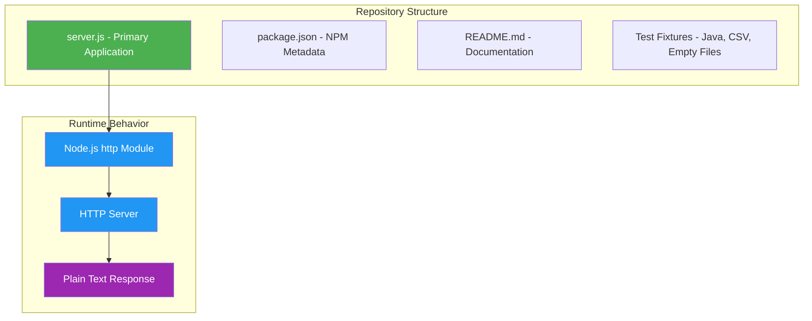

**Component Inventory:**

| Component | File | Purpose |
|-----------|------|---------|
| HTTP Server | `server.js` | 14-line Node.js application serving HTTP responses |
| Package Manifest | `package.json` | NPM metadata and project configuration |
| Lock File | `package-lock.json` | Dependency lock (confirms zero dependencies) |
| Documentation | `README.md` | Project identification and usage warning |
| Java Stubs | `LoginTest.java`, `LoginTest - Copy.java` | Non-functional test fixtures |
| Data Fixtures | `industry.csv`, `industry - Copy.csv` | Reference data for format testing |
| Empty Files | `test.py.txt`, `test.py - Copy.txt`, `test.txt.txt` | Placeholder fixtures |
| Duplicate | `server - Copy.js` | Exact duplicate for duplication detection testing |

#### Core Technical Approach

The system employs a **minimalist architecture** using only Node.js built-in capabilities:

| Technical Aspect | Implementation |
|------------------|----------------|
| Runtime | Node.js |
| HTTP Framework | Built-in `http` module |
| Module System | CommonJS (`require`) |
| External Dependencies | None (zero dependencies) |
| Network Binding | 127.0.0.1:3000 (localhost only) |

### 1.2.3 Success Criteria

#### Measurable Objectives

Given the project's nature as a test fixture, success criteria differ from traditional applications:

| Objective | Measurement | Target |
|-----------|-------------|--------|
| Stability | Code changes since baseline | Zero modifications |
| Availability | Server starts successfully | 100% startup success |
| Consistency | Response content | Identical "Hello, World!\n" output |
| Compatibility | Backprop integration tests pass | 100% pass rate |

#### Critical Success Factors

1. **Immutability:** The codebase must remain unchanged to preserve test baseline integrity
2. **Zero Dependencies:** No external packages ensures environment-independent behavior
3. **Predictable Output:** Every request returns identical response content and headers

#### Key Performance Indicators (KPIs)

| KPI | Description | Threshold |
|-----|-------------|-----------|
| Repository Stability | Days since last modification | Maximize |
| Dependency Count | Number of npm packages | 0 |
| Test Integration Success | Backprop test pass rate | 100% |
| Response Consistency | HTTP 200 responses | 100% |

## 1.3 Scope

### 1.3.1 In-Scope

#### Core Features and Functionalities

**Must-Have Capabilities:**

| Capability | Status | Implementation |
|------------|--------|----------------|
| HTTP Server | ✅ Implemented | `server.js` using Node.js `http` module |
| Plain Text Response | ✅ Implemented | Returns "Hello, World!\n" |
| Localhost Binding | ✅ Implemented | 127.0.0.1:3000 |
| Startup Logging | ✅ Implemented | Console message on server start |

**Primary User Workflows:**

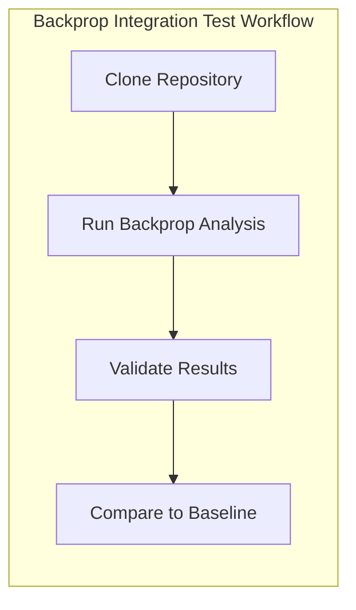

**Essential Integrations:**

| Integration Point | Type | Description |
|-------------------|------|-------------|
| Backprop Tool | Passive | Repository analyzed by Backprop for integration testing |
| npm Registry | Metadata | Package published as `hello_world@1.0.0` |

**Key Technical Requirements:**

| Requirement | Specification |
|-------------|---------------|
| Node.js Runtime | Required (version not specified) |
| npm Package Manager | v7+ (lockfileVersion 3) |
| Network Port | 3000 (hardcoded) |
| Host Binding | 127.0.0.1 (localhost only) |

#### Implementation Boundaries

**System Boundaries:**

| Boundary | Scope |
|----------|-------|
| Network | Localhost only (127.0.0.1) |
| Protocol | HTTP only (no HTTPS) |
| Response Type | Plain text only |

**User Groups Covered:**

| User Group | Access Level |
|------------|--------------|
| Backprop Developers | Full repository access for analysis |
| QA Engineers | Read-only for test execution |

**Geographic/Market Coverage:**

Not applicable—this is an internal test fixture with no geographic or market considerations.

**Data Domains Included:**

| Data Domain | Files | Purpose |
|-------------|-------|---------|
| Industry Categories | `industry.csv` (44 entries) | Reference data fixture for CSV parsing validation |
| Package Metadata | `package.json`, `package-lock.json` | NPM ecosystem integration testing |

### 1.3.2 Out-of-Scope

#### Explicitly Excluded Features

| Feature | Exclusion Rationale |
|---------|---------------------|
| URL Routing | Not required for test fixture purpose |
| Request Parsing | No need to interpret request content |
| Dynamic Responses | Predictable output is a requirement |
| Authentication | No security requirements for test fixture |
| Authorization | No access control needed |
| Database Connectivity | No data persistence requirements |
| External API Integration | Isolation is a design goal |
| Error Handling | Simplicity prioritized over robustness |
| Input Validation | No user input processing |
| Logging Framework | Minimal startup message sufficient |
| Configuration Management | Hardcoded values intentional |
| HTTPS/TLS | Security not applicable for localhost test |

#### Future Phase Considerations

This project is **explicitly not intended for evolution**. The "Do not touch!" directive in `README.md` indicates that future enhancements are not planned or desired. The project's value lies in its unchanging nature.

| Consideration | Status |
|---------------|--------|
| Feature Additions | Not Planned |
| Dependency Updates | Not Planned |
| Production Deployment | Explicitly Excluded |
| Framework Migration | Not Applicable |

#### Integration Points Not Covered

| Integration | Reason for Exclusion |
|-------------|----------------------|
| CI/CD Pipelines | No automated build/deploy requirements |
| Container Orchestration | No deployment infrastructure |
| Monitoring Systems | No production monitoring needed |
| Log Aggregation | No logging infrastructure |
| Secret Management | No secrets to manage |

#### Unsupported Use Cases

| Use Case | Support Status | Alternative |
|----------|----------------|-------------|
| Production Web Serving | ❌ Not Supported | Use production-grade frameworks |
| API Development | ❌ Not Supported | Use Express.js, Fastify, etc. |
| Multi-user Access | ❌ Not Supported | N/A—localhost only |
| Concurrent Request Handling | ❌ Not Optimized | Use production server |
| Custom Response Content | ❌ Not Supported | Modify source (violates "Do not touch!") |

### 1.3.3 Repository Content Classification

The repository contains intentionally diverse file types for comprehensive Backprop testing:

| Content Type | Files | Functional Status |
|--------------|-------|-------------------|
| Functional Code | `server.js` | ✅ Executable |
| Duplicate Code | `server - Copy.js` | ✅ Executable (duplicate) |
| Java Stubs | `LoginTest.java`, `LoginTest - Copy.java` | ❌ Non-compilable (syntax errors) |
| Data Files | `industry.csv`, `industry - Copy.csv` | ✅ Valid CSV |
| Empty Files | `test.py.txt`, `test.py - Copy.txt`, `test.txt.txt` | ⚪ Intentionally empty |
| Configuration | `package.json`, `package-lock.json` | ✅ Valid JSON |
| Documentation | `README.md` | ✅ Valid Markdown |

---

## 1.4 References

#### Files Examined

| File Path | Relevance |
|-----------|-----------|
| `README.md` | Project identification, purpose statement, and stability directive |
| `package.json` | NPM package metadata, version, author, license, and dependency confirmation |
| `package-lock.json` | Dependency lock verification (confirms zero external dependencies) |
| `server.js` | Primary application implementation—HTTP server source code |
| `server - Copy.js` | Duplicate file for Backprop duplicate detection testing |
| `LoginTest.java` | Java stub fixture for multi-language analysis testing |
| `industry.csv` | Reference data fixture containing 44 industry categories |

#### Repository Structure

| Path | Type | Contents |
|------|------|----------|
| `/` (root) | Directory | 12 files, 0 subdirectories (flat structure) |

# 2. Product Requirements

## 2.1 Feature Catalog

This section catalogs the discrete, testable features of the `hao-backprop-test` repository. Given the project's nature as a deliberately minimal test fixture for Backprop integration testing, the feature set is intentionally limited and focused.

### 2.1.1 Feature Overview

The repository implements two primary feature categories:

| Category | Feature Count | Purpose |
|----------|---------------|---------|
| Core Functionality | 1 | HTTP server capability |
| Test Infrastructure | 1 | Multi-format file diversity |

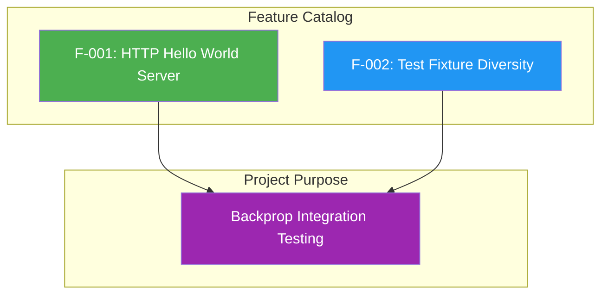

---

### 2.1.2 Feature F-001: HTTP Hello World Server

#### Feature Metadata

| Attribute | Value |
|-----------|-------|
| **Feature ID** | F-001 |
| **Feature Name** | HTTP Hello World Server |
| **Category** | Core Functionality |
| **Priority Level** | Critical |
| **Status** | Completed |

#### Description

| Aspect | Details |
|--------|---------|
| **Overview** | A minimal HTTP server that responds to all incoming requests with a plain text "Hello, World!" message |
| **Business Value** | Provides a stable, predictable baseline for validating Backprop's code analysis capabilities against known expected behavior |
| **User Benefits** | Enables Backprop developers and QA engineers to execute integration tests with deterministic outcomes |
| **Technical Context** | Implemented in `server.js` using Node.js built-in `http` module with CommonJS module system |

#### Implementation Details

| Technical Aspect | Specification |
|------------------|---------------|
| Source File | `server.js` (14 lines) |
| Runtime | Node.js |
| HTTP Module | Built-in `http` (CommonJS `require`) |
| Hostname | `127.0.0.1` (localhost only) |
| Port | `3000` (hardcoded) |
| Response Code | HTTP 200 |
| Content-Type | `text/plain` |
| Response Body | `Hello, World!\n` |

#### Dependencies

| Dependency Type | Dependencies |
|-----------------|--------------|
| **Prerequisite Features** | None |
| **System Dependencies** | Node.js runtime environment |
| **External Dependencies** | None (zero npm packages) |
| **Integration Requirements** | Network port 3000 available on localhost |

---

### 2.1.3 Feature F-002: Test Fixture Diversity

#### Feature Metadata

| Attribute | Value |
|-----------|-------|
| **Feature ID** | F-002 |
| **Feature Name** | Test Fixture Diversity |
| **Category** | Test Infrastructure |
| **Priority Level** | High |
| **Status** | Completed |

#### Description

| Aspect | Details |
|--------|---------|
| **Overview** | A collection of intentionally diverse file types designed to enable comprehensive Backprop integration testing across multiple formats |
| **Business Value** | Validates Backprop's ability to analyze, parse, and handle various file types including functional code, broken code, data files, and edge cases |
| **User Benefits** | Enables thorough testing of multi-language and multi-format analysis capabilities without requiring multiple separate test repositories |
| **Technical Context** | Flat repository structure containing JavaScript, Java, CSV, and empty placeholder files with intentional duplicates |

#### File Inventory

| File Type | Files | Status |
|-----------|-------|--------|
| Functional JavaScript | `server.js` | ✅ Executable |
| Duplicate JavaScript | `server - Copy.js` | ✅ Identical duplicate |
| Java Stubs | `LoginTest.java`, `LoginTest - Copy.java` | ❌ Intentionally non-compilable |
| CSV Data | `industry.csv`, `industry - Copy.csv` | ✅ Valid (44 entries) |
| Empty Placeholders | `test.py.txt`, `test.py - Copy.txt`, `test.txt.txt` | ⚪ 0 bytes each |
| Configuration | `package.json`, `package-lock.json` | ✅ Valid JSON |
| Documentation | `README.md` | ✅ Valid Markdown |

#### Dependencies

| Dependency Type | Dependencies |
|-----------------|--------------|
| **Prerequisite Features** | None |
| **System Dependencies** | File system access |
| **External Dependencies** | None |
| **Integration Requirements** | Backprop tool for analysis consumption |

---

## 2.2 Functional Requirements

### 2.2.1 Feature F-001 Requirements

#### Requirements Summary Table

| Req ID | Description | Priority | Complexity |
|--------|-------------|----------|------------|
| F-001-RQ-001 | HTTP Server Startup | Must-Have | Low |
| F-001-RQ-002 | HTTP Request Response | Must-Have | Low |
| F-001-RQ-003 | Response Consistency | Must-Have | Low |
| F-001-RQ-004 | Startup Logging | Should-Have | Low |

---

#### F-001-RQ-001: HTTP Server Startup

**Requirement Details**

| Attribute | Specification |
|-----------|---------------|
| **Requirement ID** | F-001-RQ-001 |
| **Description** | The system shall start an HTTP server bound to localhost on port 3000 when executed |
| **Priority** | Must-Have |
| **Complexity** | Low |

**Acceptance Criteria**

| Criteria ID | Criterion |
|-------------|-----------|
| AC-001 | Server binds to `127.0.0.1:3000` without error |
| AC-002 | Server remains running until manually terminated |
| AC-003 | Server accepts incoming HTTP connections |

**Technical Specifications**

| Aspect | Specification |
|--------|---------------|
| **Input Parameters** | None (command: `node server.js`) |
| **Output/Response** | Server process running, port bound |
| **Performance Criteria** | Server starts within 1 second |
| **Data Requirements** | None |

**Validation Rules**

| Rule Type | Specification |
|-----------|---------------|
| **Business Rules** | Server must bind to localhost only (no external network access) |
| **Data Validation** | Not applicable |
| **Security Requirements** | Localhost-only binding prevents external access |
| **Compliance Requirements** | None |

---

#### F-001-RQ-002: HTTP Request Response

**Requirement Details**

| Attribute | Specification |
|-----------|---------------|
| **Requirement ID** | F-001-RQ-002 |
| **Description** | The system shall respond to any HTTP request with a plain text "Hello, World!" message |
| **Priority** | Must-Have |
| **Complexity** | Low |

**Acceptance Criteria**

| Criteria ID | Criterion |
|-------------|-----------|
| AC-001 | All HTTP methods (GET, POST, PUT, DELETE, etc.) receive identical response |
| AC-002 | All URL paths receive identical response |
| AC-003 | Response status code is HTTP 200 |
| AC-004 | Response body is exactly `Hello, World!\n` |

**Technical Specifications**

| Aspect | Specification |
|--------|---------------|
| **Input Parameters** | Any HTTP request to `127.0.0.1:3000` |
| **Output/Response** | HTTP 200, `Content-Type: text/plain`, Body: `Hello, World!\n` |
| **Performance Criteria** | Response within 100ms |
| **Data Requirements** | None |

**Validation Rules**

| Rule Type | Specification |
|-----------|---------------|
| **Business Rules** | No URL routing; all requests treated identically |
| **Data Validation** | Not applicable—no request parsing |
| **Security Requirements** | No authentication required |
| **Compliance Requirements** | None |

---

#### F-001-RQ-003: Response Consistency

**Requirement Details**

| Attribute | Specification |
|-----------|---------------|
| **Requirement ID** | F-001-RQ-003 |
| **Description** | The system shall return identical responses for every request to ensure predictable test outcomes |
| **Priority** | Must-Have |
| **Complexity** | Low |

**Acceptance Criteria**

| Criteria ID | Criterion |
|-------------|-----------|
| AC-001 | Response headers are identical across all requests |
| AC-002 | Response body is identical across all requests |
| AC-003 | No variation based on request content, headers, or timing |

**Technical Specifications**

| Aspect | Specification |
|--------|---------------|
| **Input Parameters** | Any HTTP request |
| **Output/Response** | Deterministic: HTTP 200, `text/plain`, `Hello, World!\n` |
| **Performance Criteria** | Consistent response times (< 100ms variance) |
| **Data Requirements** | Static response—no external data sources |

**Validation Rules**

| Rule Type | Specification |
|-----------|---------------|
| **Business Rules** | Predictability is critical for baseline testing |
| **Data Validation** | Not applicable |
| **Security Requirements** | Not applicable |
| **Compliance Requirements** | None |

---

#### F-001-RQ-004: Startup Logging

**Requirement Details**

| Attribute | Specification |
|-----------|---------------|
| **Requirement ID** | F-001-RQ-004 |
| **Description** | The system shall log a startup confirmation message to the console upon successful initialization |
| **Priority** | Should-Have |
| **Complexity** | Low |

**Acceptance Criteria**

| Criteria ID | Criterion |
|-------------|-----------|
| AC-001 | Console displays: `Server running at http://127.0.0.1:3000/` |
| AC-002 | Message appears immediately after server binds to port |

**Technical Specifications**

| Aspect | Specification |
|--------|---------------|
| **Input Parameters** | None |
| **Output/Response** | Console output (stdout) |
| **Performance Criteria** | Message appears within 1 second of startup |
| **Data Requirements** | None |

**Validation Rules**

| Rule Type | Specification |
|-----------|---------------|
| **Business Rules** | Confirms successful startup for test automation |
| **Data Validation** | Not applicable |
| **Security Requirements** | Not applicable |
| **Compliance Requirements** | None |

---

### 2.2.2 Feature F-002 Requirements

#### Requirements Summary Table

| Req ID | Description | Priority | Complexity |
|--------|-------------|----------|------------|
| F-002-RQ-001 | File Type Diversity | Must-Have | Low |
| F-002-RQ-002 | Duplicate File Presence | Should-Have | Low |
| F-002-RQ-003 | Error Case Fixtures | Should-Have | Low |
| F-002-RQ-004 | Repository Stability | Must-Have | Low |

---

#### F-002-RQ-001: File Type Diversity

**Requirement Details**

| Attribute | Specification |
|-----------|---------------|
| **Requirement ID** | F-002-RQ-001 |
| **Description** | The repository shall contain diverse file types to enable comprehensive format validation testing |
| **Priority** | Must-Have |
| **Complexity** | Low |

**Acceptance Criteria**

| Criteria ID | Criterion |
|-------------|-----------|
| AC-001 | Repository contains JavaScript files (`.js`) |
| AC-002 | Repository contains Java files (`.java`) |
| AC-003 | Repository contains CSV data files (`.csv`) |
| AC-004 | Repository contains text placeholder files (`.txt`) |
| AC-005 | Repository contains JSON configuration files |
| AC-006 | Repository contains Markdown documentation |

**Technical Specifications**

| Aspect | Specification |
|--------|---------------|
| **Input Parameters** | Not applicable (static repository content) |
| **Output/Response** | 12 files across 6 file types |
| **Performance Criteria** | Not applicable |
| **Data Requirements** | Flat file structure (root directory only) |

**Validation Rules**

| Rule Type | Specification |
|-----------|---------------|
| **Business Rules** | Files must remain unchanged to preserve test baseline |
| **Data Validation** | Not applicable |
| **Security Requirements** | Not applicable |
| **Compliance Requirements** | None |

---

#### F-002-RQ-002: Duplicate File Presence

**Requirement Details**

| Attribute | Specification |
|-----------|---------------|
| **Requirement ID** | F-002-RQ-002 |
| **Description** | The repository shall contain duplicate file pairs to enable duplicate detection testing |
| **Priority** | Should-Have |
| **Complexity** | Low |

**Acceptance Criteria**

| Criteria ID | Criterion |
|-------------|-----------|
| AC-001 | `server - Copy.js` is byte-identical to `server.js` |
| AC-002 | `LoginTest - Copy.java` is byte-identical to `LoginTest.java` |
| AC-003 | `industry - Copy.csv` is byte-identical to `industry.csv` |
| AC-004 | `test.py - Copy.txt` is byte-identical to `test.py.txt` |

**Technical Specifications**

| Aspect | Specification |
|--------|---------------|
| **Input Parameters** | Not applicable |
| **Output/Response** | 4 duplicate file pairs |
| **Performance Criteria** | Not applicable |
| **Data Requirements** | Exact byte-for-byte duplication |

**Validation Rules**

| Rule Type | Specification |
|-----------|---------------|
| **Business Rules** | Duplicates enable Backprop duplicate detection validation |
| **Data Validation** | Checksums must match between originals and copies |
| **Security Requirements** | Not applicable |
| **Compliance Requirements** | None |

---

#### F-002-RQ-003: Error Case Fixtures

**Requirement Details**

| Attribute | Specification |
|-----------|---------------|
| **Requirement ID** | F-002-RQ-003 |
| **Description** | The repository shall contain intentionally malformed files to test error handling capabilities |
| **Priority** | Should-Have |
| **Complexity** | Low |

**Acceptance Criteria**

| Criteria ID | Criterion |
|-------------|-----------|
| AC-001 | Java files contain syntax errors (non-compilable) |
| AC-002 | Empty files (0 bytes) are present |
| AC-003 | Files with misleading extensions exist (`.py.txt`) |

**Technical Specifications**

| Aspect | Specification |
|--------|---------------|
| **Input Parameters** | Not applicable |
| **Output/Response** | Error-inducing test fixtures |
| **Performance Criteria** | Not applicable |
| **Data Requirements** | Intentional defects preserved |

**Java Stub Details (LoginTest.java)**

| Aspect | Value |
|--------|-------|
| Package | `com.blitzyTest` |
| Defect | Invalid token `Web` without statement termination |
| Status | Intentionally non-compilable |

**Validation Rules**

| Rule Type | Specification |
|-----------|---------------|
| **Business Rules** | Error cases validate Backprop graceful degradation |
| **Data Validation** | Files must remain malformed |
| **Security Requirements** | Not applicable |
| **Compliance Requirements** | None |

---

#### F-002-RQ-004: Repository Stability

**Requirement Details**

| Attribute | Specification |
|-----------|---------------|
| **Requirement ID** | F-002-RQ-004 |
| **Description** | The repository codebase shall remain unchanged to preserve test baseline integrity |
| **Priority** | Must-Have |
| **Complexity** | Low |

**Acceptance Criteria**

| Criteria ID | Criterion |
|-------------|-----------|
| AC-001 | Zero code modifications from baseline state |
| AC-002 | README.md warning "Do not touch!" remains visible |
| AC-003 | All files maintain original content and metadata |

**Technical Specifications**

| Aspect | Specification |
|--------|---------------|
| **Input Parameters** | Not applicable |
| **Output/Response** | Immutable repository state |
| **Performance Criteria** | Not applicable |
| **Data Requirements** | Version control preserves baseline |

**Validation Rules**

| Rule Type | Specification |
|-----------|---------------|
| **Business Rules** | Immutability is the primary value proposition |
| **Data Validation** | Git diff should show zero changes |
| **Security Requirements** | Not applicable |
| **Compliance Requirements** | None |

---

## 2.3 Feature Relationships

### 2.3.1 Feature Dependency Map

The feature set is intentionally minimal with no interdependencies:

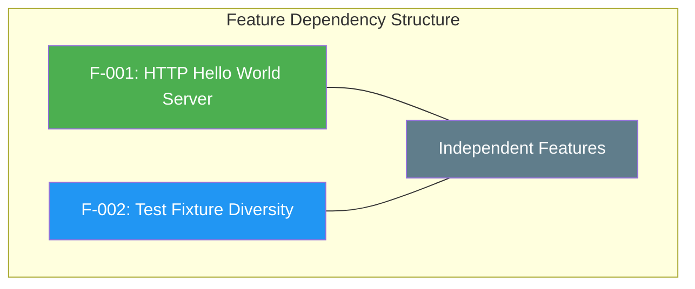

| Feature | Depends On | Depended By |
|---------|------------|-------------|
| F-001 | None | None |
| F-002 | None | None |

**Design Rationale:** Features are deliberately independent to ensure isolation during testing. No coupling exists between the HTTP server functionality and the test fixture files.

### 2.3.2 Integration Points

| Integration Point | Type | Feature(s) | Description |
|-------------------|------|------------|-------------|
| Backprop Tool | Passive Analysis | F-001, F-002 | Repository serves as analysis target |
| npm Registry | Package Metadata | F-001 | Package published as `hello_world@1.0.0` |

### 2.3.3 Shared Components

| Component | Features Using | Purpose |
|-----------|----------------|---------|
| None | N/A | Flat structure with no shared modules |

**Structural Observation:** The repository employs a flat file structure with no subdirectories, module imports, or shared utilities. Each file is self-contained and independent.

### 2.3.4 Common Services

| Service | Features Using | Description |
|---------|----------------|-------------|
| Node.js Runtime | F-001 | Required for server execution |
| File System | F-002 | Required for fixture access |

---

## 2.4 Implementation Considerations

### 2.4.1 Feature F-001 Considerations

#### Technical Constraints

| Constraint | Description | Impact |
|------------|-------------|--------|
| Localhost-only | Server binds to `127.0.0.1` | No external network access possible |
| Fixed Port | Port 3000 hardcoded | Port conflicts require manual resolution |
| No Routing | Single response for all URLs | Cannot serve multiple endpoints |
| No HTTPS | HTTP only | Not suitable for secure communications |

#### Performance Requirements

| Metric | Requirement | Rationale |
|--------|-------------|-----------|
| Startup Time | < 1 second | Quick test iteration |
| Response Time | < 100ms | Predictable baseline measurements |
| Memory Footprint | Minimal | No memory leaks in test runs |

#### Scalability Considerations

| Aspect | Status | Notes |
|--------|--------|-------|
| Horizontal Scaling | Not Applicable | Single localhost instance by design |
| Vertical Scaling | Not Applicable | Minimal resource requirements |
| Load Handling | Not Optimized | Test fixture, not production server |

#### Security Implications

| Security Aspect | Status | Notes |
|-----------------|--------|-------|
| Network Exposure | Mitigated | Localhost binding prevents external access |
| Authentication | Not Implemented | Not required for test fixture |
| Input Validation | Not Implemented | No request parsing performed |
| HTTPS/TLS | Not Implemented | Not required for localhost testing |

#### Maintenance Requirements

| Requirement | Description |
|-------------|-------------|
| Code Changes | Prohibited ("Do not touch!" directive) |
| Dependency Updates | Not applicable (zero dependencies) |
| Version Updates | Not planned (frozen at 1.0.0) |

---

### 2.4.2 Feature F-002 Considerations

#### Technical Constraints

| Constraint | Description | Impact |
|------------|-------------|--------|
| Flat Structure | No subdirectories | All files at root level |
| Fixed Content | Files must remain unchanged | Baseline integrity depends on immutability |
| Intentional Defects | Java files non-compilable | Cannot be used as functional code |

#### Performance Requirements

| Metric | Requirement | Rationale |
|--------|-------------|-----------|
| File Access | Standard filesystem speed | No special requirements |
| Repository Clone | Minimal size (< 1MB) | Quick test setup |

#### Scalability Considerations

| Aspect | Status | Notes |
|--------|--------|-------|
| File Count | Fixed | 12 files by design |
| File Growth | Prohibited | Immutability requirement |

#### Security Implications

| Security Aspect | Status | Notes |
|-----------------|--------|-------|
| Sensitive Data | None | No credentials or secrets |
| CSV Data | Reference only | Industry categories—non-sensitive |

#### Maintenance Requirements

| Requirement | Description |
|-------------|-------------|
| File Modifications | Prohibited |
| Addition of Files | Prohibited |
| Deletion of Files | Prohibited |

---

## 2.5 Traceability Matrix

### 2.5.1 Requirements to Features

| Requirement ID | Feature ID | Description |
|----------------|------------|-------------|
| F-001-RQ-001 | F-001 | HTTP Server Startup |
| F-001-RQ-002 | F-001 | HTTP Request Response |
| F-001-RQ-003 | F-001 | Response Consistency |
| F-001-RQ-004 | F-001 | Startup Logging |
| F-002-RQ-001 | F-002 | File Type Diversity |
| F-002-RQ-002 | F-002 | Duplicate File Presence |
| F-002-RQ-003 | F-002 | Error Case Fixtures |
| F-002-RQ-004 | F-002 | Repository Stability |

### 2.5.2 Requirements to Success Criteria

| Requirement ID | Success Criteria | Target |
|----------------|------------------|--------|
| F-001-RQ-001 | Server starts successfully | 100% startup success |
| F-001-RQ-002 | Response content | Identical `Hello, World!\n` |
| F-001-RQ-003 | Response consistency | 100% identical responses |
| F-002-RQ-004 | Code changes since baseline | Zero modifications |

### 2.5.3 Requirements to Technical Specifications

| Requirement ID | Implementation File | Section Reference |
|----------------|---------------------|-------------------|
| F-001-RQ-001 | `server.js` | Lines 3-4 (hostname, port) |
| F-001-RQ-002 | `server.js` | Lines 5-9 (request handler) |
| F-001-RQ-004 | `server.js` | Lines 12-14 (console.log) |
| F-002-RQ-001 | Repository root | All 12 files |
| F-002-RQ-003 | `LoginTest.java` | Invalid syntax at line 5 |

---

## 2.6 Non-Requirements (Explicitly Excluded)

The following capabilities are **explicitly out of scope** and shall not be implemented:

| Excluded Capability | Rationale |
|---------------------|-----------|
| URL Routing | Not required for test fixture purpose |
| Request Parsing | No need to interpret request content |
| Dynamic Responses | Predictable output is a requirement |
| Authentication/Authorization | No security requirements |
| Database Connectivity | No data persistence requirements |
| External API Integration | Isolation is a design goal |
| Error Handling | Simplicity prioritized over robustness |
| Input Validation | No user input processing |
| HTTPS/TLS | Security not applicable for localhost |
| Configuration Management | Hardcoded values intentional |
| CI/CD Pipelines | No automated build/deploy requirements |
| Container Orchestration | No deployment infrastructure |
| Monitoring/Logging Framework | Minimal startup message sufficient |

---

## 2.7 Assumptions and Constraints

### 2.7.1 Assumptions

| ID | Assumption | Impact if Invalid |
|----|------------|-------------------|
| A-001 | Node.js runtime is available on test systems | Server cannot execute |
| A-002 | Port 3000 is available on localhost | Server fails to bind |
| A-003 | Backprop tool can analyze repository content | Primary purpose unfulfilled |
| A-004 | Test baseline integrity is maintained | Test results become unreliable |

### 2.7.2 Constraints

| ID | Constraint | Source |
|----|------------|--------|
| C-001 | Repository must remain unchanged | README.md directive |
| C-002 | Zero external dependencies | Design decision |
| C-003 | Localhost-only network binding | Security consideration |
| C-004 | Single-purpose functionality | Test fixture requirement |

---

## 2.8 References

#### Files Examined

| File Path | Relevance |
|-----------|-----------|
| `server.js` | Primary HTTP server implementation (14 lines) |
| `package.json` | NPM package metadata, version, license |
| `package-lock.json` | Dependency verification (zero dependencies) |
| `README.md` | Project purpose and stability directive |
| `industry.csv` | Reference data fixture (44 industry entries) |
| `LoginTest.java` | Java stub fixture (intentionally malformed) |
| `server - Copy.js` | Duplicate file for detection testing |

#### Repository Structure

| Path | Contents |
|------|----------|
| `/` (root) | 12 files, 0 subdirectories (flat structure) |

#### Technical Specification Cross-References

| Section | Relevance |
|---------|-----------|
| 1.1 Executive Summary | Project context and value proposition |
| 1.2 System Overview | Component inventory and success criteria |
| 1.3 Scope | In-scope and out-of-scope capabilities |
| 1.4 References | File inventory and structure |

# 3. Technology Stack

## 3.1 OVERVIEW

The `hao-backprop-test` project employs a deliberately minimal technology stack designed specifically for its role as a stable test fixture for Backprop integration validation. Unlike typical production applications, this system intentionally avoids external dependencies, frameworks, and infrastructure components to ensure predictable, environment-independent behavior.

### 3.1.1 Technology Stack Rationale

The technology choices for this project are governed by the test fixture's core requirements:

| Requirement | Technology Impact |
|-------------|-------------------|
| **Immutability** | Frozen codebase prohibits technology upgrades or changes |
| **Zero Dependencies** | No npm packages eliminates environmental variables from test outcomes |
| **Predictability** | Built-in modules only ensures consistent behavior across environments |
| **Simplicity** | Minimal stack isolates Backprop integration behavior from application complexity |

### 3.1.2 Technology Stack Summary

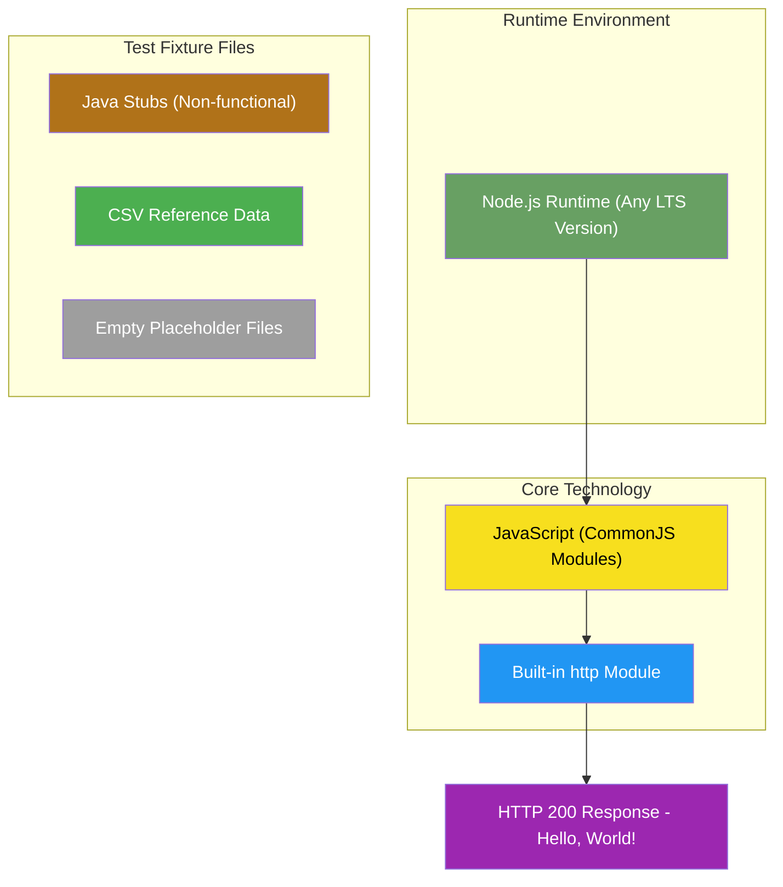

---

## 3.2 PROGRAMMING LANGUAGES

### 3.2.1 Primary Language: JavaScript (Node.js)

JavaScript serves as the sole functional programming language for this project, executed via the Node.js runtime environment.

| Attribute | Specification | Source |
|-----------|---------------|--------|
| **Language** | JavaScript (ECMAScript) | `server.js` |
| **Runtime** | Node.js | Assumption A-001 |
| **Module System** | CommonJS (`require()`) | `server.js` line 1 |
| **Version** | Unspecified (compatible with any recent LTS) | `package.json` |

#### Language Selection Justification

| Criterion | Rationale |
|-----------|-----------|
| **Runtime Availability** | Node.js is ubiquitously available in development and CI environments |
| **Built-in HTTP Support** | Node.js provides a robust HTTP server via its built-in `http` module |
| **Zero Compilation** | JavaScript executes directly without build steps |
| **Ecosystem Stability** | CommonJS module system provides predictable, stable behavior |

#### CommonJS Module Usage

The project uses CommonJS (CJS) module syntax rather than ECMAScript Modules (ESM):

```
const http = require('http');
```

This choice ensures maximum backward compatibility with older Node.js versions while maintaining the project's stability requirements.

### 3.2.2 Secondary Language: Java (Test Fixtures Only)

Java files exist in the repository solely as non-functional test fixtures for validating Backprop's multi-language analysis capabilities.

| Attribute | Specification | Source |
|-----------|---------------|--------|
| **Files** | `LoginTest.java`, `LoginTest - Copy.java` | Repository root |
| **Package** | `com.blitzyTest` | `LoginTest.java` line 1 |
| **Status** | **Intentionally non-compilable** | Invalid syntax on line 7 |
| **Purpose** | Multi-language format validation | Test fixture requirement |

> **Important:** These Java files contain intentional syntax errors and are not designed to be compiled or executed. They serve exclusively as reference artifacts for Backprop's code analysis testing.

### 3.2.3 Node.js Runtime Requirements

| Requirement | Specification | Notes |
|-------------|---------------|-------|
| **Minimum Version** | Any Node.js LTS version | No version-specific APIs used |
| **Recommended Version** | Node.js 24.x LTS "Krypton" or Node.js v22 "Jod" | Current LTS releases |
| **npm Version** | v7.0.0+ | Implied by `lockfileVersion: 3` in `package-lock.json` |

The project's minimal feature set ensures compatibility across a wide range of Node.js versions, as it relies only on the stable `http` module available since Node.js 0.x.

---

## 3.3 FRAMEWORKS & LIBRARIES

### 3.3.1 Framework Philosophy: Zero External Frameworks

This project intentionally uses **no external frameworks**. This architectural decision directly supports the test fixture's core requirements for stability and environmental independence.

| Excluded Framework Type | Rationale | Source |
|-------------------------|-----------|--------|
| Web Frameworks (Express, Koa, Fastify) | Zero dependencies requirement | Constraint C-002 |
| URL Routing | Not required for test fixture purpose | Section 2.6 |
| Authentication/Authorization | No security requirements | Section 2.6 |
| Configuration Management | Hardcoded values intentional | Section 2.6 |
| Logging Frameworks | Minimal startup message sufficient | Section 2.6 |

### 3.3.2 Core Library: Node.js Built-in `http` Module

The sole library dependency is the Node.js built-in `http` module, which is part of the Node.js core distribution and requires no external installation.

| Attribute | Specification |
|-----------|---------------|
| **Module Name** | `http` |
| **Import Method** | `require('http')` |
| **Source** | Node.js core (built-in) |
| **External Installation** | Not required |

#### HTTP Module Capabilities Utilized

| Capability | Usage in Project | Source |
|------------|------------------|--------|
| `http.createServer()` | Creates HTTP server instance | `server.js` line 6 |
| `res.statusCode` | Sets HTTP 200 status code | `server.js` line 7 |
| `res.setHeader()` | Sets `Content-Type: text/plain` | `server.js` line 8 |
| `res.end()` | Sends response body "Hello, World!\n" | `server.js` line 9 |
| `server.listen()` | Binds to 127.0.0.1:3000 | `server.js` line 12 |

### 3.3.3 Framework Selection Justification

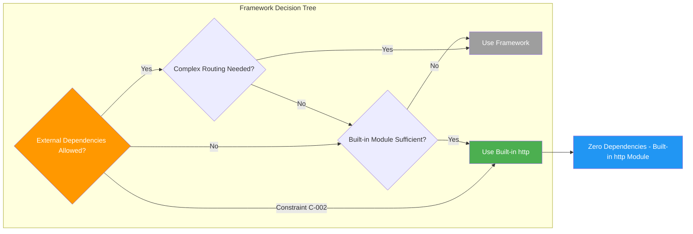

The built-in `http` module was selected because:

1. **Zero Installation**: Ships with every Node.js installation
2. **API Stability**: Stable API unchanged across Node.js versions
3. **Sufficient Functionality**: Provides all required HTTP server capabilities
4. **No Version Conflicts**: Eliminates dependency version management
5. **Environment Independence**: Behavior consistent across all test environments

---

## 3.4 OPEN SOURCE DEPENDENCIES

### 3.4.1 Dependency Status: Zero External Dependencies

The project maintains **zero external dependencies** as an explicit design decision documented in Constraint C-002.

| Dependency Type | Count | Evidence |
|-----------------|-------|----------|
| Production Dependencies | 0 | No `dependencies` field in `package.json` |
| Development Dependencies | 0 | No `devDependencies` field in `package.json` |
| Peer Dependencies | 0 | No `peerDependencies` field in `package.json` |
| Optional Dependencies | 0 | No `optionalDependencies` field in `package.json` |

### 3.4.2 NPM Package Metadata

Despite having no dependencies, the project maintains valid npm package metadata:

| Field | Value | Source |
|-------|-------|--------|
| Package Name | `hello_world` | `package.json` line 2 |
| Version | `1.0.0` | `package.json` line 3 |
| Description | *(empty)* | `package.json` line 4 |
| Entry Point | `index.js` (declared but absent) | `package.json` line 5 |
| License | MIT | `package.json` line 10 |
| Author | hxu | `package.json` line 9 |

### 3.4.3 Package Lock Analysis

The `package-lock.json` file confirms the zero-dependency architecture:

| Field | Value | Implication |
|-------|-------|-------------|
| `lockfileVersion` | 3 | Indicates npm v7.0.0 or later was used |
| `packages` | Contains only root package | No dependency tree |
| `dependencies` | *(absent)* | No locked dependencies |

### 3.4.4 Dependency Management Strategy

| Aspect | Strategy | Rationale |
|--------|----------|-----------|
| **Updates** | None permitted | Constraint C-001: Repository must remain unchanged |
| **Vulnerability Scanning** | Not applicable | No third-party code to scan |
| **License Compliance** | MIT license only | Single package, single license |
| **Version Pinning** | Not applicable | No dependencies to pin |

---

## 3.5 THIRD-PARTY SERVICES

### 3.5.1 External Service Integration: None

The project explicitly excludes all third-party service integrations as part of its isolation requirements.

| Service Category | Status | Rationale |
|------------------|--------|-----------|
| External APIs | **Excluded** | Isolation is a design goal |
| Authentication Services (Auth0, Okta) | **Excluded** | No security requirements |
| Cloud Services (AWS, GCP, Azure) | **Excluded** | No deployment infrastructure |
| Monitoring Tools (Datadog, New Relic) | **Excluded** | Minimal startup message sufficient |
| Payment Gateways | **Excluded** | Not applicable |
| Email Services | **Excluded** | Not applicable |
| Analytics Platforms | **Excluded** | Not applicable |

### 3.5.2 Integration Architecture

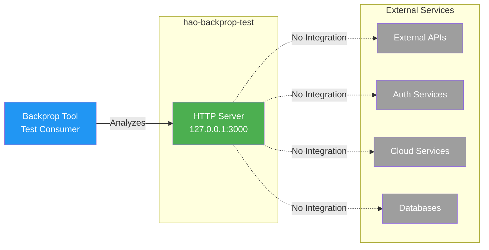

### 3.5.3 Backprop Integration (Test Consumer Only)

While the project integrates with the Backprop tool, this is a **passive relationship** where Backprop analyzes the repository content rather than the application calling Backprop APIs:

| Aspect | Description |
|--------|-------------|
| **Integration Type** | Passive (repository is analyzed by Backprop) |
| **Direction** | Backprop → Repository (read-only) |
| **Runtime Dependency** | None (integration occurs at repository level) |
| **API Calls** | None from the application |

---

## 3.6 DATABASES & STORAGE

### 3.6.1 Database Connectivity: Explicitly Excluded

The project has no database requirements and explicitly excludes database connectivity as documented in Section 2.6.

| Database Category | Status | Rationale |
|-------------------|--------|-----------|
| Relational (PostgreSQL, MySQL) | **Excluded** | No data persistence requirements |
| NoSQL (MongoDB, Redis) | **Excluded** | No data persistence requirements |
| In-Memory Caches | **Excluded** | Not applicable for test fixture |
| Cloud Databases (DynamoDB, Firestore) | **Excluded** | No cloud infrastructure |

### 3.6.2 Data Persistence Strategy: None

| Aspect | Implementation |
|--------|----------------|
| **Session Storage** | Not implemented |
| **User Data** | Not applicable |
| **Application State** | Stateless (each request independent) |
| **Caching** | Not implemented |
| **File Storage** | Not implemented |

### 3.6.3 Static Data Files (Reference Only)

The repository contains CSV files that serve as test fixtures, not as application data stores:

| File | Format | Content | Purpose |
|------|--------|---------|---------|
| `industry.csv` | Single-column CSV | 44 industry category labels | Reference data for CSV parsing validation |
| `industry - Copy.csv` | Duplicate CSV | Identical content + trailing blank line | Duplicate file detection testing |

These files are read-only test artifacts and are not accessed by the running HTTP server application.

---

## 3.7 DEVELOPMENT & DEPLOYMENT

### 3.7.1 Development Environment

The project requires minimal development tooling:

| Tool | Requirement | Purpose |
|------|-------------|---------|
| **Node.js** | LTS version (22.x or 24.x recommended) | JavaScript runtime execution |
| **npm** | v7.0.0+ (ships with Node.js) | Package metadata validation |
| **Text Editor** | Any | Code viewing (modifications prohibited) |
| **Terminal** | Any | Server execution |

### 3.7.2 Build System: None Required

The project has **no build system** by design:

| Build Aspect | Status | Rationale |
|--------------|--------|-----------|
| Transpilation (Babel, TypeScript) | Not required | Native JavaScript only |
| Bundling (Webpack, Rollup) | Not required | Single file application |
| Minification | Not required | Development/test use only |
| Asset Compilation | Not required | No frontend assets |
| Code Generation | Not required | No generated code |

### 3.7.3 Execution Model

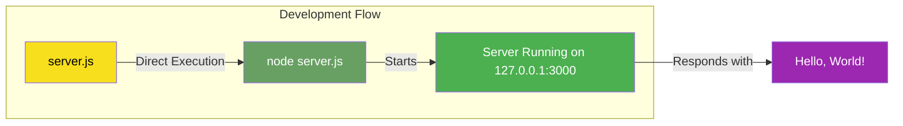

**Server Startup Command:**
```bash
node server.js
```

**Expected Console Output:**
```
Server running at http://127.0.0.1:3000/
```

### 3.7.4 Test Infrastructure

The project includes a placeholder test script that intentionally fails:

| Script | Command | Behavior |
|--------|---------|----------|
| `test` | `echo "Error: no test specified" && exit 1` | Exits with error code 1 |

This intentional failure prevents accidental CI execution and signals that automated testing is not implemented for this test fixture.

### 3.7.5 Containerization: Explicitly Excluded

| Container Technology | Status | Source |
|----------------------|--------|--------|
| Docker | **Excluded** | Section 2.6 |
| Docker Compose | **Excluded** | Section 2.6 |
| Kubernetes | **Excluded** | Section 2.6 |
| Container Registries | **Excluded** | Section 2.6 |

The project has no `Dockerfile`, `docker-compose.yml`, or container configuration files.

### 3.7.6 CI/CD Pipeline: Explicitly Excluded

| CI/CD Technology | Status | Source |
|------------------|--------|--------|
| GitHub Actions | **Excluded** | Section 2.6 |
| GitLab CI | **Excluded** | Section 2.6 |
| Jenkins | **Excluded** | Section 2.6 |
| CircleCI | **Excluded** | Section 2.6 |

The project has no CI/CD configuration files (`.github/workflows`, `.gitlab-ci.yml`, `Jenkinsfile`, etc.).

### 3.7.7 Infrastructure as Code: Not Applicable

| IaC Technology | Status |
|----------------|--------|
| Terraform | Not present |
| CloudFormation | Not present |
| Pulumi | Not present |
| Ansible | Not present |

---

## 3.8 SECURITY CONSIDERATIONS

### 3.8.1 Network Security

| Security Aspect | Implementation | Status |
|-----------------|----------------|--------|
| **Network Binding** | `127.0.0.1` (localhost only) | ✓ Mitigated |
| **External Access** | Prevented by localhost binding | ✓ Secured |
| **HTTPS/TLS** | Not implemented | N/A (localhost only) |
| **Port Exposure** | Port 3000 (localhost) | ✓ Local only |

### 3.8.2 Application Security

| Security Aspect | Status | Rationale |
|-----------------|--------|-----------|
| Input Validation | Not implemented | No request parsing performed |
| Authentication | Not implemented | Test fixture, not production |
| Authorization | Not implemented | Single response, no protected resources |
| SQL Injection | Not applicable | No database |
| XSS Prevention | Not applicable | Plain text response only |
| CSRF Protection | Not implemented | No state modification |

### 3.8.3 Dependency Security

| Security Aspect | Status | Rationale |
|-----------------|--------|-----------|
| Dependency Vulnerabilities | Not applicable | Zero dependencies |
| Supply Chain Attacks | Mitigated | No external packages |
| License Compliance | MIT only | Single package license |
| Audit Requirements | None | No third-party code |

---

## 3.9 DEFAULT TECHNOLOGY STACK COMPARISON

The following table compares the user-provided default technology stack against the actual implementation:

| Default Component | Actual Implementation | Status | Notes |
|-------------------|----------------------|--------|-------|
| **Cloud Platform:** AWS | None | ❌ Not Applicable | No cloud deployment |
| **Containerization:** Docker | None | ❌ Not Applicable | Explicitly excluded |
| **Infrastructure as Code:** Terraform | None | ❌ Not Applicable | No infrastructure |
| **CI/CD:** GitHub Actions | None | ❌ Not Applicable | Explicitly excluded |
| **Primary Language:** Python | JavaScript (Node.js) | ❌ Different | Runtime language |
| **Framework:** Flask | Built-in `http` module | ❌ Different | No external frameworks |
| **Authentication:** Auth0 | None | ❌ Not Applicable | No authentication |
| **Database:** MongoDB | None | ❌ Not Applicable | No persistence |
| **AI Framework:** Langchain | None | ❌ Not Applicable | No AI capabilities |
| **Frontend:** React/TypeScript | None | ❌ Not Applicable | Server-only |
| **CSS Framework:** TailwindCSS | None | ❌ Not Applicable | No frontend |
| **Mobile:** React-Native | None | ❌ Not Applicable | No mobile |
| **Native Apps:** Swift/Kotlin | None | ❌ Not Applicable | No native apps |

> **Important:** The default technology stack is designed for production applications and is **not applicable** to this test fixture project. The minimal technology stack is an intentional design choice to support the project's role as a stable, predictable test artifact for Backprop integration validation.

---

## 3.10 TECHNOLOGY STACK CONSTRAINTS

### 3.10.1 Immutability Constraints

Per Constraint C-001, the technology stack cannot be modified:

| Prohibited Action | Impact |
|-------------------|--------|
| Node.js version pinning | Cannot add `engines` field to `package.json` |
| Dependency addition | Cannot add `dependencies` to `package.json` |
| Framework adoption | Cannot replace `http` module with Express/Koa |
| Build tool integration | Cannot add bundlers or transpilers |
| Test framework addition | Cannot implement Jest, Mocha, etc. |

### 3.10.2 Compatibility Guarantees

| Aspect | Guarantee |
|--------|-----------|
| **Node.js Compatibility** | Any LTS version with `http` module support |
| **Operating System** | Any platform supporting Node.js (Windows, macOS, Linux) |
| **Architecture** | Any architecture supported by Node.js (x64, ARM64, etc.) |
| **npm Compatibility** | npm v7.0.0+ for lockfile v3 parsing |

---

## 3.11 REFERENCES

### 3.11.1 Repository Files Examined

| File Path | Relevance |
|-----------|-----------|
| `server.js` | Primary HTTP server implementation, module imports, runtime configuration |
| `package.json` | NPM package metadata, version, license, scripts |
| `package-lock.json` | Dependency lock verification, npm version inference |
| `README.md` | Project purpose and usage directives |
| `LoginTest.java` | Java test fixture for multi-language validation |
| `industry.csv` | CSV reference data for format testing |

### 3.11.2 Technical Specification Sections Referenced

| Section | Content Used |
|---------|--------------|
| 1.1 Executive Summary | Project overview, value proposition, zero dependency rationale |
| 1.2 System Overview | Technical approach, core components, success criteria |
| 2.4 Implementation Considerations | Technical constraints, security implications |
| 2.6 Non-Requirements | Explicitly excluded capabilities and technologies |
| 2.7 Assumptions and Constraints | Runtime assumptions, design constraints |

### 3.11.3 External Resources

| Resource | Information Retrieved |
|----------|----------------------|
| nodejs.org | Node.js LTS version information (v22 "Jod", v24 "Krypton") |
| GitHub - nodejs/Release | Node.js release lifecycle and LTS schedule |

# 4. Process Flowchart

This section documents the process workflows, state transitions, and system interactions for the `hao-backprop-test` repository. Given the project's deliberate role as a minimal test fixture for Backprop integration testing, the process flows are intentionally simple and deterministic. This simplicity is by design—the system's value lies in its predictable, unchanging behavior.

## 4.1 SYSTEM WORKFLOW OVERVIEW

### 4.1.1 High-Level Process Architecture

The system implements two primary operational workflows: the **HTTP Server Runtime Workflow** (Feature F-001) and the **Backprop Integration Test Workflow**. Both workflows are characterized by their simplicity and lack of branching logic—a deliberate design choice to ensure test baseline integrity.

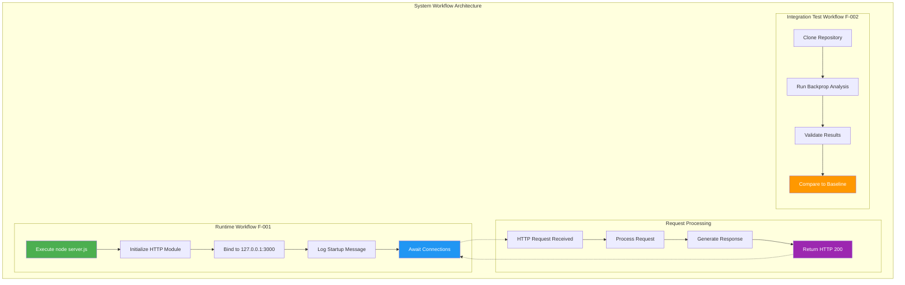

#### Workflow Characteristics Summary

| Workflow | Decision Points | Error Handling | State Persistence |
|----------|-----------------|----------------|-------------------|
| Server Startup | None | None (by design) | None |
| Request Processing | None | None (by design) | None (stateless) |
| Backprop Integration | None | External to system | None |

### 4.1.2 Actor Interactions

The system involves minimal actor interactions due to its test fixture nature:

| Actor | Role | Interactions |
|-------|------|--------------|
| **Backprop Developers** | Primary users | Clone repository, execute Backprop analysis, validate results |
| **QA Engineers** | Test validation | Execute integration tests, compare to baseline |
| **HTTP Client** | Request originator | Send HTTP requests to `127.0.0.1:3000` |
| **Node.js Runtime** | Execution engine | Execute `server.js`, manage HTTP server lifecycle |
| **Backprop Tool** | Analysis engine | Analyze repository content for integration testing |

---

## 4.2 CORE BUSINESS PROCESSES

### 4.2.1 HTTP Server Startup Process

The server startup process is a linear sequence with no conditional logic or error handling branches. This simplicity ensures deterministic startup behavior for test baseline validation.

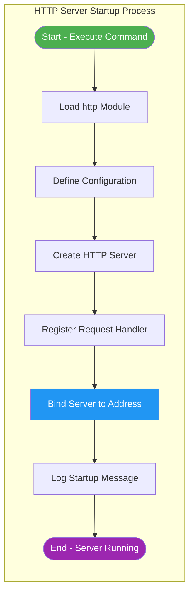

#### Startup Process Steps

| Step | Action | Implementation | Output |
|------|--------|----------------|--------|
| 1 | Load HTTP Module | `const http = require('http')` | HTTP module available |
| 2 | Define Hostname | `const hostname = '127.0.0.1'` | Localhost binding configured |
| 3 | Define Port | `const port = 3000` | Port 3000 configured |
| 4 | Create Server | `http.createServer(callback)` | Server instance created |
| 5 | Bind to Address | `server.listen(port, hostname)` | Server bound to 127.0.0.1:3000 |
| 6 | Log Ready | `console.log('Server running...')` | Console confirmation displayed |

#### Startup Performance Requirements

| Metric | Requirement | Validation |
|--------|-------------|------------|
| Startup Time | < 1 second | Server ready message appears within 1 second |
| Port Binding | Success | Server binds to port 3000 without error |
| Console Output | Exact message | `Server running at http://127.0.0.1:3000/` |

### 4.2.2 HTTP Request Processing Workflow

The request processing workflow demonstrates the system's core functionality—responding to any HTTP request with an identical `Hello, World!` response. This workflow contains **no decision points**, ensuring predictable output for all inputs.

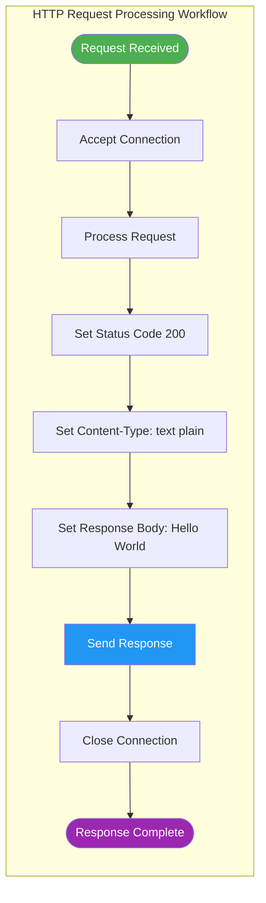

#### Request Processing Details

| Processing Stage | Implementation | Notes |
|------------------|----------------|-------|
| Request Reception | Node.js http module event | Any HTTP method accepted |
| URL Handling | **None** | All paths receive identical response |
| Method Handling | **None** | GET, POST, PUT, DELETE treated identically |
| Header Processing | **None** | Request headers ignored |
| Body Processing | **None** | Request body ignored |
| Response Generation | Static content | Always `Hello, World!\n` |

#### Response Specifications

| Response Attribute | Value | Consistency |
|--------------------|-------|-------------|
| Status Code | `200` | Identical for all requests |
| Content-Type | `text/plain` | Identical for all requests |
| Response Body | `Hello, World!\n` | Identical for all requests |
| Response Time | < 100ms | Variance < 100ms |

### 4.2.3 End-to-End User Journey

The primary user journey for this system involves Backprop developers and QA engineers using the repository as a test fixture. The following sequence diagram illustrates this workflow:

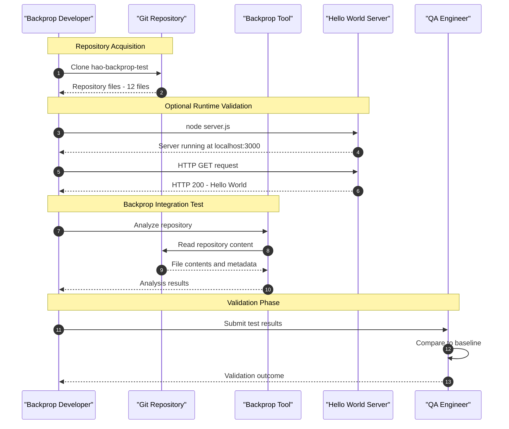

---

## 4.3 INTEGRATION WORKFLOWS

### 4.3.1 Backprop Integration Test Workflow

The Backprop integration test workflow represents the primary use case for this repository. As a passive test subject, the repository itself does not execute integration logic—it serves as stable input for the Backprop tool.

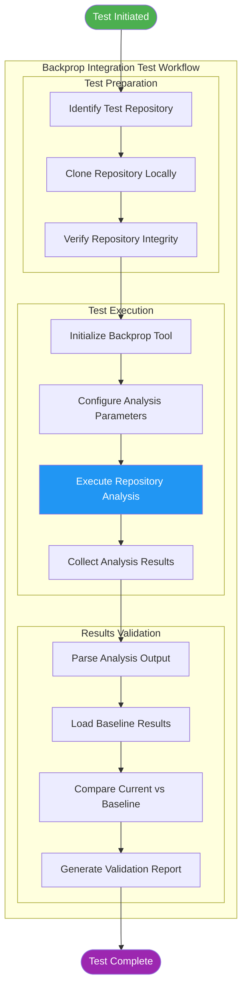

#### Integration Workflow Phases

| Phase | Steps | Responsibility | Artifacts |
|-------|-------|----------------|-----------|
| **Preparation** | Clone, verify integrity | Backprop Developer | Local repository copy |
| **Execution** | Configure and run Backprop | Backprop Tool | Analysis results |
| **Validation** | Compare to baseline | QA Engineer | Validation report |

### 4.3.2 Repository Content Analysis Flow

The Backprop tool analyzes the repository's diverse file types to validate multi-format analysis capabilities:

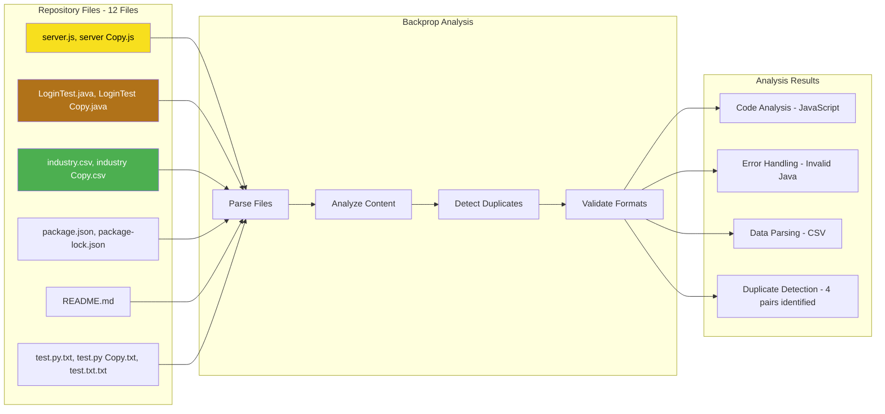

#### Analyzed File Categories

| File Category | Files | Expected Analysis Behavior |
|---------------|-------|---------------------------|
| Functional JavaScript | `server.js`, `server - Copy.js` | Full code analysis, duplicate detection |
| Non-Compilable Java | `LoginTest.java`, `LoginTest - Copy.java` | Graceful error handling, syntax error detection |
| Valid CSV Data | `industry.csv`, `industry - Copy.csv` | Data parsing, format validation |
| JSON Configuration | `package.json`, `package-lock.json` | Schema validation, metadata extraction |
| Markdown Documentation | `README.md` | Documentation parsing |
| Empty Placeholders | `test.py.txt`, etc. | Empty file handling |

---

## 4.4 STATE MANAGEMENT

### 4.4.1 Server State Transitions

The HTTP server maintains a minimal two-state model with a linear transition path:

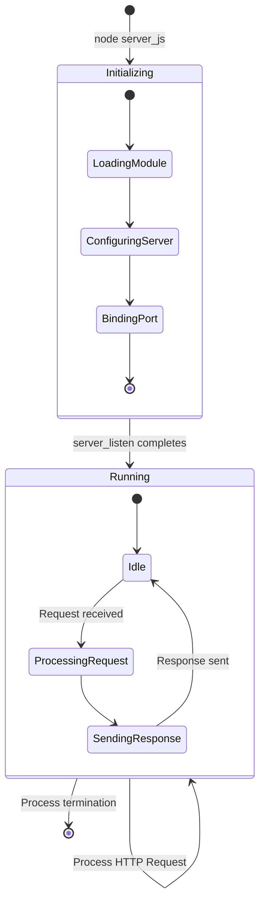

#### State Descriptions

| State | Description | Duration | Transitions |
|-------|-------------|----------|-------------|
| **Initializing** | Server loading and binding | < 1 second | → Running |
| **Running** | Server accepting connections | Indefinite | → Terminated (manual) |
| **Idle** | Awaiting HTTP requests | Variable | ↔ ProcessingRequest |
| **ProcessingRequest** | Handling active request | < 100ms | → SendingResponse |
| **SendingResponse** | Transmitting response | Milliseconds | → Idle |

### 4.4.2 State Persistence

The system implements **no state persistence** by design:

| Persistence Aspect | Status | Rationale |
|--------------------|--------|-----------|
| Session State | Not Implemented | Stateless request handling |
| Request History | Not Implemented | No logging requirement |
| Configuration State | Not Applicable | Hardcoded values |
| Database State | Not Applicable | No database integration |
| Cache State | Not Implemented | No caching requirements |

### 4.4.3 Transaction Boundaries

Due to the system's stateless nature, transaction boundaries are trivial:

| Transaction | Scope | Isolation | Rollback |
|-------------|-------|-----------|----------|
| HTTP Request | Single request-response | Complete | Not applicable |

---

## 4.5 ERROR HANDLING FLOWS

### 4.5.1 Explicit Non-Implementation

Error handling flows are **explicitly excluded** from this system per the Non-Requirements specification. This section documents the intentional absence of error handling to ensure accurate system understanding.

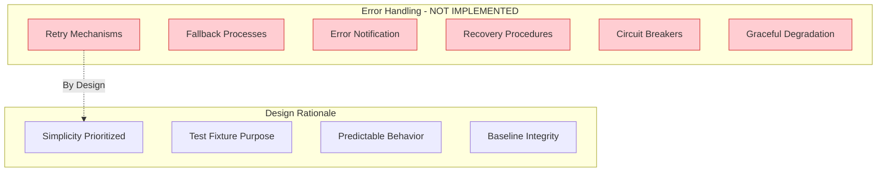

#### Excluded Error Handling Capabilities

| Capability | Status | Rationale |
|------------|--------|-----------|
| Retry Mechanisms | ❌ Excluded | Simplicity prioritized |
| Fallback Processes | ❌ Excluded | Single response path by design |
| Error Notification | ❌ Excluded | Minimal logging requirement |
| Recovery Procedures | ❌ Excluded | Test fixture, not production |
| Input Validation | ❌ Excluded | No request parsing performed |
| Exception Handling | ❌ Excluded | Simplicity over robustness |

### 4.5.2 Potential Failure Points

While error handling is not implemented, the following failure points exist at the system boundary:

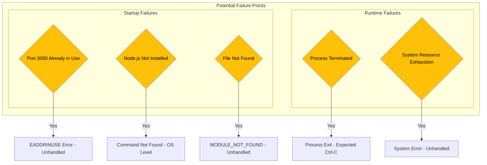

#### Failure Point Analysis

| Failure Point | Cause | System Behavior | Resolution |
|---------------|-------|-----------------|------------|
| Port Conflict | Port 3000 in use | `EADDRINUSE` error, process exits | Manual: Free port 3000 |
| Missing Runtime | Node.js not installed | Command not found error | Install Node.js |
| File Not Found | `server.js` missing | `MODULE_NOT_FOUND` error | Verify repository integrity |
| Process Termination | Ctrl+C or kill signal | Clean exit | Expected behavior |
| Resource Exhaustion | Memory/CPU limits | System-dependent | Restart process |

### 4.5.3 Assumption Dependencies

The system relies on the following assumptions for successful operation:

| Assumption ID | Assumption | Impact if Invalid |
|---------------|------------|-------------------|
| A-001 | Node.js runtime available | Server cannot execute |
| A-002 | Port 3000 available | Server fails to bind |
| A-003 | Backprop tool can analyze repository | Primary purpose unfulfilled |
| A-004 | Test baseline integrity maintained | Test results unreliable |

---

## 4.6 VALIDATION RULES

### 4.6.1 Business Rules by Process Step

The following business rules govern system behavior at each process step:

```mermaid
flowchart TD
    subgraph ValidationRules["Business Rules Enforcement"]
        subgraph StartupRules["Startup Rules"]
            SR1["BR-001: Localhost Only - Must bind to 127.0.0.1"]
            SR2["BR-002: Fixed Port - Must use port 3000"]
            SR3["BR-003: Startup Message - Must log exact message"]
        end
        
        subgraph ResponseRules["Response Rules"]
            RR1["BR-004: Universal Response - All requests identical"]
            RR2["BR-005: Status Code - Always HTTP 200"]
            RR3["BR-006: Content Type - Always text/plain"]
            RR4["BR-007: Response Body - Always Hello World"]
        end
        
        subgraph RepositoryRules["Repository Rules"]
            PR1["BR-008: Immutability - No code modifications"]
            PR2["BR-009: Zero Dependencies - No npm packages"]
            PR3["BR-010: File Integrity - All files unchanged"]
        end
    end
    
    StartupRules --> ResponseRules
    ResponseRules --> RepositoryRules
    
    style SR1 fill:#E3F2FD
    style SR2 fill:#E3F2FD
    style SR3 fill:#E3F2FD
    style RR1 fill:#E8F5E9
    style RR2 fill:#E8F5E9
    style RR3 fill:#E8F5E9
    style RR4 fill:#E8F5E9
    style PR1 fill:#FFF3E0
    style PR2 fill:#FFF3E0
    style PR3 fill:#FFF3E0
```

#### Business Rules Matrix

| Rule ID | Rule Description | Process Step | Enforcement |
|---------|------------------|--------------|-------------|
| BR-001 | Server binds to localhost only | Startup | Hardcoded `127.0.0.1` |
| BR-002 | Server uses port 3000 | Startup | Hardcoded `port = 3000` |
| BR-003 | Exact startup message logged | Startup | Hardcoded message string |
| BR-004 | All requests receive identical response | Request Processing | No routing logic |
| BR-005 | HTTP status always 200 | Response Generation | Hardcoded `statusCode = 200` |
| BR-006 | Content-Type always text/plain | Response Generation | Hardcoded header |
| BR-007 | Body always `Hello, World!\n` | Response Generation | Hardcoded response |
| BR-008 | Repository immutable | Repository Management | README.md directive |
| BR-009 | Zero external dependencies | Dependency Management | package.json verification |
| BR-010 | All files maintain original state | Repository Management | Version control baseline |

### 4.6.2 Data Validation Requirements

Data validation is **explicitly not implemented** in this system:

| Validation Type | Status | Rationale |
|-----------------|--------|-----------|
| Request URL Validation | Not Implemented | All URLs treated identically |
| Request Method Validation | Not Implemented | All methods accepted |
| Request Header Validation | Not Implemented | Headers ignored |
| Request Body Validation | Not Implemented | Body ignored |
| Input Sanitization | Not Implemented | No input processing |
| Schema Validation | Not Applicable | No structured data |

### 4.6.3 Authorization Checkpoints

Authorization checkpoints are **not applicable** to this system:

| Checkpoint | Status | Rationale |
|------------|--------|-----------|
| Authentication | Not Implemented | Test fixture, no security requirements |
| Authorization | Not Implemented | Single response, no protected resources |
| Role-Based Access | Not Applicable | No user roles defined |
| API Key Validation | Not Implemented | No API authentication |

---

## 4.7 TECHNICAL IMPLEMENTATION DETAILS

### 4.7.1 Request Handler Implementation Flow

The following diagram details the internal request handler implementation in `server.js`:

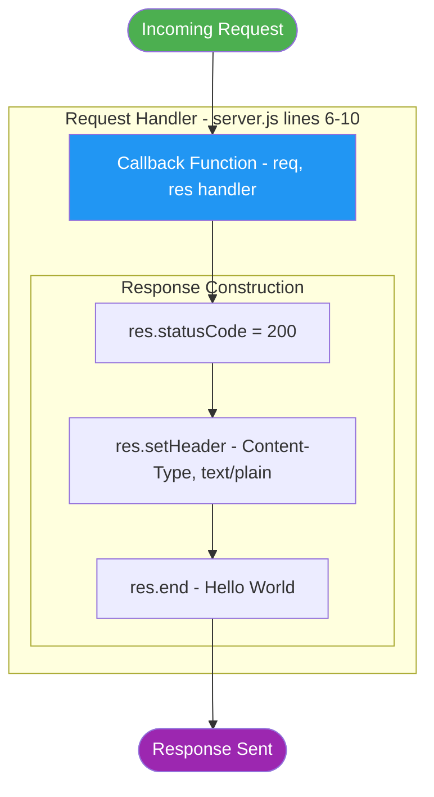

#### Implementation Reference

| Code Line | Implementation | Purpose |
|-----------|----------------|---------|
| Line 1 | `const http = require('http');` | Load HTTP module |
| Line 3 | `const hostname = '127.0.0.1';` | Configure hostname |
| Line 4 | `const port = 3000;` | Configure port |
| Lines 6-10 | Request handler callback | Process requests |
| Line 7 | `res.statusCode = 200;` | Set success status |
| Line 8 | `res.setHeader(...)` | Set content type |
| Line 9 | `res.end('Hello, World!\n');` | Send response body |
| Lines 12-14 | `server.listen(...)` | Start server |

### 4.7.2 Module Dependency Graph

The system uses minimal module dependencies:

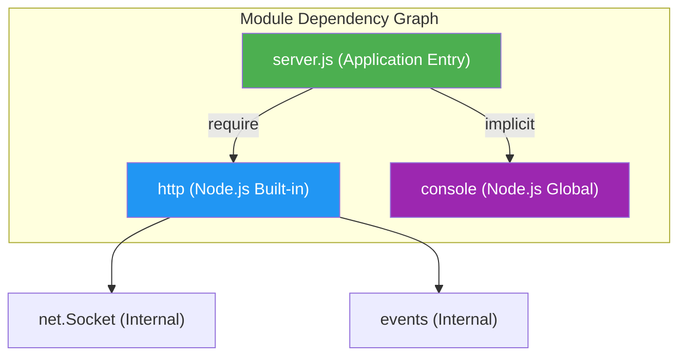

### 4.7.3 Timing Constraints

| Operation | SLA Requirement | Typical Performance |
|-----------|-----------------|---------------------|
| Server Startup | < 1 second | ~100ms |
| Request Processing | < 100ms | ~1-5ms |
| Response Variance | < 100ms | ~1-2ms |

---

## 4.8 PROCESS FLOW CONSTRAINTS

### 4.8.1 Design Constraints Impact

The following design constraints directly impact process flows:

| Constraint ID | Constraint | Process Flow Impact |
|---------------|------------|---------------------|
| C-001 | Repository must remain unchanged | No process modifications permitted |
| C-002 | Zero external dependencies | No third-party integration flows |
| C-003 | Localhost-only network binding | No external network communication |
| C-004 | Single-purpose functionality | Single request-response flow only |

### 4.8.2 Security Boundary Enforcement

```mermaid
flowchart TD
    subgraph SecurityBoundary["Security Boundary"]
        External["External Network - BLOCKED"]
        Localhost["Localhost 127.0.0.1 - ALLOWED"]
        Server["HTTP Server Port 3000"]
    end
    
    External -->|"Rejected"| Server
    Localhost -->|"Accepted"| Server
    Server -->|"HTTP 200"| Localhost
    
    style External fill:#ffcdd2,stroke:#d32f2f
    style Localhost fill:#c8e6c9,stroke:#388e3c
    style Server fill:#2196F3,stroke:#1565c0,color:#ffffff
```

#### Network Security Rules

| Rule | Enforcement | Verification |
|------|-------------|--------------|
| Localhost-only binding | `hostname = '127.0.0.1'` | External connection attempts fail |
| HTTP only (no HTTPS) | No TLS configuration | Plain text communication |
| No authentication | No auth middleware | All requests accepted |

---

## 4.9 REFERENCES

#### Files Examined

- `server.js` - Primary HTTP server implementation (14 lines)
- `package.json` - NPM metadata and project configuration
- `README.md` - Project purpose and "Do not touch!" directive

#### Technical Specification Sections Referenced

- Section 1.2 System Overview - Component architecture and success criteria
- Section 1.3 Scope - Primary user workflows and integration boundaries
- Section 2.1 Feature Catalog - Feature F-001 and F-002 specifications
- Section 2.2 Functional Requirements - Detailed requirements and acceptance criteria
- Section 2.4 Implementation Considerations - Technical constraints and performance requirements
- Section 2.6 Non-Requirements - Explicitly excluded capabilities
- Section 2.7 Assumptions and Constraints - System assumptions and design constraints
- Section 3.1 Overview - Technology stack rationale
- Section 3.8 Security Considerations - Network and application security status

# 5. System Architecture

## 5.1 HIGH-LEVEL ARCHITECTURE

### 5.1.1 System Overview

#### Architecture Style and Rationale

The `hao-backprop-test` system implements an **ultra-minimalist, single-component, stateless HTTP server architecture**. This architectural style was deliberately chosen to fulfill the project's primary purpose: serving as a stable, predictable test fixture for Backprop integration validation.

The architecture is characterized by the following design principles:

| Principle | Description | Implementation Evidence |
|-----------|-------------|------------------------|
| **Immutability** | Frozen codebase that prohibits modifications | `README.md` directive: "Do not touch!" |
| **Zero Dependencies** | No external npm packages or frameworks | Empty `dependencies` in `package.json` |
| **Predictability** | Identical behavior across all execution contexts | Hardcoded configuration values |
| **Simplicity** | Minimal abstraction layers | 14-line single-file implementation |

Unlike traditional enterprise architectures that employ multiple tiers, middleware layers, and external service integrations, this system intentionally adopts a monolithic single-file design. This approach ensures that test outcomes are determined solely by Backprop's analysis capabilities rather than environmental variables or application complexity.

#### Key Architectural Patterns

The system employs the following architectural patterns:

| Pattern | Implementation | Rationale |
|---------|---------------|-----------|
| **Single-File Module** | All server logic in `server.js` | Eliminates module coordination complexity |
| **Stateless Request Handling** | No session or request state retained | Ensures response consistency |
| **Built-in Module Only** | Uses Node.js `http` module exclusively | Eliminates dependency vulnerabilities |
| **Localhost Binding** | Network restricted to `127.0.0.1` | Prevents external network access |

#### System Boundaries and Major Interfaces

The system operates within well-defined boundaries:

```mermaid
flowchart TB
    subgraph ExternalBoundary["External Boundary"]
        HTTPClient["HTTP Client<br/>(Any localhost client)"]
        BackpropTool["Backprop Tool<br/>(Repository Analysis)"]
    end
    
    subgraph SystemBoundary["System Boundary - hao-backprop-test"]
        subgraph RuntimeComponents["Runtime Components"]
            NodeRuntime["Node.js Runtime"]
            HTTPModule["http Module<br/>(Built-in)"]
            ServerJS["server.js<br/>(Application)"]
        end
        
        subgraph StaticAssets["Static Repository Assets"]
            PackageJSON["package.json"]
            TestFixtures["Test Fixture Files<br/>(Java, CSV, Empty)"]
            README["README.md"]
        end
    end
    
    HTTPClient -->|"HTTP Request<br/>Port 3000"| ServerJS
    ServerJS -->|"HTTP 200<br/>Hello, World!"| HTTPClient
    BackpropTool -->|"File System Read"| StaticAssets
    BackpropTool -->|"Code Analysis"| ServerJS
    ServerJS -->|"require()"| HTTPModule
    HTTPModule -->|"Managed by"| NodeRuntime
    
    style ServerJS fill:#4CAF50,color:#fff
    style HTTPModule fill:#2196F3,color:#fff
    style BackpropTool fill:#9C27B0,color:#fff
```

**Interface Definitions:**

| Interface | Type | Protocol | Direction |
|-----------|------|----------|-----------|
| HTTP Server Port | Network | HTTP/1.1 | Inbound only |
| File System | Passive | File I/O | Read-only (by Backprop) |
| Console Output | System | stdout | Outbound only |

### 5.1.2 Core Components Table

The system consists of minimal, focused components:

| Component Name | Primary Responsibility | Key Dependencies |
|----------------|----------------------|------------------|
| **HTTP Server** (`server.js`) | Accept HTTP requests and return static response | Node.js `http` module |
| **Package Manifest** (`package.json`) | Define npm package metadata | None |
| **Package Lock** (`package-lock.json`) | Lock dependency versions (confirms zero deps) | npm client |
| **Test Fixtures** (various) | Provide multi-format analysis targets | None |

| Component Name | Integration Points | Critical Considerations |
|----------------|-------------------|------------------------|
| **HTTP Server** | Port 3000 localhost binding | Single point of runtime functionality |
| **Package Manifest** | npm registry (metadata only) | Immutability constraint |
| **Package Lock** | npm client | Confirms zero external dependencies |
| **Test Fixtures** | Backprop analysis engine | Intentional diversity of file types |

### 5.1.3 Data Flow Description

#### Primary Data Flows

The system implements two distinct data flow patterns:

**1. HTTP Request-Response Flow**

The HTTP server processes all incoming requests through a uniform, unidirectional flow without branching logic:

1. **Request Reception**: Node.js runtime receives TCP connection on port 3000
2. **Handler Invocation**: The registered callback function receives request and response objects
3. **Response Construction**: Status code (200), headers (`Content-Type: text/plain`), and body (`Hello, World!\n`) are set
4. **Response Transmission**: Complete response transmitted to client
5. **Connection Closure**: HTTP connection closed, no state retained

**2. Backprop Analysis Flow**

The Backprop tool interacts with the repository through passive file system access:

1. **Repository Discovery**: Backprop identifies the test repository
2. **File Enumeration**: All 12 repository files are discovered
3. **Content Analysis**: Each file is parsed according to its type
4. **Results Generation**: Analysis results are produced for validation

#### Data Transformation Points

| Transformation Point | Input | Output | Location |
|---------------------|-------|--------|----------|
| HTTP Request Handler | HTTP Request Object | HTTP Response Object | `server.js` lines 6-10 |
| Console Logger | Server State | Text Message | `server.js` line 13 |

#### Key Data Stores and Caches

The system implements **no data persistence** by design:

| Store Type | Implementation | Rationale |
|------------|---------------|-----------|
| Database | Not implemented | No data persistence requirements |
| Session Store | Not implemented | Stateless request handling |
| Cache | Not implemented | Static response eliminates caching need |
| File Storage | Read-only repository | Test fixture files are static |

### 5.1.4 External Integration Points

| System Name | Integration Type | Data Exchange Pattern |
|-------------|------------------|----------------------|
| **Backprop Tool** | Passive/Read-Only | Batch file analysis |
| **npm Registry** | Metadata Only | Package manifest reference |
| **HTTP Clients** | Request-Response | Synchronous HTTP |

| System Name | Protocol/Format | SLA Requirements |
|-------------|-----------------|------------------|
| **Backprop Tool** | File system access | No formal SLA |
| **npm Registry** | npm protocol / JSON | No runtime dependency |
| **HTTP Clients** | HTTP/1.1 / Plain text | < 100ms response time |

---

## 5.2 COMPONENT DETAILS

### 5.2.1 HTTP Server Component

#### Purpose and Responsibilities

The HTTP Server component (`server.js`) serves as the sole runtime component of the system. Its responsibilities are deliberately limited to:

| Responsibility | Implementation |
|----------------|---------------|
| Accept HTTP connections | Bind to `127.0.0.1:3000` |
| Process HTTP requests | Handle all methods and paths identically |
| Generate HTTP responses | Return `HTTP 200` with `Hello, World!\n` |
| Log startup status | Output server URL to console |

#### Technologies and Frameworks

| Technology | Role | Version Requirements |
|------------|------|---------------------|
| Node.js | Runtime environment | Any LTS version |
| `http` module | HTTP server implementation | Built-in (Node.js core) |
| CommonJS | Module system | Native to Node.js |

The component explicitly **does not use**:
- Express, Koa, or other HTTP frameworks
- Middleware libraries
- Template engines
- Database drivers

#### Key Interfaces and APIs

**Server Configuration API:**

| Constant | Value | Purpose |
|----------|-------|---------|
| `hostname` | `'127.0.0.1'` | Network interface binding |
| `port` | `3000` | TCP port binding |

**HTTP Response API:**

| Method | Value Set | Purpose |
|--------|-----------|---------|
| `res.statusCode` | `200` | HTTP success status |
| `res.setHeader()` | `'Content-Type', 'text/plain'` | Response content type |
| `res.end()` | `'Hello, World!\n'` | Response body and termination |

#### Data Persistence Requirements

**None.** The HTTP Server component is entirely stateless:

| Persistence Aspect | Status |
|--------------------|--------|
| Session state | Not persisted |
| Request history | Not recorded |
| Configuration state | Hardcoded (no persistence) |

#### Scaling Considerations

As a single-process, single-threaded Node.js application designed for localhost-only access:

| Scaling Dimension | Consideration |
|-------------------|---------------|
| Horizontal scaling | Not applicable (localhost only) |
| Vertical scaling | Not applicable (test fixture) |
| Load balancing | Not applicable |
| Clustering | Not implemented |

### 5.2.2 Package Manifest Component

#### Purpose and Responsibilities

The `package.json` file defines npm package metadata and confirms the zero-dependency architecture:

| Responsibility | Implementation |
|----------------|---------------|
| Package identification | `name: "hello_world"`, `version: "1.0.0"` |
| Dependency declaration | Empty `dependencies` object |
| License declaration | MIT license |
| Author attribution | `hxu` |

#### Key Metadata

| Field | Value | Significance |
|-------|-------|--------------|
| `name` | `hello_world` | Package identifier |
| `version` | `1.0.0` | Semantic version |
| `main` | `index.js` | Default entry point (note: actual entry is `server.js`) |
| `license` | `MIT` | Open source license |

### 5.2.3 Test Fixture Components

#### Purpose and Responsibilities

Test fixture files provide diverse analysis targets for Backprop integration testing:

| File Category | Files | Testing Purpose |
|---------------|-------|-----------------|
| Functional JavaScript | `server.js`, `server - Copy.js` | Code analysis, duplicate detection |
| Non-Compilable Java | `LoginTest.java`, `LoginTest - Copy.java` | Error handling, syntax error detection |
| Valid CSV Data | `industry.csv`, `industry - Copy.csv` | Data format parsing (44 entries) |
| Empty Placeholders | `test.py.txt`, `test.py - Copy.txt`, `test.txt.txt` | Empty file handling |
| JSON Configuration | `package.json`, `package-lock.json` | Schema validation |
| Documentation | `README.md` | Markdown parsing |

### 5.2.4 Component Interaction Diagram

```mermaid
flowchart TD
    subgraph NodeJSRuntime["Node.js Runtime Environment"]
        subgraph BuiltInModules["Built-in Modules"]
            HTTPModule["http Module"]
            NetModule["net.Socket - Internal"]
            EventsModule["events - Internal"]
        end
        subgraph ConsoleAPI["Console API"]
            ConsoleLog["console.log"]
        end
    end
    
    subgraph Application["Application Layer"]
        ServerJS["server.js"]
    end
    
    subgraph IOLayer["I/O Layer"]
        TCPPort["TCP Port 3000"]
        StdOut["Standard Output"]
    end
    
    ServerJS -->|require http| HTTPModule
    ServerJS -->|Implicit access| ConsoleLog
    HTTPModule --> NetModule
    HTTPModule --> EventsModule
    HTTPModule -->|server.listen| TCPPort
    ConsoleLog --> StdOut
    
    style ServerJS fill:#4CAF50,color:#fff
    style HTTPModule fill:#2196F3,color:#fff
    style TCPPort fill:#FF9800,color:#fff
```

### 5.2.5 Server State Transition Diagram

```mermaid
stateDiagram-v2
    [*] --> Initializing : start_server
    
    state Initializing {
        [*] --> LoadingModule
        LoadingModule --> ConfiguringServer
        ConfiguringServer --> BindingPort
        BindingPort --> [*]
    }
    
    Initializing --> Running : listen_completes
    
    state Running {
        [*] --> Idle
        Idle --> ProcessingRequest : request_received
        ProcessingRequest --> SendingResponse : response_ready
        SendingResponse --> Idle : response_sent
    }
    
    Running --> [*] : process_terminated
```

**State Definitions:**

| State | Description | Duration |
|-------|-------------|----------|
| **Initializing** | Module loading and port binding | < 1 second |
| **Running** | Server accepting connections | Indefinite |
| **Idle** | Awaiting HTTP requests | Variable |
| **ProcessingRequest** | Handling active request | < 100ms |
| **SendingResponse** | Transmitting response | Milliseconds |

### 5.2.6 Request Processing Sequence Diagram

```mermaid
sequenceDiagram
    autonumber
    participant Client as HTTP Client
    participant Node as Node.js Runtime
    participant HTTP as http Module
    participant Handler as Request Handler
    
    Note over Client,Handler: Server Startup Phase
    Node->>HTTP: require http
    HTTP-->>Node: http module loaded
    Node->>HTTP: createServer with callback
    HTTP-->>Node: Server instance
    Node->>HTTP: server.listen on port 3000
    HTTP-->>Node: Listening on port 3000
    Node->>Node: console.log Server running
    
    Note over Client,Handler: Request Processing Phase
    Client->>HTTP: HTTP Request (any method or path)
    HTTP->>Handler: Invoke callback with req, res
    Handler->>Handler: res.statusCode = 200
    Handler->>Handler: res.setHeader Content-Type, text/plain
    Handler->>Handler: res.end Hello World
    Handler-->>HTTP: Response complete
    HTTP-->>Client: HTTP 200 OK with Body
```

---

## 5.3 TECHNICAL DECISIONS

### 5.3.1 Architecture Style Decisions

The following architectural decisions were made to support the project's test fixture purpose:

| Decision | Choice Made | Alternatives Considered | Rationale |
|----------|-------------|------------------------|-----------|
| **Architecture Pattern** | Single-file monolith | MVC, Layered, Microservices | Minimizes complexity for test baseline |
| **HTTP Implementation** | Built-in `http` module | Express, Koa, Fastify | Zero dependencies requirement |
| **Module System** | CommonJS (`require`) | ES Modules (`import`) | Broader Node.js compatibility |
| **Network Binding** | Localhost only (`127.0.0.1`) | All interfaces (`0.0.0.0`) | Security through isolation |

### 5.3.2 Communication Pattern Choices

| Pattern | Decision | Justification |
|---------|----------|---------------|
| **Request-Response Model** | Synchronous HTTP | Simplest interaction pattern |
| **Routing** | None (all requests identical) | Predictable output requirement |
| **Content Negotiation** | None (plain text only) | Simplicity over flexibility |
| **Connection Handling** | Single connection per request | Default `http` module behavior |

### 5.3.3 Data Storage Solution Rationale

**Decision: No Data Storage**

| Storage Option | Decision | Rationale |
|----------------|----------|-----------|
| Relational Database | Excluded | No data persistence requirements |
| NoSQL Database | Excluded | No data persistence requirements |
| File-based Storage | Excluded | Static response eliminates storage need |
| In-memory Cache | Excluded | Stateless design by requirement |

This decision aligns with the core architectural principle of **predictability**—no stored state means no state-dependent behavior variations.

### 5.3.4 Security Mechanism Selection

| Security Aspect | Decision | Rationale |
|-----------------|----------|-----------|
| **Authentication** | Not implemented | Test fixture, no protected resources |
| **Authorization** | Not implemented | Single, uniform response |
| **HTTPS/TLS** | Not implemented | Localhost-only access |
| **Input Validation** | Not implemented | No request parsing performed |
| **CSRF Protection** | Not implemented | No state modification possible |

**Security by Design:**
- Localhost binding (`127.0.0.1`) prevents external network access
- Zero dependencies eliminates supply chain vulnerabilities
- Plain text response eliminates XSS attack vectors

### 5.3.5 Architecture Decision Record

```mermaid
flowchart TD
    subgraph ADR001["ADR-001: Zero External Dependencies"]
        Context1["Context: Test fixture for Backprop integration"]
        Decision1["Decision: Use only NodeJS built-in modules"]
        Consequence1["Consequence: Environment-independent behavior guaranteed"]
    end

    subgraph ADR002["ADR-002: Stateless Request Handling"]
        Context2["Context: Predictable response required"]
        Decision2["Decision: No session or request state retained"]
        Consequence2["Consequence: Identical response for all requests"]
    end

    subgraph ADR003["ADR-003: Localhost-Only Binding"]
        Context3["Context: No external access required"]
        Decision3["Decision: Bind to localhost only"]
        Consequence3["Consequence: Network isolation achieved"]
    end

    Context1 --> Decision1
    Decision1 --> Consequence1
    Context2 --> Decision2
    Decision2 --> Consequence2
    Context3 --> Decision3
    Decision3 --> Consequence3

    style Decision1 fill:#4CAF50,color:#ffffff
    style Decision2 fill:#2196F3,color:#ffffff
    style Decision3 fill:#9C27B0,color:#ffffff
```

---

## 5.4 CROSS-CUTTING CONCERNS

### 5.4.1 Monitoring and Observability Approach

**Decision: Minimal Observability**

The system implements minimal observability appropriate for its test fixture nature:

| Observability Aspect | Implementation | Justification |
|---------------------|----------------|---------------|
| **Application Metrics** | Not implemented | Test fixture, not production |
| **Health Checks** | Not implemented | Manual verification sufficient |
| **Distributed Tracing** | Not implemented | Single-component system |
| **Performance Monitoring** | Not implemented | Predictable performance |

### 5.4.2 Logging and Tracing Strategy

**Logging Implementation:**

| Log Event | Output | Format |
|-----------|--------|--------|
| Server startup | `Server running at http://127.0.0.1:3000/` | Plain text to stdout |
| Request received | Not logged | By design |
| Response sent | Not logged | By design |
| Errors | Not logged | No error handling |

The logging strategy prioritizes simplicity over comprehensiveness. The single startup message provides sufficient verification that the server is operational.

### 5.4.3 Error Handling Patterns

**Decision: Explicit Non-Implementation**

Error handling is **intentionally excluded** from the architecture:

| Error Handling Capability | Status | Rationale |
|--------------------------|--------|-----------|
| Try-catch blocks | Not implemented | Simplicity prioritized |
| Retry mechanisms | Not implemented | Single response path |
| Fallback processes | Not implemented | No alternative paths |
| Error notification | Not implemented | Test fixture purpose |
| Circuit breakers | Not implemented | No external dependencies |
| Graceful degradation | Not implemented | Binary operation model |

#### Error Handling Flow (Architectural View)

```mermaid
flowchart TD
    subgraph PotentialErrors["Potential Error Scenarios"]
        PortConflict["Port 3000 Already in Use"]
        MissingRuntime["NodeJS Not Installed"]
        MissingFile["Server File Not Found"]
        ProcessKill["Process Termination Signal"]
    end
    
    subgraph SystemBehavior["System Behavior - No Handling"]
        EADDRINUSE["EADDRINUSE Error"]
        CommandNotFound["Command Not Found"]
        ModuleNotFound["Module Not Found Error"]
        CleanExit["Clean Exit"]
    end
    
    subgraph Resolution["Manual Resolution Required"]
        FreePort["Free port 3000"]
        InstallNode["Install NodeJS"]
        VerifyRepo["Verify repository"]
        ExpectedOp["No action needed"]
    end
    
    PortConflict --> EADDRINUSE --> FreePort
    MissingRuntime --> CommandNotFound --> InstallNode
    MissingFile --> ModuleNotFound --> VerifyRepo
    ProcessKill --> CleanExit --> ExpectedOp
    
    style EADDRINUSE fill:#ffcdd2,stroke:#d32f2f
    style CommandNotFound fill:#ffcdd2,stroke:#d32f2f
    style ModuleNotFound fill:#ffcdd2,stroke:#d32f2f
    style CleanExit fill:#c8e6c9,stroke:#388e3c
```

### 5.4.4 Authentication and Authorization Framework

**Decision: Not Implemented**

| Security Control | Status | Rationale |
|------------------|--------|-----------|
| User authentication | Not implemented | No user identification needed |
| Role-based access | Not implemented | Single response for all |
| API keys | Not implemented | Test fixture purpose |
| JWT tokens | Not implemented | No session management |
| OAuth integration | Not implemented | No external identity providers |

This decision is justified by the system's nature as a localhost-only test fixture with no protected resources or user-specific functionality.

### 5.4.5 Performance Requirements and SLAs

| Metric | Requirement | Typical Performance |
|--------|-------------|---------------------|
| **Server Startup Time** | < 1 second | ~100ms |
| **Request Processing Time** | < 100ms | ~1-5ms |
| **Response Time Variance** | < 100ms | ~1-2ms |
| **Availability** | Best effort | Process-dependent |
| **Throughput** | Not specified | Limited by single-thread |

**Performance Characteristics:**

| Characteristic | Value |
|----------------|-------|
| Concurrent connections | Limited by Node.js event loop |
| Memory footprint | Minimal (~20-50MB) |
| CPU utilization | Negligible for test workloads |

### 5.4.6 Disaster Recovery Procedures

**Recovery Model: Restart-Based**

Given the stateless architecture and test fixture nature, disaster recovery is trivial:

| Failure Scenario | Recovery Procedure | Recovery Time |
|------------------|-------------------|---------------|
| Server process crash | Re-execute `node server.js` | < 1 second |
| Port conflict | Terminate conflicting process, restart | Manual intervention |
| Corrupted repository | Re-clone from source control | < 1 minute |
| Node.js corruption | Reinstall Node.js | Environment-dependent |

**No Formal DR Plan Required:**
- No persistent data to recover
- No state synchronization needed
- Repository is version-controlled externally
- Restart restores full functionality

---

## 5.5 ARCHITECTURAL CONSTRAINTS

### 5.5.1 Immutability Constraints

Per the `README.md` directive ("test project for backprop integration. Do not touch!"), the following modifications are prohibited:

| Prohibited Action | Impact |
|-------------------|--------|
| Adding npm dependencies | Violates zero-dependency architecture |
| Modifying `server.js` | Breaks test baseline integrity |
| Adding new source files | Alters repository structure |
| Changing port/hostname | Invalidates existing tests |
| Adding frameworks | Contradicts minimalist design |

### 5.5.2 Compatibility Guarantees

| Aspect | Guarantee |
|--------|-----------|
| **Node.js Compatibility** | Any LTS version with `http` module support |
| **Operating System** | Any platform supporting Node.js (Windows, macOS, Linux) |
| **Architecture** | Any CPU architecture supported by Node.js (x64, ARM64) |
| **npm Compatibility** | npm v7.0.0+ for lockfile v3 parsing |

---

## 5.6 REFERENCES

#### Files Examined

| File Path | Relevance |
|-----------|-----------|
| `server.js` | Primary HTTP server implementation (14 lines) |
| `package.json` | NPM package metadata, zero-dependency confirmation |
| `package-lock.json` | Lockfile version 3, dependency lock confirmation |
| `README.md` | Project purpose and immutability directive |
| `server - Copy.js` | Duplicate detection test fixture |
| `LoginTest.java` | Java stub test fixture (intentionally non-compilable) |
| `industry.csv` | CSV data test fixture (44 entries) |

#### Technical Specification Sections Referenced

| Section | Information Provided |
|---------|---------------------|
| 1.2 System Overview | Project context, component inventory, success criteria |
| 2.1 Feature Catalog | Feature F-001 and F-002 specifications |
| 2.6 Non-Requirements | Explicitly excluded capabilities |
| 3.1 OVERVIEW | Technology stack rationale and summary |
| 3.8 SECURITY CONSIDERATIONS | Network, application, and dependency security |
| 3.10 TECHNOLOGY STACK CONSTRAINTS | Immutability and compatibility guarantees |
| 4.1 SYSTEM WORKFLOW OVERVIEW | Process architecture and actor interactions |
| 4.2 CORE BUSINESS PROCESSES | Startup and request processing workflows |
| 4.3 INTEGRATION WORKFLOWS | Backprop integration test workflow |
| 4.4 STATE MANAGEMENT | Server state transitions and persistence |
| 4.5 ERROR HANDLING FLOWS | Explicit non-implementation documentation |
| 4.7 TECHNICAL IMPLEMENTATION DETAILS | Request handler implementation and timing constraints |

# 6. SYSTEM COMPONENTS DESIGN

## 6.1 Core Services Architecture

#### INFRASTRUCTURE AND DEPLOYMENT

## 6.1 Core Services Architecture

### 6.1.1 Applicability Assessment

**Core Services Architecture is not applicable for this system.**

The `hao-backprop-test` repository is an ultra-minimalist, single-component test fixture that does not implement microservices, distributed architecture, or distinct service components. This determination is based on comprehensive analysis of the codebase, architectural decisions, and explicit design constraints documented throughout the technical specification.

#### 6.1.1.1 System Classification

The system implements a **single-file monolith** architecture rather than a services-based design:

| Architecture Characteristic | Typical Services Architecture | This System |
|----------------------------|------------------------------|-------------|
| Component Count | Multiple independent services | Single component (`server.js`) |
| Lines of Code | Thousands to millions | 14 lines |
| External Dependencies | Multiple frameworks/libraries | Zero (0) |
| Inter-Service Communication | REST, gRPC, message queues | Not applicable |
| Service Discovery | Consul, Kubernetes DNS, etc. | Not applicable |

#### 6.1.1.2 Architectural Decision Evidence

The selection of a single-file monolith over microservices was an explicit, documented architectural decision:

| Decision | Choice Made | Alternatives Considered | Rationale |
|----------|-------------|------------------------|-----------|
| Architecture Pattern | Single-file monolith | MVC, Layered, **Microservices** | Minimizes complexity for test baseline |
| HTTP Implementation | Built-in `http` module | Express, Koa, Fastify | Zero dependencies requirement |
| Network Binding | Localhost only (`127.0.0.1`) | All interfaces (`0.0.0.0`) | Security through isolation |

### 6.1.2 Justification for Non-Applicability

#### 6.1.2.1 No Microservices Architecture

The system is a deliberately minimal test artifact with a single runtime component:

```mermaid
flowchart TB
    subgraph SingleComponent["System: hao-backprop-test - Complete Architecture"]
        ServerJS["server.js - 14 Lines of Code - Single HTTP Server"]
    end
    
    subgraph Runtime["Node.js Runtime"]
        HTTPModule["http Module - Built-in"]
    end
    
    subgraph Output["Output Interfaces"]
        Port3000["TCP Port 3000 - Localhost Only"]
        Console["stdout Console"]
    end
    
    ServerJS -->|"require()"| HTTPModule
    HTTPModule -->|"server.listen()"| Port3000
    ServerJS -->|"console.log()"| Console
    
    style ServerJS fill:#4CAF50,color:#fff
    style HTTPModule fill:#2196F3,color:#fff
```

**Evidence from Component Details:**

| Component Name | Primary Responsibility | Status |
|----------------|----------------------|--------|
| HTTP Server (`server.js`) | Accept HTTP requests and return static response | **Only runtime component** |
| Package Manifest (`package.json`) | Define npm package metadata | Configuration only |
| Test Fixtures (various) | Provide analysis targets for Backprop | Static files only |

#### 6.1.2.2 No Distributed Architecture

The application is bound exclusively to localhost with no external connections:

| Network Aspect | Implementation | Impact on Services Architecture |
|----------------|----------------|--------------------------------|
| Host Binding | `127.0.0.1` (localhost only) | Prevents any external access |
| Port | `3000` (hardcoded) | Single endpoint, no routing |
| External Services | None | Complete isolation |
| Database Connections | None | No data layer |
| Message Queues | None | No async communication |

#### 6.1.2.3 No Service Components

The system lacks the fundamental building blocks required for services architecture:

| Service Architecture Component | Status | Evidence |
|-------------------------------|--------|----------|
| Service Registry | Not implemented | No service discovery needed |
| API Gateway | Not implemented | Direct localhost access only |
| Load Balancer | Not implemented | Single instance only |
| Message Broker | Not implemented | No inter-service communication |
| Configuration Server | Not implemented | Hardcoded values by design |
| Service Mesh | Not implemented | Single service, no mesh needed |

### 6.1.3 Scalability Design Assessment

#### 6.1.3.1 Scaling Requirements

Scaling considerations are explicitly marked as **not applicable** for this system:

| Scaling Dimension | Status | Rationale |
|-------------------|--------|-----------|
| Horizontal scaling | Not applicable | Localhost-only binding prevents multiple instances |
| Vertical scaling | Not applicable | Test fixture has no performance demands |
| Load balancing | Not applicable | Single endpoint, single instance |
| Clustering | Not implemented | No clustering capability or requirement |
| Auto-scaling | Not applicable | No dynamic workload patterns |

#### 6.1.3.2 Comparison with Typical Scalable Architectures

```mermaid
flowchart LR
    subgraph TypicalScalable ["Typical Scalable Architecture"]
        LB["Load Balancer"]
        S1["Service Instance 1"]
        S2["Service Instance 2"]
        S3["Service Instance 3"]
        DB[("Database Cluster")]
        Cache[("Distributed Cache")]
        
        LB --> S1
        LB --> S2
        LB --> S3
        S1 --> DB
        S2 --> DB
        S3 --> DB
        S1 --> Cache
        S2 --> Cache
        S3 --> Cache
    end
    
    subgraph ThisSystem ["This System Architecture"]
        SingleServer["server.js - Single Process"]
        LocalPort["localhost:3000"]
        
        SingleServer --> LocalPort
    end
    
    style LB fill:#FF9800,color:#fff
    style SingleServer fill:#4CAF50,color:#fff
```

#### 6.1.3.3 Resource Allocation

| Resource | Allocation | Notes |
|----------|------------|-------|
| Memory | ~20-50MB | Minimal Node.js footprint |
| CPU | Negligible | Single-threaded event loop |
| Network | Localhost only | No external bandwidth |
| Storage | Static files only | No runtime storage |

### 6.1.4 Resilience Patterns Assessment

#### 6.1.4.1 Fault Tolerance Mechanisms

Resilience patterns are **intentionally excluded** from this architecture:

| Resilience Pattern | Status | Rationale |
|--------------------|--------|-----------|
| Try-catch blocks | Not implemented | Simplicity prioritized |
| Retry mechanisms | Not implemented | Single response path |
| Fallback processes | Not implemented | No alternative paths |
| Circuit breakers | Not implemented | No external dependencies to protect |
| Graceful degradation | Not implemented | Binary operation model |
| Health checks | Not implemented | Manual verification sufficient |

#### 6.1.4.2 Error Handling Philosophy

The system adopts a **binary operation model**: it either runs successfully or fails completely with restart as the recovery mechanism.

```mermaid
flowchart TD
    subgraph ErrorScenarios["Potential Error Scenarios"]
        E1["Port 3000 Conflict"]
        E2["NodeJS Not Installed"]
        E3["Server file Missing"]
        E4["Process Termination"]
    end
    
    subgraph SystemResponse["System Response - No Internal Handling"]
        R1["EADDRINUSE Error"]
        R2["Command Not Found"]
        R3["MODULE_NOT_FOUND Error"]
        R4["Clean Exit"]
    end
    
    subgraph ManualRecovery["Manual Recovery Required"]
        M1["Free port 3000"]
        M2["Install NodeJS"]
        M3["Verify repository"]
        M4["Restart if needed"]
    end
    
    E1 --> R1
    R1 --> M1
    E2 --> R2
    R2 --> M2
    E3 --> R3
    R3 --> M3
    E4 --> R4
    R4 --> M4
    
    style R1 fill:#ffcdd2,stroke:#d32f2f
    style R2 fill:#ffcdd2,stroke:#d32f2f
    style R3 fill:#ffcdd2,stroke:#d32f2f
    style R4 fill:#c8e6c9,stroke:#388e3c
```

#### 6.1.4.3 Disaster Recovery

| Failure Scenario | Recovery Procedure | Recovery Time |
|------------------|-------------------|---------------|
| Server process crash | Re-execute `node server.js` | < 1 second |
| Port conflict | Terminate conflicting process, restart | Manual intervention |
| Corrupted repository | Re-clone from source control | < 1 minute |
| Node.js corruption | Reinstall Node.js | Environment-dependent |

**Key Consideration:** No formal disaster recovery plan is required because:
- No persistent data exists to recover
- No state synchronization is needed
- The repository is version-controlled externally
- Restart restores full functionality immediately

### 6.1.5 Excluded Service Architecture Capabilities

The following capabilities, typical of services-based architectures, are **explicitly excluded** per the project's non-requirements:

| Excluded Capability | Category | Rationale |
|---------------------|----------|-----------|
| Container Orchestration | Deployment | No deployment infrastructure required |
| External API Integration | Communication | Isolation is a design goal |
| CI/CD Pipelines | DevOps | No automated build/deploy requirements |
| Monitoring/Logging Framework | Observability | Minimal startup message sufficient |
| Database Connectivity | Data Layer | No data persistence requirements |
| Service Mesh | Networking | Single component, no mesh needed |
| API Gateway | Routing | Direct localhost access only |
| Authentication/Authorization | Security | No protected resources |

### 6.1.6 What the System Actually Implements

#### 6.1.6.1 Single-Component Architecture

Instead of a services architecture, the system implements an **ultra-minimalist, single-component, stateless HTTP server**:

| Design Principle | Description | Implementation Evidence |
|-----------------|-------------|------------------------|
| Immutability | Frozen codebase prohibiting modifications | `README.md` directive: "Do not touch!" |
| Zero Dependencies | No external npm packages or frameworks | Empty `dependencies` in `package.json` |
| Predictability | Identical behavior across all execution contexts | Hardcoded configuration values |
| Simplicity | Minimal abstraction layers | 14-line single-file implementation |

#### 6.1.6.2 Actual Request Processing Flow

The complete request processing occurs within a single component with no service interactions:

```mermaid
sequenceDiagram
    autonumber
    participant Client as HTTP Client
    participant Node as Node.js Runtime
    participant HTTP as http Module
    participant Handler as Request Handler
    
    Note over Client,Handler: Server Startup (One-time)
    Node->>HTTP: require('http')
    HTTP-->>Node: http module loaded
    Node->>HTTP: createServer(callback)
    HTTP-->>Node: Server instance
    Node->>HTTP: server.listen(3000, '127.0.0.1')
    HTTP-->>Node: Listening on port 3000
    Node->>Node: console.log("Server running")
    
    Note over Client,Handler: Request Processing (Stateless)
    Client->>HTTP: HTTP Request (any method or path)
    HTTP->>Handler: Invoke callback(req, res)
    Handler->>Handler: res.statusCode = 200
    Handler->>Handler: res.setHeader('Content-Type', 'text/plain')
    Handler->>Handler: res.end('Hello, World!')
    Handler-->>HTTP: Response complete
    HTTP-->>Client: HTTP 200 OK + Body
```

#### 6.1.6.3 System State Model

The server operates with only two possible runtime states:

| State | Description | Duration |
|-------|-------------|----------|
| **Initializing** | Module loading and port binding | < 1 second |
| **Running** | Server accepting connections (Idle → Processing → Idle) | Indefinite until process terminated |

### 6.1.7 Architectural Constraints Preventing Services Architecture

The project has explicit immutability constraints that prohibit evolution toward a services architecture:

| Prohibited Action | Impact on Services Architecture |
|-------------------|--------------------------------|
| Adding npm dependencies | Cannot add service frameworks (Express, Fastify, etc.) |
| Modifying `server.js` | Cannot implement service patterns |
| Adding new source files | Cannot create additional service modules |
| Changing port/hostname | Cannot implement multi-port service deployment |
| Adding frameworks | Cannot add API gateways, service mesh, etc. |

### 6.1.8 Summary

The Core Services Architecture section is not applicable to `hao-backprop-test` because:

1. **Single Component**: The entire system consists of one 14-line JavaScript file with no service boundaries
2. **Explicit Decision**: Microservices architecture was considered and explicitly rejected in favor of a single-file monolith
3. **No Scalability Requirements**: Horizontal and vertical scaling are marked as "not applicable"
4. **No Resilience Patterns**: Circuit breakers, retry mechanisms, and graceful degradation are explicitly "not implemented"
5. **Zero Dependencies**: No frameworks or external services exist to enable service patterns
6. **Test Fixture Purpose**: The project exists solely as a stable test artifact for Backprop integration validation, not as a production system requiring services architecture
7. **Immutability Constraint**: The codebase is explicitly frozen ("Do not touch!") preventing architectural evolution

### 6.1.9 References

#### Source Files Examined

- `server.js` - Primary application file (14 lines), sole runtime component implementing HTTP server
- `package.json` - NPM manifest confirming zero external dependencies
- `README.md` - Project documentation with immutability directive

#### Technical Specification Sections Referenced

- `5.1 HIGH-LEVEL ARCHITECTURE` - System overview confirming ultra-minimalist single-component design
- `5.2 COMPONENT DETAILS` - HTTP Server component details and scaling considerations
- `5.3 TECHNICAL DECISIONS` - Architecture style decisions documenting rejection of microservices
- `5.4 CROSS-CUTTING CONCERNS` - Error handling patterns and disaster recovery procedures
- `5.5 ARCHITECTURAL CONSTRAINTS` - Immutability constraints and compatibility guarantees
- `1.1 Executive Summary` - Project overview as minimal test fixture
- `2.6 Non-Requirements (Explicitly Excluded)` - Excluded capabilities including container orchestration and CI/CD

## 6.2 Database Design

### 6.2.1 Applicability Assessment

**Database Design is not applicable to this system.**

The `hao-backprop-test` repository is an ultra-minimalist, stateless test fixture that explicitly excludes all database connectivity and data persistence by design. This determination is based on comprehensive analysis of the codebase, explicit architectural decisions, and documented design constraints throughout the technical specification.

#### 6.2.1.1 System Classification

The system operates as a **stateless HTTP server** with no data layer:

| Database Characteristic | Typical Data-Driven System | This System |
|------------------------|---------------------------|-------------|
| Database Connections | One or more database drivers | None (0) |
| Data Models/Entities | ORM models or schemas | Not implemented |
| Persistence Layer | Database abstraction layer | Not applicable |
| Query Operations | CRUD operations | None |
| External Dependencies | Database client libraries | Zero (0) |

#### 6.2.1.2 Explicit Exclusion Evidence

Database connectivity is **explicitly listed as a non-requirement** in the technical specification:

| Excluded Capability | Rationale | Source |
|---------------------|-----------|--------|
| Database Connectivity | No data persistence requirements | Section 2.6 Non-Requirements |
| Relational Databases (PostgreSQL, MySQL) | No data persistence requirements | Section 3.6 Databases & Storage |
| NoSQL Databases (MongoDB, Redis) | No data persistence requirements | Section 3.6 Databases & Storage |
| In-Memory Caches | Not applicable for test fixture | Section 3.6 Databases & Storage |
| Cloud Databases (DynamoDB, Firestore) | No cloud infrastructure | Section 3.6 Databases & Storage |

### 6.2.2 Justification for Non-Applicability

#### 6.2.2.1 No Data Persistence Requirements

The system has **zero data persistence requirements** by explicit design:

```mermaid
flowchart TB
    subgraph TypicalSystem["Typical Data-Driven System"]
        App1["Application Layer"]
        DAL1["Data Access Layer"]
        DB1[(Database)]
        Cache1[(Cache)]
        
        App1 --> DAL1
        DAL1 --> DB1
        DAL1 --> Cache1
    end
    
    subgraph ThisSystem["This System - Hao Backprop Test"]
        Server["server.js"]
        Response["Static Response"]
        NoData["No Data Layer"]
        
        Server --> Response
        Server -.-> NoData
    end
    
    style App1 fill:#2196F3,color:#fff
    style DAL1 fill:#FF9800,color:#fff
    style DB1 fill:#4CAF50,color:#fff
    style Cache1 fill:#4CAF50,color:#fff
    style Server fill:#4CAF50,color:#fff
    style Response fill:#4CAF50,color:#fff
    style NoData fill:#9E9E9E,color:#fff,stroke-dasharray:5
```

#### 6.2.2.2 Stateless Request Handling

Every HTTP request to this system receives an identical, pre-determined response without any data lookup or storage:

| Request Aspect | Typical Database System | This System |
|----------------|------------------------|-------------|
| Request Processing | Query database for data | Return hardcoded string |
| Response Generation | Compose from stored data | Static "Hello, World!\n" |
| State Mutation | Create/Update/Delete records | No state changes |
| Session Tracking | Store session in database/cache | Not implemented |
| Request History | Logged to database | Not recorded |

#### 6.2.2.3 Zero Dependencies Constraint

The system mandates **zero external npm packages**, which fundamentally prevents database integration:

| Dependency Type | Common Packages | This System |
|-----------------|-----------------|-------------|
| SQL Clients | `pg`, `mysql2`, `sqlite3` | Not included |
| NoSQL Clients | `mongodb`, `redis`, `cassandra-driver` | Not included |
| ORMs | `sequelize`, `typeorm`, `prisma` | Not included |
| Query Builders | `knex`, `kysely` | Not included |
| ODMs | `mongoose` | Not included |

**Evidence from `package.json`:**

The project manifest contains no `dependencies` or `devDependencies` sections, confirming zero external packages are permitted per design constraint C-002.

### 6.2.3 Schema Design Assessment

#### 6.2.3.1 Entity Relationships

**Not applicable.** The system has no entities requiring relational mapping:

| Schema Component | Status | Rationale |
|------------------|--------|-----------|
| Entity Definitions | Not implemented | No data model requirements |
| Relationship Mapping | Not implemented | No entities to relate |
| Primary Keys | Not applicable | No tables to identify |
| Foreign Keys | Not applicable | No relationships to enforce |
| Indexes | Not applicable | No queries to optimize |

#### 6.2.3.2 Data Models and Structures

The system does not implement any data models. The only "data" is a hardcoded string literal:

```mermaid
flowchart LR
    subgraph DataFlow[Complete Data Flow]
        Request["HTTP Request"]
        Handler["Request Handler"]
        StaticString["Hello World"]
        Response["HTTP Response"]
        
        Request --> Handler
        Handler --> StaticString
        StaticString --> Response
    end
    
    style Request fill:#2196F3,color:#fff
    style Handler fill:#FF9800,color:#fff
    style StaticString fill:#4CAF50,color:#fff
    style Response fill:#9C27B0,color:#fff
```

#### 6.2.3.3 Database Architecture Comparison

The following diagram illustrates what a typical database architecture would include versus what this system implements:

```mermaid
flowchart TB
    subgraph NotImplemented["Components NOT Implemented"]
        subgraph SchemaLayer["Schema Layer"]
            Tables["Tables/Collections"]
            Indexes["Indexes"]
            Constraints["Constraints"]
        end
        
        subgraph InfraLayer["Infrastructure Layer"]
            Primary[("Primary DB")]
            Replica[("Read Replicas")]
            Backup[("Backup Storage")]
        end
        
        subgraph CacheLayer["Caching Layer"]
            L1Cache[("L1 Cache")]
            L2Cache[("L2 Cache")]
        end
    end
    
    subgraph Implemented["What IS Implemented"]
        ServerJS["server.js - 14 lines"]
        InMemory["In-Memory String Literal"]
        
        ServerJS --> InMemory
    end
    
    style Tables fill:#9E9E9E,color:#fff,stroke-dasharray:5 5
    style Indexes fill:#9E9E9E,color:#fff,stroke-dasharray:5 5
    style Constraints fill:#9E9E9E,color:#fff,stroke-dasharray:5 5
    style Primary fill:#9E9E9E,color:#fff,stroke-dasharray:5 5
    style Replica fill:#9E9E9E,color:#fff,stroke-dasharray:5 5
    style Backup fill:#9E9E9E,color:#fff,stroke-dasharray:5 5
    style L1Cache fill:#9E9E9E,color:#fff,stroke-dasharray:5 5
    style L2Cache fill:#9E9E9E,color:#fff,stroke-dasharray:5 5
    style ServerJS fill:#4CAF50,color:#fff
    style InMemory fill:#4CAF50,color:#fff
```

### 6.2.4 Data Management Assessment

#### 6.2.4.1 Data Persistence Strategy

The system implements **no data persistence** by design:

| Persistence Aspect | Implementation | Rationale |
|--------------------|----------------|-----------|
| Session Storage | Not implemented | Stateless request handling |
| User Data | Not applicable | No user-specific data |
| Application State | Stateless | Each request independent |
| Caching | Not implemented | No caching requirements |
| File Storage | Not implemented | No dynamic file operations |

#### 6.2.4.2 Migration Procedures

**Not applicable.** With no database schema, there are no migrations to manage:

| Migration Aspect | Status |
|------------------|--------|
| Schema Migrations | Not applicable |
| Data Migrations | Not applicable |
| Version Control | Not applicable |
| Rollback Procedures | Not applicable |

#### 6.2.4.3 Static Data Files (Reference Only)

The repository contains CSV files that serve as **test fixtures for Backprop analysis**, not as application data stores:

| File | Format | Purpose |
|------|--------|---------|
| `industry.csv` | Single-column CSV | Reference data for CSV parsing validation |
| `industry - Copy.csv` | Duplicate CSV | Duplicate file detection testing |

**Critical Distinction:** These files are:
- Read-only test artifacts
- Not accessed by the running HTTP server application
- Not loaded into memory during server execution
- Present solely for Backprop's code analysis capabilities

### 6.2.5 Compliance Considerations Assessment

#### 6.2.5.1 Data Retention Rules

**Not applicable.** The system stores no data and therefore has no retention requirements:

| Retention Aspect | Status | Rationale |
|------------------|--------|-----------|
| Data Lifecycle Policies | Not applicable | No data to retain |
| Archival Procedures | Not applicable | No data to archive |
| Purge Schedules | Not applicable | No data to purge |
| Legal Hold Capabilities | Not applicable | No data subject to holds |

#### 6.2.5.2 Privacy Controls

**Not applicable.** The system processes no personal or sensitive data:

| Privacy Aspect | Status |
|----------------|--------|
| PII Storage | Not applicable |
| Data Encryption | Not applicable |
| Access Logging | Not implemented |
| Data Anonymization | Not applicable |
| GDPR Compliance | Not applicable |

#### 6.2.5.3 Audit Mechanisms

**Not applicable.** With no data operations, there is nothing to audit:

| Audit Aspect | Status |
|--------------|--------|
| Query Logging | Not implemented |
| Change Tracking | Not applicable |
| Access Auditing | Not implemented |
| Compliance Reporting | Not applicable |

#### 6.2.5.4 Access Controls

Database-level access controls are not applicable. The system has no protected data resources:

| Access Control Aspect | Status |
|----------------------|--------|
| User Authentication | Not implemented |
| Role-Based Access | Not applicable |
| Row-Level Security | Not applicable |
| Column-Level Security | Not applicable |

### 6.2.6 Performance Optimization Assessment

#### 6.2.6.1 Query Optimization

**Not applicable.** The system performs no database queries:

| Optimization Aspect | Status |
|--------------------|--------|
| Query Planning | Not applicable |
| Index Utilization | Not applicable |
| Query Caching | Not applicable |
| Execution Plans | Not applicable |

#### 6.2.6.2 Caching Strategy

**Not implemented.** The system has no caching layer:

| Cache Tier | Status | Rationale |
|------------|--------|-----------|
| Application Cache | Not implemented | Static response requires no caching |
| Distributed Cache | Not implemented | No data to cache |
| Database Query Cache | Not applicable | No database queries |
| CDN Cache | Not applicable | Localhost-only binding |

#### 6.2.6.3 Connection Pooling

**Not applicable.** With no database connections, connection pooling is not relevant:

| Connection Aspect | Status |
|-------------------|--------|
| Pool Size Configuration | Not applicable |
| Connection Reuse | Not applicable |
| Idle Connection Management | Not applicable |
| Connection Timeouts | Not applicable |

#### 6.2.6.4 Read/Write Splitting

**Not applicable.** The system performs no read or write operations to any data store:

| Operation Type | Status |
|----------------|--------|
| Read Operations | None |
| Write Operations | None |
| Primary/Replica Routing | Not applicable |

### 6.2.7 What the System Actually Implements

#### 6.2.7.1 In-Memory Static Response

Instead of a database-backed data model, the system returns a **hardcoded string literal** stored in the application code:

```mermaid
sequenceDiagram
    autonumber
    participant Client as HTTP Client
    participant Server as server.js
    participant Memory as Process Memory
    
    Note over Server,Memory: Server Startup
    Server->>Memory: Load Hello World string literal
    
    Note over Client,Memory: Request Processing
    Client->>Server: HTTP Request - any method or path
    Server->>Memory: Access string literal
    Memory-->>Server: Hello World
    Server-->>Client: HTTP 200 OK + Response Body
    
    Note over Client,Memory: No Database Interaction
```

#### 6.2.7.2 State Management Reality

The system's complete state management is documented in Section 4.4:

| Persistence Aspect | Status | Rationale |
|--------------------|--------|-----------|
| Session State | Not Implemented | Stateless request handling |
| Request History | Not Implemented | No logging requirement |
| Configuration State | Not Applicable | Hardcoded values |
| Database State | Not Applicable | No database integration |
| Cache State | Not Implemented | No caching requirements |

#### 6.2.7.3 Data Flow Summary

```mermaid
flowchart LR
    subgraph Input
        HTTPReq["Any HTTP Request"]
    end
    
    subgraph Processing
        Handler["Request Handler"]
        NoQuery["No Query Execution"]
        NoStorage["No Data Storage"]
    end
    
    subgraph Output
        StaticResp["Static Response"]
    end
    
    HTTPReq --> Handler
    Handler -.-> NoQuery
    Handler -.-> NoStorage
    Handler --> StaticResp
    
    style HTTPReq fill:#2196F3,color:#fff
    style Handler fill:#FF9800,color:#fff
    style NoQuery fill:#9E9E9E,color:#fff
    style NoStorage fill:#9E9E9E,color:#fff
    style StaticResp fill:#4CAF50,color:#fff
```

### 6.2.8 Architectural Constraints Preventing Database Design

The project has explicit constraints that prohibit database integration:

| Constraint ID | Constraint | Impact on Database Design |
|---------------|------------|---------------------------|
| C-001 | Repository must remain unchanged | Cannot add database configuration files |
| C-002 | Zero external dependencies | Cannot add database drivers or ORMs |
| C-004 | Single-purpose functionality | Database would add complexity beyond test fixture purpose |

#### 6.2.8.1 Immutability Constraint

The codebase is explicitly frozen per `README.md` directive ("Do not touch!"), preventing:

| Prohibited Action | Database Design Impact |
|-------------------|------------------------|
| Adding npm dependencies | Cannot install database drivers |
| Modifying `server.js` | Cannot add database connection code |
| Adding configuration files | Cannot add database connection strings |
| Creating new source files | Cannot create data access layer |

#### 6.2.8.2 Test Fixture Purpose

The system exists solely as a stable test artifact for Backprop integration validation. This purpose requires:

| Requirement | Database Implication |
|-------------|---------------------|
| Predictable Output | Database queries would introduce variability |
| Zero Dependencies | Database drivers would violate core constraint |
| Immutability | Database evolution is incompatible with frozen codebase |
| Simplicity | Database layer would add unnecessary complexity |

### 6.2.9 Summary

Database Design is not applicable to `hao-backprop-test` because:

1. **Explicit Exclusion**: Database connectivity is listed as a non-requirement in Section 2.6
2. **Zero Dependencies**: The C-002 constraint prohibits adding database drivers or ORMs
3. **Stateless Architecture**: Every request returns an identical hardcoded response with no data lookup
4. **No Data Model**: The system has no entities, relationships, or schemas to design
5. **Test Fixture Purpose**: The project exists to provide a stable test baseline, not to manage data
6. **Immutability Constraint**: The frozen codebase prevents architectural evolution toward database usage
7. **Complete Isolation**: The system explicitly avoids integration with databases as documented in Section 1.2

The system's "data" consists entirely of a single hardcoded string literal (`'Hello, World!\n'`) embedded directly in the application code, eliminating any need for database design, data management, or persistence strategies.

### 6.2.10 References

#### Source Files Examined

- `server.js` - Primary application file (14 lines), confirming no database imports, connections, or data access code
- `package.json` - NPM manifest confirming zero dependencies (no database drivers or ORMs)
- `industry.csv` - Static test fixture file (not accessed by application)
- `industry - Copy.csv` - Duplicate test fixture file (not accessed by application)

#### Technical Specification Sections Referenced

- `3.6 DATABASES & STORAGE` - Explicit database exclusion tables and rationale
- `2.6 Non-Requirements (Explicitly Excluded)` - Database connectivity listed as excluded capability
- `1.2 System Overview` - Confirmation of no database integration in enterprise landscape
- `4.4 STATE MANAGEMENT` - Documentation of no state persistence by design
- `2.7 Assumptions and Constraints` - Zero dependencies constraint (C-002)
- `6.1 Core Services Architecture` - Architectural context confirming single-component, stateless design

## 6.3 Integration Architecture

### 6.3.1 Applicability Assessment

**Integration Architecture is not applicable for this system.**

The `hao-backprop-test` repository is an ultra-minimalist, single-component test fixture that explicitly excludes all external integrations by design. This determination is based on comprehensive analysis of the codebase, explicit architectural decisions, and documented design constraints throughout the technical specification.

#### 6.3.1.1 System Classification

The system implements a **completely isolated, stateless HTTP server** with no integration capabilities:

| Integration Characteristic | Typical Integrated System | This System |
|---------------------------|--------------------------|-------------|
| External API Calls | REST, GraphQL, gRPC clients | None (0) |
| Message Queues | RabbitMQ, Kafka, SQS | Not implemented |
| Third-Party Services | Auth0, Stripe, AWS services | Explicitly excluded |
| Database Connections | PostgreSQL, MongoDB, Redis | Not implemented |
| External Dependencies | Multiple npm packages | Zero (0) |
| Network Access | External internet access | Localhost only (`127.0.0.1`) |

#### 6.3.1.2 Explicit Exclusion Evidence

Integration capabilities are **explicitly documented as non-requirements** throughout the technical specification:

| Excluded Capability | Rationale | Source |
|---------------------|-----------|--------|
| External API Integration | Isolation is a design goal | Section 2.6 Non-Requirements |
| Authentication/Authorization | No security requirements | Section 2.6 Non-Requirements |
| Database Connectivity | No data persistence requirements | Section 2.6 Non-Requirements |
| URL Routing | Not required for test fixture purpose | Section 2.6 Non-Requirements |
| Request Parsing | No need to interpret request content | Section 2.6 Non-Requirements |
| HTTPS/TLS | Security not applicable for localhost | Section 2.6 Non-Requirements |

#### 6.3.1.3 Integration Non-Applicability Diagram

```mermaid
flowchart TB
    subgraph ExternalWorld["External Services - NOT Connected"]
        direction LR
        APIs["External APIs"]
        Auth["Auth Services"]
        Cloud["Cloud Providers"]
        DB[(Databases)]
        MQ["Message Queues"]
    end
    
    subgraph IsolatedSystem["This System - Complete Isolation"]
        Server["server.js (14 Lines)"]
        LocalOnly["localhost:3000"]
        
        Server --> LocalOnly
    end
    
    subgraph Backprop["Backprop Tool - Passive Analysis"]
        BPTool["Backprop Analyzer"]
    end
    
    APIs -.->|"No Connection"| Server
    Auth -.->|"No Connection"| Server
    Cloud -.->|"No Connection"| Server
    DB -.->|"No Connection"| Server
    MQ -.->|"No Connection"| Server
    
    BPTool -->|"Analyzes Repository (Read-Only)"| Server
    
    style Server fill:#4CAF50,color:#fff
    style LocalOnly fill:#4CAF50,color:#fff
    style BPTool fill:#2196F3,color:#fff
    style APIs fill:#9E9E9E,color:#fff
    style Auth fill:#9E9E9E,color:#fff
    style Cloud fill:#9E9E9E,color:#fff
    style DB fill:#9E9E9E,color:#fff
    style MQ fill:#9E9E9E,color:#fff
```

### 6.3.2 API Design Assessment

#### 6.3.2.1 API Architecture Status

**API Design is not applicable.** The system exposes a single HTTP endpoint that returns a static response without implementing any API architecture:

| API Design Component | Status | Rationale |
|---------------------|--------|-----------|
| Protocol Specifications | Not implemented | Single static response |
| Authentication Methods | Not implemented | No security requirements |
| Authorization Framework | Not implemented | No protected resources |
| Rate Limiting Strategy | Not implemented | Test fixture, no abuse concern |
| Versioning Approach | Not implemented | Immutable response |
| Documentation Standards | Not applicable | No API to document |

#### 6.3.2.2 Protocol Implementation Reality

The system implements a minimal HTTP server without API semantics:

| Protocol Aspect | Typical API | This System |
|-----------------|-------------|-------------|
| HTTP Methods | GET, POST, PUT, DELETE with distinct behaviors | All methods return identical response |
| URL Routing | Path-based resource identification | No routing (single endpoint) |
| Request Headers | Content-Type, Authorization, etc. | Headers ignored |
| Request Body | JSON/XML payload parsing | Body ignored |
| Response Format | JSON/XML with schema | Plain text only |
| Status Codes | 200, 201, 400, 401, 403, 404, 500 | Always 200 OK |

#### 6.3.2.3 Authentication and Authorization Assessment

Authentication and authorization are **explicitly excluded** from this system:

| Security Control | Status | Evidence |
|------------------|--------|----------|
| User Authentication | Not implemented | Section 3.8 SECURITY CONSIDERATIONS |
| Role-Based Access | Not implemented | No user identification needed |
| API Keys | Not implemented | Test fixture purpose |
| JWT Tokens | Not implemented | No session management |
| OAuth Integration | Not implemented | No external identity providers |
| Input Validation | Not implemented | No request parsing performed |

#### 6.3.2.4 API Architecture Comparison

```mermaid
flowchart LR
    subgraph TypicalAPI["Typical API Architecture"]
        Gateway["API Gateway"]
        Auth["Authentication"]
        Route["Router"]
        Controller["Controllers"]
        Validation["Input Validation"]
        Rate["Rate Limiter"]
        
        Gateway --> Auth
        Auth --> Route
        Route --> Controller
        Controller --> Validation
        Gateway --> Rate
    end
    
    subgraph ThisSystem["This System"]
        SingleHandler["Request Handler"]
        StaticResponse["Static Response: Hello World"]
        
        SingleHandler --> StaticResponse
    end
    
    style Gateway fill:#2196F3,color:#fff
    style Auth fill:#FF9800,color:#fff
    style Route fill:#FF9800,color:#fff
    style Controller fill:#FF9800,color:#fff
    style Validation fill:#FF9800,color:#fff
    style Rate fill:#FF9800,color:#fff
    style SingleHandler fill:#4CAF50,color:#fff
    style StaticResponse fill:#4CAF50,color:#fff
```

#### 6.3.2.5 API Specification Table

Since the system does not implement an API, the following table documents what is explicitly **not present**:

| Specification Element | Industry Standard | This System Status |
|----------------------|-------------------|-------------------|
| OpenAPI/Swagger | Comprehensive API documentation | Not implemented |
| JSON Schema | Request/response validation | Not applicable |
| HATEOAS | Hypermedia controls | Not implemented |
| Content Negotiation | Accept header handling | Not implemented |
| Error Responses | Structured error objects | Not implemented |

### 6.3.3 Message Processing Assessment

#### 6.3.3.1 Message Processing Status

**Message Processing is not applicable.** The system implements no asynchronous communication patterns:

| Message Processing Component | Status | Rationale |
|------------------------------|--------|-----------|
| Event Processing Patterns | Not implemented | Synchronous HTTP only |
| Message Queue Architecture | Not implemented | No async requirements |
| Stream Processing Design | Not implemented | No data streams |
| Batch Processing Flows | Not implemented | No bulk operations |
| Error Handling Strategy | Not implemented | Simplicity prioritized |

#### 6.3.3.2 Event Processing Assessment

The system processes no events and implements no event-driven patterns:

| Event Pattern | Status | Evidence |
|---------------|--------|----------|
| Event Sourcing | Not implemented | No state changes to capture |
| CQRS | Not implemented | No commands or queries |
| Pub/Sub | Not implemented | No message broker |
| Event Bus | Not implemented | Single-component system |
| Webhooks | Not implemented | No callback mechanism |

#### 6.3.3.3 Message Queue Assessment

Message queues are explicitly excluded from this architecture:

| Queue Technology | Status | Rationale |
|------------------|--------|-----------|
| RabbitMQ | Not implemented | Zero dependencies constraint |
| Apache Kafka | Not implemented | No streaming requirements |
| Amazon SQS | Not implemented | No cloud infrastructure |
| Redis Pub/Sub | Not implemented | No caching/messaging needs |
| Azure Service Bus | Not implemented | No enterprise messaging |

#### 6.3.3.4 Error Handling Strategy

Error handling is **intentionally not implemented** as documented in Section 5.4:

| Error Handling Capability | Status | Rationale |
|--------------------------|--------|-----------|
| Try-catch blocks | Not implemented | Simplicity prioritized |
| Retry mechanisms | Not implemented | Single response path |
| Dead letter queues | Not applicable | No message queues |
| Fallback processes | Not implemented | No alternative paths |
| Circuit breakers | Not implemented | No external dependencies |

#### 6.3.3.5 Message Flow Non-Implementation Diagram

```mermaid
flowchart TB
    subgraph NotImplemented [Message Processing - NOT Implemented]
        EventBus["Event Bus"]
        MessageQueue["Message Queue"]
        StreamProcessor["Stream Processor"]
        BatchProcessor["Batch Processor"]
        DLQ["Dead Letter Queue"]
        
        EventBus -.-> MessageQueue
        MessageQueue -.-> StreamProcessor
        StreamProcessor -.-> BatchProcessor
        BatchProcessor -.-> DLQ
    end
    
    subgraph Implemented [What IS Implemented]
        SyncRequest["HTTP Request"]
        SyncHandler["Sync Handler"]
        SyncResponse["HTTP Response"]
        
        SyncRequest --> SyncHandler
        SyncHandler --> SyncResponse
    end
    
    style EventBus fill:#9E9E9E,color:#fff,stroke:#666,stroke-width:2px
    style MessageQueue fill:#9E9E9E,color:#fff,stroke:#666,stroke-width:2px
    style StreamProcessor fill:#9E9E9E,color:#fff,stroke:#666,stroke-width:2px
    style BatchProcessor fill:#9E9E9E,color:#fff,stroke:#666,stroke-width:2px
    style DLQ fill:#9E9E9E,color:#fff,stroke:#666,stroke-width:2px
    style SyncRequest fill:#2196F3,color:#fff
    style SyncHandler fill:#4CAF50,color:#fff
    style SyncResponse fill:#9C27B0,color:#fff
```

### 6.3.4 External Systems Assessment

#### 6.3.4.1 External Systems Integration Status

**External Systems integration is explicitly excluded.** The project documentation confirms complete isolation from external services:

| External System Category | Status | Evidence Source |
|-------------------------|--------|-----------------|
| External APIs | Excluded | Section 3.5 THIRD-PARTY SERVICES |
| Authentication Services | Excluded | Section 3.5 - Auth0, Okta excluded |
| Cloud Services | Excluded | Section 3.5 - AWS, GCP, Azure excluded |
| Monitoring Tools | Excluded | Section 3.5 - Datadog, New Relic excluded |
| Payment Gateways | Excluded | Section 3.5 - Not applicable |
| Email Services | Excluded | Section 3.5 - Not applicable |
| Analytics Platforms | Excluded | Section 3.5 - Not applicable |

#### 6.3.4.2 Third-Party Integration Patterns Assessment

No third-party integration patterns are implemented:

| Integration Pattern | Status | Rationale |
|--------------------|--------|-----------|
| REST Client | Not implemented | No outbound HTTP calls |
| GraphQL Client | Not implemented | No query-based integrations |
| gRPC Client | Not implemented | No RPC requirements |
| SDK Integration | Not implemented | Zero dependencies |
| Webhook Receiver | Not implemented | No callback handling |
| OAuth Flow | Not implemented | No identity federation |

#### 6.3.4.3 Legacy System Interfaces

**Not applicable.** The system has no integration points with legacy systems:

| Legacy Integration Aspect | Status |
|--------------------------|--------|
| SOAP Services | Not implemented |
| XML-RPC | Not implemented |
| FTP/SFTP | Not implemented |
| Mainframe Connectors | Not applicable |
| EDI Processing | Not applicable |

#### 6.3.4.4 API Gateway Configuration

**Not applicable.** As confirmed in Section 6.1, the system does not implement or require an API gateway:

| Gateway Capability | Status | Rationale |
|-------------------|--------|-----------|
| Request Routing | Not implemented | Direct localhost access only |
| Authentication Proxy | Not implemented | No auth requirements |
| Rate Limiting | Not implemented | Test fixture purpose |
| Load Balancing | Not implemented | Single instance only |
| SSL Termination | Not implemented | HTTPS not required for localhost |

#### 6.3.4.5 External Service Contracts

With no external integrations, there are no service contracts to manage:

| Contract Element | Status |
|-----------------|--------|
| API Specifications | Not applicable |
| SLA Agreements | Not applicable |
| Version Compatibility | Not applicable |
| Breaking Change Policies | Not applicable |

### 6.3.5 The Only Integration: Passive Backprop Analysis

#### 6.3.5.1 Backprop Integration Nature

The only "integration" this system participates in is a **passive relationship** where Backprop analyzes the repository content:

| Aspect | Description |
|--------|-------------|
| Integration Type | Passive (repository is analyzed by Backprop) |
| Direction | Backprop → Repository (read-only) |
| Runtime Dependency | None (integration occurs at repository level) |
| API Calls | None from the application |

#### 6.3.5.2 Critical Distinction

This is **not a runtime integration**. The relationship is:

| Characteristic | Traditional Integration | This Backprop Relationship |
|---------------|------------------------|---------------------------|
| Communication | Application makes API calls | Backprop reads static files |
| Runtime Coupling | Services connected at runtime | No runtime connection |
| Dependencies | Client libraries required | No dependencies needed |
| Authentication | API keys, tokens required | Repository access only |
| State Sharing | Data exchanged between systems | No data exchange |

#### 6.3.5.3 Backprop Integration Workflow

```mermaid
sequenceDiagram
    autonumber
    participant BP as Backprop Tool
    participant Repo as Repository Files
    participant Server as server.js - Not Running
    
    Note over BP,Server: Repository Analysis - Not Runtime Integration
    
    BP->>Repo: Clone/Access Repository
    Repo-->>BP: Repository Contents
    
    BP->>Repo: Read server.js
    Repo-->>BP: JavaScript Source Code
    
    BP->>Repo: Read package.json
    Repo-->>BP: NPM Manifest
    
    BP->>Repo: Read Test Fixtures
    Repo-->>BP: Java, CSV, Empty Files
    
    BP->>BP: Perform Code Analysis
    BP->>BP: Generate Analysis Report
    
    Note over BP,Server: server.js NEVER makes calls to Backprop
    Note over BP,Server: This is file analysis, not API integration
```

#### 6.3.5.4 Repository Files Analyzed by Backprop

| File Category | Files | Analysis Purpose |
|---------------|-------|-----------------|
| Functional JavaScript | `server.js`, `server - Copy.js` | Code analysis, duplicate detection |
| Non-Compilable Java | `LoginTest.java`, `LoginTest - Copy.java` | Error handling, syntax detection |
| Valid CSV Data | `industry.csv`, `industry - Copy.csv` | Data parsing, format validation |
| JSON Configuration | `package.json`, `package-lock.json` | Schema validation, metadata extraction |
| Markdown Documentation | `README.md` | Documentation parsing |
| Empty Placeholders | `test.py.txt`, `test.py - Copy.txt`, `test.txt.txt` | Empty file handling |

### 6.3.6 Architectural Constraints Preventing Integration

#### 6.3.6.1 Zero Dependencies Constraint (C-002)

The fundamental constraint preventing any integration is the **zero external dependencies** requirement. From `package.json`:

| Dependency Type | Count | Impact on Integration |
|-----------------|-------|----------------------|
| Production Dependencies | 0 | Cannot add HTTP clients, SDKs |
| Development Dependencies | 0 | Cannot add testing frameworks |
| Peer Dependencies | 0 | No framework integrations |
| Optional Dependencies | 0 | No optional features |

#### 6.3.6.2 Immutability Constraint

Per `README.md` directive ("test project for backprop integration. Do not touch!"), the following integration-enabling modifications are prohibited:

| Prohibited Action | Integration Impact |
|-------------------|-------------------|
| Adding npm dependencies | Cannot install axios, node-fetch, SDKs |
| Modifying `server.js` | Cannot add integration code |
| Adding configuration files | Cannot add API keys, endpoints |
| Adding new source files | Cannot create integration modules |
| Adding frameworks | Cannot add Express, Fastify with plugins |

#### 6.3.6.3 Network Isolation Constraint

The system binds exclusively to localhost, preventing external network access:

| Network Aspect | Implementation | Integration Impact |
|----------------|----------------|-------------------|
| Host Binding | `127.0.0.1` | Cannot reach external services |
| Port | `3000` (hardcoded) | Single local endpoint |
| External Access | Prevented by design | No outbound connections |
| HTTPS/TLS | Not implemented | No secure external communication |

#### 6.3.6.4 Constraint Impact Diagram

```mermaid
flowchart TB
    subgraph Constraints["Architectural Constraints"]
        C002["C-002: Zero Dependencies"]
        Immutable["Immutability Directive"]
        Localhost["Localhost Binding"]
    end
    
    subgraph BlockedCapabilities["Blocked Integration Capabilities"]
        SDKs["Third-Party SDKs"]
        HTTPClients["HTTP Client Libraries"]
        AuthLibs["Auth Libraries"]
        MQClients["Message Queue Clients"]
        DBDrivers["Database Drivers"]
    end
    
    subgraph Result["System State"]
        Isolated["Complete Isolation"]
    end
    
    C002 -->|Prevents| SDKs
    C002 -->|Prevents| HTTPClients
    C002 -->|Prevents| AuthLibs
    C002 -->|Prevents| MQClients
    C002 -->|Prevents| DBDrivers
    
    Immutable -->|Freezes| Isolated
    Localhost -->|Restricts| Isolated
    
    SDKs -->|Cannot Install| Isolated
    HTTPClients -->|Cannot Install| Isolated
    AuthLibs -->|Cannot Install| Isolated
    MQClients -->|Cannot Install| Isolated
    DBDrivers -->|Cannot Install| Isolated
    
    style C002 fill:#f44336,color:#ffffff
    style Immutable fill:#f44336,color:#ffffff
    style Localhost fill:#f44336,color:#ffffff
    style Isolated fill:#4CAF50,color:#ffffff
```

### 6.3.7 Comparison with Typical Integrated Architectures

#### 6.3.7.1 Architecture Comparison Matrix

| Capability | Enterprise Integration | Microservices | This System |
|------------|----------------------|---------------|-------------|
| API Gateway | ✓ Kong, AWS API Gateway | ✓ Istio, Envoy | ✗ None |
| Service Discovery | ✓ Consul, Eureka | ✓ Kubernetes DNS | ✗ None |
| Message Broker | ✓ Kafka, RabbitMQ | ✓ Event-driven | ✗ None |
| External APIs | ✓ Multiple integrations | ✓ Service mesh | ✗ Excluded |
| Authentication | ✓ OAuth, SAML, OIDC | ✓ JWT, mTLS | ✗ None |
| Database | ✓ Multiple databases | ✓ Per-service DBs | ✗ None |
| Monitoring | ✓ APM, tracing | ✓ Observability stack | ✗ Minimal |

#### 6.3.7.2 Visual Architecture Comparison

```mermaid
flowchart TB
    subgraph Typical["Typical Integrated Architecture"]
        TGateway["API Gateway"]
        TAuth["Auth Service"]
        TService1["Service A"]
        TService2["Service B"]
        TQueue["Message Queue"]
        TDB[(Database)]
        TExternal["External APIs"]
        
        TGateway --> TAuth
        TGateway --> TService1
        TGateway --> TService2
        TService1 --> TQueue
        TQueue --> TService2
        TService1 --> TDB
        TService2 --> TDB
        TService1 --> TExternal
    end
    
    subgraph ThisSystem["This System Architecture"]
        SingleFile["server.js"]
        SinglePort["localhost:3000"]
        
        SingleFile --> SinglePort
    end
    
    style TGateway fill:#2196F3,color:#fff
    style TAuth fill:#FF9800,color:#fff
    style TService1 fill:#4CAF50,color:#fff
    style TService2 fill:#4CAF50,color:#fff
    style TQueue fill:#9C27B0,color:#fff
    style TDB fill:#009688,color:#fff
    style TExternal fill:#E91E63,color:#fff
    style SingleFile fill:#4CAF50,color:#fff
    style SinglePort fill:#4CAF50,color:#fff
```

### 6.3.8 What the System Actually Implements

#### 6.3.8.1 Complete Request Flow (No Integration Points)

The system implements a minimal HTTP server with no integration touchpoints:

```mermaid
sequenceDiagram
    autonumber
    participant Client as HTTP Client
    participant NodeRuntime as Node.js Runtime
    participant HTTP as http Module
    participant Handler as Request Handler
    
    Note over Client,Handler: Complete Request-Response Cycle
    
    Client->>HTTP: HTTP Request
    HTTP->>Handler: Invoke callback(req, res)
    
    Note over Handler: No Authentication Check
    Note over Handler: No Database Query
    Note over Handler: No External API Call
    Note over Handler: No Message Publishing
    
    Handler->>Handler: res.statusCode = 200
    Handler->>Handler: res.setHeader(Content-Type, text/plain)
    Handler->>Handler: res.end(Hello World)
    
    Handler-->>HTTP: Response complete
    HTTP-->>Client: HTTP 200 OK + Body
    
    Note over Client,Handler: Zero Integration Points
```

#### 6.3.8.2 Integration Points Summary

| Integration Point | Typical System | This System |
|-------------------|----------------|-------------|
| Pre-request (Gateway) | Authentication, rate limiting | None |
| Request Processing | Validation, transformation | None |
| Data Access | Database queries | None |
| External Calls | Third-party APIs | None |
| Post-processing | Logging, metrics | None |
| Async Operations | Event publishing | None |

#### 6.3.8.3 System Isolation Summary

```mermaid
flowchart LR
    subgraph Internet["External Network"]
        ExtAPI["External APIs"]
        CloudSvc["Cloud Services"]
        AuthSvc["Auth Services"]
    end
    
    subgraph Localhost["Localhost Boundary"]
        Server["server.js Port 3000"]
        LocalClient["Local HTTP Client"]
    end
    
    LocalClient -->|"HTTP Request"| Server
    Server -->|"Hello World"| LocalClient
    
    Internet -.->|"NO ACCESS"| Localhost
    Server -.->|"NO OUTBOUND"| Internet
    
    style Server fill:#4CAF50,color:#fff
    style LocalClient fill:#2196F3,color:#fff
    style ExtAPI fill:#9E9E9E,color:#fff
    style CloudSvc fill:#9E9E9E,color:#fff
    style AuthSvc fill:#9E9E9E,color:#fff
```

### 6.3.9 Summary

Integration Architecture is **not applicable** to `hao-backprop-test` because:

1. **Explicit Design Goal**: Isolation is explicitly stated as a design goal in Section 2.6 Non-Requirements, with "External API Integration" listed as excluded
2. **Zero Dependencies Constraint**: The C-002 constraint prohibits adding any npm packages, fundamentally preventing the installation of HTTP clients, SDKs, or integration libraries
3. **Localhost-Only Binding**: The server binds to `127.0.0.1`, preventing any external network access for outbound integration calls
4. **No API Architecture**: The system returns an identical static response for all requests without implementing authentication, routing, rate limiting, or versioning
5. **No Message Processing**: Event-driven patterns, message queues, and async processing are completely absent
6. **All Third-Party Services Excluded**: Authentication services, cloud providers, monitoring tools, and external APIs are explicitly excluded as documented in Section 3.5
7. **Immutability Constraint**: The `README.md` directive ("Do not touch!") prevents any architectural evolution toward integration capabilities
8. **Test Fixture Purpose**: The project exists solely as a stable test artifact for Backprop validation, not as a production system requiring external integrations

The only relationship with external systems is the **passive analysis by Backprop**, which reads repository files as static content—this is repository-level analysis, not a runtime API integration.

### 6.3.10 References

#### Source Files Examined

- `server.js` - Primary application file (14 lines), confirming no external API calls, imports limited to built-in `http` module
- `package.json` - NPM manifest confirming zero external dependencies (no HTTP clients, SDKs, or integration libraries)
- `README.md` - Project documentation with immutability directive and Backprop test fixture purpose

#### Technical Specification Sections Referenced

- `1.1 Executive Summary` - Project purpose as minimal test fixture for Backprop integration validation
- `1.2 System Overview` - Confirmation of no integration with production systems, databases, external APIs, or authentication services
- `2.6 Non-Requirements (Explicitly Excluded)` - External API integration, authentication, database connectivity listed as excluded capabilities
- `3.5 THIRD-PARTY SERVICES` - Comprehensive exclusion of all external service integrations with rationale
- `3.8 SECURITY CONSIDERATIONS` - Authentication and authorization not implemented, network security through localhost binding
- `4.3 INTEGRATION WORKFLOWS` - Documentation of passive Backprop analysis relationship (not runtime integration)
- `5.4 CROSS-CUTTING CONCERNS` - Error handling explicitly not implemented, authentication framework not implemented
- `5.5 ARCHITECTURAL CONSTRAINTS` - Immutability constraints preventing integration modifications
- `6.1 Core Services Architecture` - Confirmation of no API gateway, service mesh, or service discovery requirements
- `6.2 Database Design` - Database integration explicitly excluded, zero dependencies constraint documented

## 6.4 Security Architecture

### 6.4.1 Security Architecture Applicability Statement

**Detailed Security Architecture is not applicable for this system.**

The `hao-backprop-test` repository is an ultra-minimalist "Hello World" HTTP server designed exclusively as a test fixture for Backprop integration validation. Due to its intentionally constrained purpose, scope, and design, formal security components such as authentication frameworks, authorization systems, and data protection mechanisms are neither implemented nor required.

#### 6.4.1.1 Rationale for Non-Applicability

The following characteristics exempt this system from requiring a formal security architecture:

| Characteristic | Value | Security Implication |
|----------------|-------|----------------------|
| **System Purpose** | Test fixture for Backprop integration | Non-production, development/testing only |
| **Network Scope** | Localhost-only (`127.0.0.1`) | Inherently isolated from external access |
| **Data Handling** | None | No data protection requirements |
| **User Interaction** | None | No identity management needed |
| **State Management** | Stateless | No session security required |
| **External Integration** | None | No API security requirements |
| **Dependencies** | Zero external packages | No supply chain vulnerabilities |

#### 6.4.1.2 Explicit Security Exclusions

Per the Technical Specification Section 2.6 (Non-Requirements), the following security capabilities are explicitly excluded from scope:

| Excluded Capability | Rationale |
|---------------------|-----------|
| Authentication/Authorization | No security requirements for test fixture |
| HTTPS/TLS | Security not applicable for localhost |
| Input Validation | No user input processing performed |
| Session Management | Stateless design, no sessions |
| API Key Management | Test fixture purpose, no protected endpoints |
| Encryption | No sensitive data handled |

#### 6.4.1.3 Immutability Constraints Preventing Security Additions

The repository README.md contains the explicit directive: **"test project for backprop integration. Do not touch!"**

This immutability requirement prohibits any security enhancements:

| Prohibited Action | Impact on Security |
|-------------------|-------------------|
| Adding npm dependencies | Cannot add security packages (helmet, passport, bcrypt) |
| Modifying `server.js` | Cannot implement authentication middleware |
| Adding new source files | Cannot create security modules |
| Adding frameworks | Cannot integrate security frameworks |

---

### 6.4.2 Inherent Security Measures

Despite the absence of formal security controls, the system achieves security through deliberate architectural constraints and minimalist design principles.

#### 6.4.2.1 Network Security Through Localhost Binding

The server is hardcoded to bind exclusively to the localhost interface, providing inherent network isolation:

```
const hostname = '127.0.0.1';
const port = 3000;
```

| Security Aspect | Implementation | Status |
|-----------------|----------------|--------|
| **Network Binding** | `127.0.0.1` (localhost only) | ✓ Mitigated |
| **External Access** | Prevented by localhost binding | ✓ Secured |
| **Port Exposure** | Port 3000 (local only) | ✓ Local only |
| **HTTPS/TLS** | Not implemented | N/A (localhost only) |

#### Network Security Boundary Diagram

```mermaid
flowchart TB
    subgraph ExternalNetwork["External Network"]
        ExternalAttacker["External Attacker"]
        RemoteClient["Remote Client"]
    end
    
    subgraph LocalMachine["Local Machine Boundary"]
        subgraph NetworkInterface["Network Interfaces"]
            LoopbackIF["Loopback Interface 127.0.0.1"]
            ExternalIF["External Interface 0.0.0.0"]
        end
        
        subgraph ApplicationLayer["Application Layer"]
            HelloServer["Hello World Server Port 3000"]
            LocalClient["Local HTTP Client"]
        end
    end
    
    ExternalAttacker -.->|"BLOCKED"| ExternalIF
    RemoteClient -.->|"BLOCKED"| ExternalIF
    
    LocalClient -->|"ALLOWED Localhost access"| LoopbackIF
    LoopbackIF -->|"Routes to"| HelloServer
    
    HelloServer -->|"Binds to"| LoopbackIF
    
    style ExternalAttacker fill:#ef5350,color:#fff
    style RemoteClient fill:#ef5350,color:#fff
    style HelloServer fill:#4CAF50,color:#fff
    style LoopbackIF fill:#2196F3,color:#fff
    style ExternalIF fill:#ff9800,color:#fff
```

#### 6.4.2.2 Attack Surface Minimization

The system achieves security through radical simplification, eliminating common vulnerability classes:

| Vulnerability Class | Risk Status | Mitigation Factor |
|--------------------|-------------|-------------------|
| **SQL Injection** | Not applicable | No database connectivity |
| **Cross-Site Scripting (XSS)** | Not applicable | Plain text response only |
| **Cross-Site Request Forgery** | Not applicable | No state modification |
| **Remote Code Execution** | Minimal | No input processing |
| **Path Traversal** | Not applicable | No file system operations |
| **Denial of Service** | Limited to localhost | No external network exposure |
| **Authentication Bypass** | Not applicable | No authentication implemented |
| **Privilege Escalation** | Not applicable | No authorization layers |

#### 6.4.2.3 Supply Chain Security

The zero-dependency architecture eliminates supply chain vulnerabilities entirely:

| Security Aspect | Status | Rationale |
|-----------------|--------|-----------|
| **Dependency Vulnerabilities** | Not applicable | Zero dependencies |
| **Supply Chain Attacks** | Mitigated | No external packages |
| **Transitive Dependencies** | None | No dependency tree |
| **License Compliance** | MIT only | Single package license |
| **Audit Requirements** | None | No third-party code |

#### Dependency Security Comparison

| Metric | Typical Node.js App | This System |
|--------|---------------------|-------------|
| Direct Dependencies | 10-50+ packages | 0 packages |
| Transitive Dependencies | 100-1000+ packages | 0 packages |
| Known CVEs | Variable | 0 (impossible) |
| npm audit findings | Variable | None possible |
| Update frequency required | Continuous | Never |

---

### 6.4.3 Security Control Matrix

#### 6.4.3.1 Authentication Framework Status

The following table documents the status of authentication controls compared to typical system requirements:

| Security Control | Typical Implementation | This System | Status |
|------------------|----------------------|-------------|--------|
| Identity Management | Auth0, Cognito, LDAP | Not implemented | N/A |
| Multi-Factor Authentication | TOTP, SMS, Hardware Keys | Not implemented | N/A |
| Session Management | JWT, Redis Sessions | Not implemented | N/A |
| Token Handling | Access/Refresh Tokens | Not implemented | N/A |
| Password Policies | Complexity, Rotation | Not implemented | N/A |

**Justification:** No user identification is needed for a test fixture that returns an identical response to all requests regardless of the requester.

#### 6.4.3.2 Authorization System Status

| Security Control | Typical Implementation | This System | Status |
|------------------|----------------------|-------------|--------|
| Role-Based Access Control | Roles, Permissions, ACLs | Not implemented | N/A |
| Permission Management | Fine-grained permissions | Not implemented | N/A |
| Resource Authorization | Resource-level access control | Not implemented | N/A |
| Policy Enforcement Points | API Gateway, Middleware | Not implemented | N/A |
| Audit Logging | Centralized logging, SIEM | Not implemented | N/A |

**Justification:** Single response for all requests eliminates the need for resource protection or access differentiation.

#### 6.4.3.3 Data Protection Status

| Security Control | Typical Implementation | This System | Status |
|------------------|----------------------|-------------|--------|
| Encryption at Rest | AES-256, KMS | Not implemented | N/A |
| Encryption in Transit | TLS 1.3, mTLS | Not implemented | N/A |
| Key Management | AWS KMS, HashiCorp Vault | Not implemented | N/A |
| Data Masking | PII redaction | Not implemented | N/A |
| Secure Communication | Certificate pinning | Not implemented | N/A |

**Justification:** No sensitive data is processed, stored, or transmitted. The only data returned is the static string "Hello, World!\n".

---

### 6.4.4 Security Zone Architecture

#### 6.4.4.1 Security Zone Diagram

The system operates within a single, isolated security zone with no external connectivity:

```mermaid
flowchart TB
    subgraph InternetZone["Internet Zone - Untrusted"]
        Internet["Public Internet"]
        ExternalUsers["External Users"]
        Attackers["Potential Attackers"]
    end
    
    subgraph DMZ["DMZ - Not Implemented"]
        NoWAF["No WAF"]
        NoLB["No Load Balancer"]
        NoAPIGW["No API Gateway"]
    end
    
    subgraph LocalZone["Local Machine Zone - Trusted"]
        subgraph AppZone["Application Zone"]
            NodeRuntime["Node.js Runtime"]
            HTTPServer["HTTP Server localhost 3000"]
        end
        
        subgraph ClientZone["Client Zone"]
            LocalBrowser["Local Browser"]
            CurlClient["curl or HTTP Client"]
            BackpropTool["Backprop Tool"]
        end
    end
    
    Internet -.->|NO ACCESS| LocalBrowser
    
    LocalBrowser -->|HTTP Request| HTTPServer
    CurlClient -->|HTTP Request| HTTPServer
    BackpropTool -->|File Analysis| NodeRuntime
    HTTPServer -->|Hello World| LocalBrowser
    HTTPServer -->|Hello World| CurlClient
    
    style InternetZone fill:#ffcdd2,stroke:#d32f2f
    style DMZ fill:#e0e0e0,stroke:#9e9e9e
    style LocalZone fill:#c8e6c9,stroke:#388e3c
    style HTTPServer fill:#4CAF50,stroke:#2E7D32
```

#### 6.4.4.2 Zone Trust Levels

| Zone | Trust Level | Access to System | Description |
|------|-------------|------------------|-------------|
| Internet Zone | Untrusted | None | External network completely blocked by localhost binding |
| DMZ | N/A | N/A | Not implemented - no need for perimeter controls |
| Local Machine Zone | Trusted | Full | Only zone with access to the HTTP server |
| Application Zone | Trusted | Internal | Contains the Node.js runtime and HTTP server |
| Client Zone | Trusted | HTTP Only | Local clients that consume the HTTP endpoint |

---

### 6.4.5 Application Security Posture

#### 6.4.5.1 Request Processing Security

The server processes all requests through a uniform code path with no branching logic or input parsing:

```mermaid
flowchart LR
    subgraph RequestFlow["Request Processing - No Security Validation"]
        Receive["Receive HTTP Request"]
        Ignore["Ignore Request Content"]
        SetStatus["Set Status Code 200"]
        SetHeader["Set Content-Type: text/plain"]
        SendBody["Send Body: Hello World"]
    end
    
    Receive --> Ignore --> SetStatus --> SetHeader --> SendBody
    
    style Receive fill:#2196F3,color:#fff
    style Ignore fill:#ff9800,color:#fff
    style SendBody fill:#4CAF50,color:#fff
```

**Security Implications of Ignoring Request Content:**

| Request Aspect | Processed | Security Benefit |
|----------------|-----------|------------------|
| HTTP Method | No | Cannot be manipulated for unexpected behavior |
| URL Path | No | No path traversal vulnerabilities |
| Query Parameters | No | No injection through query strings |
| Request Headers | No | No header-based attacks possible |
| Request Body | No | No payload injection possible |
| Cookies | No | No session hijacking possible |

#### 6.4.5.2 Response Security

The response is completely static with no dynamic content:

| Response Component | Value | Security Aspect |
|-------------------|-------|-----------------|
| Status Code | `200` (hardcoded) | No information leakage through status |
| Content-Type | `text/plain` (hardcoded) | Prevents XSS (no HTML interpretation) |
| Response Body | `Hello, World!\n` (hardcoded) | No dynamic content injection |
| Headers | Minimal | No sensitive information exposed |

---

### 6.4.6 Standard Security Practices Summary

Although formal security architecture is not applicable, the system adheres to the following standard security practices through its design:

#### 6.4.6.1 Defense in Depth Through Simplicity

| Layer | Traditional Approach | This System's Approach |
|-------|---------------------|------------------------|
| **Network** | Firewalls, WAF, IDS | Localhost binding eliminates external exposure |
| **Application** | Input validation, sanitization | No input processing eliminates injection risks |
| **Data** | Encryption, access controls | No data handling eliminates data protection needs |
| **Identity** | Authentication, authorization | No users eliminates identity management needs |

#### 6.4.6.2 Principle of Least Privilege

The server operates with minimal capabilities:

| Capability | Status |
|------------|--------|
| File system access | None (read-only at startup) |
| Network access | Localhost only, single port |
| Process spawning | None |
| External API calls | None |
| Database access | None |

#### 6.4.6.3 Secure by Default

| Security Property | Implementation |
|-------------------|----------------|
| Network isolation | Hardcoded `127.0.0.1` binding |
| No external dependencies | Zero packages in `dependencies` |
| Plain text responses | No HTML/JavaScript injection possible |
| Stateless operation | No session state to compromise |

---

### 6.4.7 Security Compliance Considerations

#### 6.4.7.1 Compliance Framework Applicability

| Compliance Framework | Applicable | Rationale |
|---------------------|------------|-----------|
| PCI DSS | No | No payment data processing |
| HIPAA | No | No health information handling |
| GDPR | No | No personal data collection |
| SOC 2 | No | Test fixture, not production service |
| ISO 27001 | No | Non-production system |

#### 6.4.7.2 Security Testing Recommendations

For systems of this nature, the following minimal security considerations apply:

| Security Activity | Recommendation |
|-------------------|----------------|
| Vulnerability Scanning | Not required - zero dependencies |
| Penetration Testing | Not required - localhost only |
| Code Review | Minimal - 14 lines of code |
| Dependency Audits | Not required - no dependencies |
| Security Monitoring | Not required - test fixture |

---

### 6.4.8 Security Risk Assessment

#### 6.4.8.1 Residual Risk Summary

| Risk Category | Risk Level | Mitigation |
|---------------|------------|------------|
| **External Network Attack** | None | Localhost binding |
| **Supply Chain Compromise** | None | Zero dependencies |
| **Data Breach** | None | No data stored |
| **Authentication Bypass** | N/A | No authentication |
| **Privilege Escalation** | N/A | No privilege levels |
| **Local DoS** | Low | Localhost access only |

#### 6.4.8.2 Threat Model Summary

```mermaid
flowchart TB
    subgraph ThreatsEliminated [Threats Eliminated by Design]
        T1["External Network Attack"]
        T2["Supply Chain Attack"]
        T3["Injection Attacks"]
        T4["Data Exfiltration"]
        T5["Session Hijacking"]
        T6["Authentication Bypass"]
    end
    
    subgraph Mitigations [Design-Based Mitigations]
        M1["Localhost Binding"]
        M2["Zero Dependencies"]
        M3["No Input Processing"]
        M4["No Data Storage"]
        M5["Stateless Design"]
        M6["No Authentication Needed"]
    end
    
    T1 -.-> M1
    T2 -.-> M2
    T3 -.-> M3
    T4 -.-> M4
    T5 -.-> M5
    T6 -.-> M6
    
    style ThreatsEliminated fill:#ffcdd2,stroke:#d32f2f
    style Mitigations fill:#c8e6c9,stroke:#388e3c
```

---

### 6.4.9 Recommendations for Production Use

If this codebase were to be adapted for production use (which violates the "Do not touch!" directive), the following security architecture would be required:

| Component | Recommended Implementation |
|-----------|---------------------------|
| **Authentication** | JWT with Auth0/Cognito integration |
| **Authorization** | RBAC with policy enforcement |
| **Encryption** | TLS 1.3 for transport, AES-256 for data |
| **Key Management** | AWS KMS or HashiCorp Vault |
| **Network Security** | WAF, API Gateway, rate limiting |
| **Logging** | Centralized logging with SIEM integration |
| **Dependency Management** | Regular vulnerability scanning |

**Note:** These recommendations are provided for reference only. The system's purpose as an immutable test fixture prohibits any such modifications.

---

### 6.4.10 References

#### Technical Specification Sections Referenced

- `Section 1.1 Executive Summary` - Project purpose and stakeholder context
- `Section 2.6 Non-Requirements (Explicitly Excluded)` - Security exclusions rationale
- `Section 3.8 Security Considerations` - Network, application, and dependency security status
- `Section 5.1 High-Level Architecture` - System boundaries and interface definitions
- `Section 5.4 Cross-Cutting Concerns` - Authentication/authorization framework status
- `Section 5.5 Architectural Constraints` - Immutability constraints documentation

#### Repository Files Examined

- `server.js` - Complete server implementation (14 lines), localhost binding verification
- `package.json` - NPM manifest confirming zero dependencies
- `package-lock.json` - Lockfile confirming zero resolved external packages
- `README.md` - Project purpose and immutability directive ("Do not touch!")

## 6.5 Monitoring and Observability

### 6.5.1 OVERVIEW

#### 6.5.1.1 Monitoring Applicability Statement

**Detailed Monitoring Architecture is not applicable for this system.**

The `hao-backprop-test` project is a deliberately minimal "Hello World" HTTP server functioning as a test fixture for Backprop integration testing. Per the Technical Specification's explicit non-requirements and architectural decisions, comprehensive monitoring, logging frameworks, and observability infrastructure are intentionally excluded from scope.

#### 6.5.1.2 Design Rationale

The exclusion of monitoring infrastructure is a **deliberate architectural decision** aligned with the system's purpose and constraints:

| Rationale Category | Justification |
|-------------------|---------------|
| **Purpose** | Test fixture for Backprop integration, not production application |
| **Immutability** | "Do not touch!" directive in `README.md` prevents adding monitoring code |
| **Zero Dependencies** | Cannot add monitoring libraries (e.g., prom-client, winston) |
| **Simplicity** | Minimal startup message deemed sufficient for test verification |
| **Localhost Binding** | 127.0.0.1 binding eliminates external network monitoring needs |

#### 6.5.1.3 Explicit Exclusions

The following monitoring capabilities are explicitly documented as non-requirements:

| Excluded Capability | Specification Source | Rationale |
|---------------------|---------------------|-----------|
| Monitoring/Logging Framework | Section 2.6 Non-Requirements | Minimal startup message sufficient |
| Monitoring Systems | Section 1.3 Out-of-Scope | No production monitoring needed |
| Log Aggregation | Section 1.3 Out-of-Scope | No logging infrastructure |
| Application Metrics | Section 5.4 Cross-Cutting | Test fixture, not production |
| Health Checks | Section 5.4 Cross-Cutting | Manual verification sufficient |
| Distributed Tracing | Section 5.4 Cross-Cutting | Single-component system |
| Performance Monitoring | Section 5.4 Cross-Cutting | Predictable performance |
| Error Notification | Section 4.5 Error Handling | Minimal logging requirement |

---

### 6.5.2 MONITORING INFRASTRUCTURE

#### 6.5.2.1 Infrastructure Status

The system implements **no monitoring infrastructure**. This section documents the intentional absence to ensure accurate system understanding.

```mermaid
flowchart TB
    subgraph MonitoringStatus ["Monitoring Infrastructure Status"]
        Metrics["Application Metrics"]
        Logs["Structured Logging"]
        Traces["Distributed Tracing"]
        Alerts["Alert Management"]
        Dashboards["Monitoring Dashboards"]
        StartupLog["Single Startup Message"]
    end
    
    subgraph NotImplemented ["NOT IMPLEMENTED By Design"]
        NI1["Metrics, Logs, Traces"]
        NI2["Alerts, Dashboards"]
    end
    
    subgraph ImplementedMin ["IMPLEMENTED Minimal"]
        IMP1["Single Startup Message"]
    end
    
    subgraph Rationale ["Design Rationale"]
        TestFixture["Test Fixture Purpose"]
        ZeroDeps["Zero Dependencies"]
        Immutable["Immutability Constraint"]
    end
    
    Metrics --> NI1
    Logs --> NI1
    Traces --> NI1
    Alerts --> NI2
    Dashboards --> NI2
    StartupLog --> IMP1
    
    Dashboards -.-> ZeroDeps
    StartupLog --> TestFixture
    
    style Metrics fill:#ffcdd2,stroke:#d32f2f
    style Logs fill:#ffcdd2,stroke:#d32f2f
    style Traces fill:#ffcdd2,stroke:#d32f2f
    style Alerts fill:#ffcdd2,stroke:#d32f2f
    style Dashboards fill:#ffcdd2,stroke:#d32f2f
    style StartupLog fill:#c8e6c9,stroke:#388e3c
```

#### 6.5.2.2 Metrics Collection

| Aspect | Status | Notes |
|--------|--------|-------|
| Application Metrics | ❌ Not Implemented | No counters, gauges, or histograms |
| Custom Metrics | ❌ Not Implemented | Zero external dependencies prevent usage |
| Metric Export | ❌ Not Implemented | No Prometheus/StatsD endpoints |
| Metric Storage | ❌ Not Implemented | No time-series database integration |

#### 6.5.2.3 Log Aggregation

| Aspect | Status | Notes |
|--------|--------|-------|
| Structured Logging | ❌ Not Implemented | Plain text only |
| Log Shipping | ❌ Not Implemented | No aggregation infrastructure |
| Log Retention | ❌ Not Implemented | Console output only |
| Log Analysis | ❌ Not Implemented | No tooling integration |

#### 6.5.2.4 Distributed Tracing

| Aspect | Status | Rationale |
|--------|--------|-----------|
| Trace Propagation | ❌ Not Applicable | Single-component system |
| Span Collection | ❌ Not Implemented | No instrumentation libraries |
| Correlation IDs | ❌ Not Implemented | No request logging |
| Trace Export | ❌ Not Implemented | No Jaeger/Zipkin integration |

#### 6.5.2.5 Alert Management

| Aspect | Status | Notes |
|--------|--------|-------|
| Alert Rules | ❌ Not Defined | No metrics to alert on |
| Alert Routing | ❌ Not Implemented | No alerting infrastructure |
| Notification Channels | ❌ Not Configured | No integration points |
| Alert Escalation | ❌ Not Applicable | Manual intervention model |

#### 6.5.2.6 Dashboard Design

No dashboards are implemented or required. Visual monitoring is not applicable for this test fixture.

---

### 6.5.3 OBSERVABILITY PATTERNS

#### 6.5.3.1 Minimal Observability Implementation

The system implements the absolute minimum observability appropriate for its test fixture nature:

```mermaid
flowchart LR
    subgraph MinimalObservability["Implemented Observability"]
        NodeStart["node server.js"]
        ConsoleLog["console.log"]
        Output["Server running at http://127.0.0.1:3000/"]
    end
    
    subgraph Verification["Manual Verification"]
        Visual["Visual Confirmation"]
        CurlTest["curl localhost:3000"]
        Response["Hello, World!"]
    end
    
    NodeStart --> ConsoleLog
    ConsoleLog --> Output
    Output --> Visual
    CurlTest --> Response
    
    style ConsoleLog fill:#4CAF50,color:#fff
    style Output fill:#4CAF50,color:#fff
    style Response fill:#4CAF50,color:#fff
```

#### 6.5.3.2 Logging Implementation

The only logging present in the system:

| Log Event | Output | Format | Destination |
|-----------|--------|--------|-------------|
| Server startup | `Server running at http://127.0.0.1:3000/` | Plain text | stdout |
| Request received | Not logged | N/A | N/A |
| Response sent | Not logged | N/A | N/A |
| Errors | Not logged | N/A | N/A |

#### 6.5.3.3 Health Checks

| Health Check Type | Implementation Status | Alternative |
|-------------------|----------------------|-------------|
| Liveness Probe | ❌ Not Implemented | Manual: `curl http://127.0.0.1:3000` |
| Readiness Probe | ❌ Not Implemented | Visual: Startup message confirmation |
| Health Endpoint | ❌ Not Implemented | No `/health` or `/status` routes |
| Dependency Health | ❌ Not Applicable | Zero external dependencies |

#### 6.5.3.4 Performance Metrics

While not collected programmatically, the following performance characteristics are documented:

| Metric | Requirement | Typical Performance |
|--------|-------------|---------------------|
| Server Startup Time | < 1 second | ~100ms |
| Request Processing Time | < 100ms | ~1-5ms |
| Response Time Variance | < 100ms | ~1-2ms |
| Memory Footprint | Not specified | ~20-50MB |
| CPU Utilization | Not specified | Negligible |

#### 6.5.3.5 Business Metrics

| Metric Type | Status | Rationale |
|-------------|--------|-----------|
| Request Volume | ❌ Not Tracked | Test fixture, no analytics needed |
| Response Latency | ❌ Not Tracked | Predictable performance |
| Error Rate | ❌ Not Tracked | No error handling implemented |
| User Sessions | ❌ Not Applicable | No user concept |

#### 6.5.3.6 SLA Monitoring

**No Formal SLAs Defined**

Given the test fixture nature and localhost-only deployment, formal Service Level Agreements are not applicable:

| SLA Aspect | Status | Notes |
|------------|--------|-------|
| Availability Target | Best Effort | Process-dependent, no monitoring |
| Response Time SLA | None | Predictable sub-100ms performance |
| Error Rate SLA | None | No error handling or tracking |
| Throughput SLA | None | Limited by single-thread model |

#### 6.5.3.7 Capacity Tracking

| Capacity Metric | Tracking Status | Rationale |
|-----------------|-----------------|-----------|
| Connection Limits | ❌ Not Tracked | Node.js event loop manages |
| Memory Usage | ❌ Not Tracked | Minimal footprint (~20-50MB) |
| CPU Utilization | ❌ Not Tracked | Negligible for test workloads |
| Disk Space | ❌ Not Applicable | No persistent storage |

---

### 6.5.4 INCIDENT RESPONSE

#### 6.5.4.1 Incident Response Model

The system employs a **restart-based recovery model** appropriate for a stateless test fixture:

```mermaid
flowchart TD
    subgraph IncidentDetection["Incident Detection - Manual"]
        Symptom1["Server Not Responding"]
        Symptom2["Unexpected Response"]
        Symptom3["Process Not Running"]
    end

    subgraph Diagnosis["Diagnosis - Manual"]
        CheckProcess["Check ps aux grep node"]
        CheckPort["Check lsof port 3000"]
        CheckCurl["Test curl localhost 3000"]
    end

    subgraph Resolution["Resolution - Restart"]
        Kill["Kill existing process"]
        Restart["Run node server.js"]
        Verify["Verify startup message"]
    end

    Symptom1 --> CheckProcess
    Symptom2 --> CheckCurl
    Symptom3 --> CheckProcess
    Symptom2 --> CheckPort

    CheckProcess --> Kill
    CheckPort --> Kill
    CheckCurl --> Kill

    Kill --> Restart
    Restart --> Verify

    style Symptom1 fill:#FFC107,color:#000
    style Symptom2 fill:#FFC107,color:#000
    style Symptom3 fill:#FFC107,color:#000
    style Restart fill:#4CAF50,color:#fff
```

#### 6.5.4.2 Alert Routing

| Alert Type | Routing | Notes |
|------------|---------|-------|
| Automated Alerts | ❌ Not Implemented | No alerting infrastructure |
| Manual Detection | Human observation | Visual verification of console output |
| External Monitoring | ❌ Not Configured | Out of scope for test fixture |

#### 6.5.4.3 Escalation Procedures

Formal escalation procedures are not applicable for this test fixture. The following simple model applies:

| Escalation Level | Action | Responsibility |
|------------------|--------|----------------|
| L1 - Initial | Restart the server process | Any developer |
| L2 - Persistent | Verify Node.js installation | Any developer |
| L3 - Repository | Re-clone from source control | Repository maintainer |

#### 6.5.4.4 Recovery Procedures

The stateless architecture enables trivial disaster recovery:

| Failure Scenario | Recovery Procedure | Recovery Time |
|------------------|-------------------|---------------|
| Server process crash | Re-execute `node server.js` | < 1 second |
| Port 3000 conflict | Terminate conflicting process, restart | Manual intervention |
| Corrupted repository | Re-clone from source control | < 1 minute |
| Node.js corruption | Reinstall Node.js | Environment-dependent |

#### 6.5.4.5 Runbooks

**Runbook: Server Not Responding**

| Step | Command/Action | Expected Result |
|------|----------------|-----------------|
| 1 | `ps aux \| grep node` | Check if process running |
| 2 | `lsof -i:3000` | Check port binding |
| 3 | `kill <PID>` (if needed) | Terminate existing process |
| 4 | `node server.js` | Start server |
| 5 | Verify console output | `Server running at http://127.0.0.1:3000/` |
| 6 | `curl http://127.0.0.1:3000` | `Hello, World!` response |

**Runbook: Port Already in Use**

| Step | Command/Action | Expected Result |
|------|----------------|-----------------|
| 1 | `lsof -i:3000` | Identify process using port |
| 2 | `kill <PID>` | Terminate conflicting process |
| 3 | `node server.js` | Start server successfully |

#### 6.5.4.6 Post-Mortem Processes

Given the test fixture nature and lack of production deployment, formal post-mortem processes are not required:

| Post-Mortem Aspect | Status | Rationale |
|-------------------|--------|-----------|
| Incident Documentation | ❌ Not Required | Test fixture, not production |
| Root Cause Analysis | ❌ Not Required | Simple restart resolves issues |
| Action Item Tracking | ❌ Not Required | No improvement cycle |
| Blameless Reviews | ❌ Not Applicable | No team operations |

#### 6.5.4.7 Improvement Tracking

| Improvement Area | Status | Notes |
|------------------|--------|-------|
| Monitoring Enhancements | 🚫 Prohibited | "Do not touch!" constraint |
| Alert Tuning | ❌ Not Applicable | No alerts implemented |
| Runbook Updates | ❌ Not Required | Static system behavior |
| Capacity Planning | ❌ Not Required | Test fixture, not production |

---

### 6.5.5 BASIC MONITORING PRACTICES

#### 6.5.5.1 Recommended External Monitoring

While internal monitoring is not implemented, the following external monitoring practices may be employed when running the server:

```mermaid
flowchart TB
    subgraph ExternalMonitoring["External Monitoring Options"]
        subgraph OSLevel["Operating System Level"]
            ProcessCheck["Process Monitoring - ps, top, htop"]
            PortCheck["Port Monitoring - lsof, netstat"]
            ResourceCheck["Resource Monitoring - free, vmstat"]
        end
        
        subgraph NetworkLevel["Network Level"]
            CurlCheck["HTTP Check - curl localhost:3000"]
            WgetCheck["HTTP Check - wget localhost:3000"]
        end
    end
    
    subgraph ServerJS["server.js"]
        HTTPServer["HTTP Server :3000"]
    end
    
    ProcessCheck -.->|"Check PID"| HTTPServer
    PortCheck -.->|"Verify Binding"| HTTPServer
    CurlCheck -->|"HTTP GET"| HTTPServer
    HTTPServer -->|"Hello, World!"| CurlCheck
    
    style HTTPServer fill:#4CAF50,color:#fff
```

#### 6.5.5.2 Manual Verification Checklist

| Verification | Command | Success Criteria |
|--------------|---------|------------------|
| Process Running | `ps aux \| grep "node server"` | Process visible in output |
| Port Bound | `lsof -i:3000` | Port shows LISTEN state |
| HTTP Response | `curl http://127.0.0.1:3000` | Returns "Hello, World!" |
| Response Code | `curl -I http://127.0.0.1:3000` | HTTP/1.1 200 OK |
| Content Type | `curl -I http://127.0.0.1:3000` | Content-Type: text/plain |

#### 6.5.5.3 Success Criteria Monitoring

The system's success criteria can be manually verified:

| Success Criterion | Verification Method | Target |
|-------------------|---------------------|--------|
| Stability | Check repository for modifications | Zero code changes |
| Availability | Execute `node server.js` | 100% startup success |
| Consistency | Execute `curl localhost:3000` | Identical "Hello, World!\n" output |
| Compatibility | Run Backprop integration tests | 100% pass rate |

---

### 6.5.6 MONITORING ARCHITECTURE DIAGRAM

#### 6.5.6.1 Current State (Minimal)

```mermaid
flowchart TB
    subgraph CurrentState["Current Monitoring Architecture"]
        subgraph ServerProcess["Server Process"]
            NodeJS["Node.js Runtime"]
            ServerJS["server.js"]
            ConsoleOut["console.log"]
        end
        
        subgraph Output["Observable Output"]
            Stdout["Standard Output Terminal"]
        end
        
        subgraph Verification["Manual Verification"]
            Human["Human Operator"]
        end
    end
    
    ServerJS -->|"Startup"| ConsoleOut
    ConsoleOut -->|"Server running"| Stdout
    Stdout -->|"Visual Check"| Human
    Human -->|"curl localhost:3000"| ServerJS
    
    style ConsoleOut fill:#4CAF50,color:#fff
    style Stdout fill:#c8e6c9,stroke:#388e3c
```

#### 6.5.6.2 What Is NOT Implemented

```mermaid
flowchart TB
    subgraph MetricsStack["Metrics Stack - NOT Implemented"]
        Prometheus["Prometheus"]
        Grafana["Grafana"]
        StatsD["StatsD"]
    end
    
    subgraph LoggingStack["Logging Stack - NOT Implemented"]
        ELK["ELK Stack"]
        Splunk["Splunk"]
        Datadog["Datadog"]
    end
    
    subgraph TracingStack["Tracing Stack - NOT Implemented"]
        Jaeger["Jaeger"]
        Zipkin["Zipkin"]
        XRay["AWS X-Ray"]
    end
    
    subgraph AlertingStack["Alerting Stack - NOT Implemented"]
        PagerDuty["PagerDuty"]
        OpsGenie["OpsGenie"]
        AlertMgr["AlertManager"]
    end
    
    ExcludedNote["All components EXCLUDED per design requirements"]
    
    MetricsStack -.-> ExcludedNote
    LoggingStack -.-> ExcludedNote
    TracingStack -.-> ExcludedNote
    AlertingStack -.-> ExcludedNote
    
    style Prometheus fill:#ffcdd2,stroke:#d32f2f
    style Grafana fill:#ffcdd2,stroke:#d32f2f
    style StatsD fill:#ffcdd2,stroke:#d32f2f
    style ELK fill:#ffcdd2,stroke:#d32f2f
    style Splunk fill:#ffcdd2,stroke:#d32f2f
    style Datadog fill:#ffcdd2,stroke:#d32f2f
    style Jaeger fill:#ffcdd2,stroke:#d32f2f
    style Zipkin fill:#ffcdd2,stroke:#d32f2f
    style XRay fill:#ffcdd2,stroke:#d32f2f
    style PagerDuty fill:#ffcdd2,stroke:#d32f2f
    style OpsGenie fill:#ffcdd2,stroke:#d32f2f
    style AlertMgr fill:#ffcdd2,stroke:#d32f2f
    style ExcludedNote fill:#FFF3E0,stroke:#FF9800
```

---

### 6.5.7 ALERT THRESHOLD MATRIX

#### 6.5.7.1 Theoretical Thresholds (Not Implemented)

If monitoring were implemented (which it is not), the following thresholds would be appropriate for a system of this nature:

| Metric | Warning Threshold | Critical Threshold | Status |
|--------|-------------------|-------------------|--------|
| Response Time | > 50ms | > 100ms | ❌ Not Monitored |
| Error Rate | > 0% | > 1% | ❌ Not Monitored |
| Process Memory | > 100MB | > 200MB | ❌ Not Monitored |
| CPU Usage | > 50% | > 80% | ❌ Not Monitored |
| Port Availability | N/A | Port not bound | ❌ Not Monitored |

#### 6.5.7.2 Manual Alert Indicators

| Indicator | Manual Detection Method | Action |
|-----------|------------------------|--------|
| Server Down | `curl` fails to connect | Restart server |
| Wrong Response | Response ≠ "Hello, World!\n" | Verify repository integrity |
| Port Conflict | EADDRINUSE error on startup | Free port 3000 |
| Process Hang | No startup message | Check Node.js installation |

---

### 6.5.8 SLA REQUIREMENTS SUMMARY

#### 6.5.8.1 Formal SLA Status

**No formal SLAs are defined or monitored for this system.**

| SLA Category | Defined | Monitored | Target |
|--------------|---------|-----------|--------|
| Availability | ❌ No | ❌ No | Best effort |
| Response Time | ❌ No | ❌ No | < 100ms (typical) |
| Error Rate | ❌ No | ❌ No | N/A |
| Throughput | ❌ No | ❌ No | N/A |
| Recovery Time | ❌ No | ❌ No | < 1 second (restart) |

#### 6.5.8.2 Implicit Quality Expectations

While not formal SLAs, the following expectations exist based on success criteria:

| Expectation | Measurement | Target |
|-------------|-------------|--------|
| Startup Success | Server starts without error | 100% |
| Response Correctness | Response = "Hello, World!\n" | 100% |
| Response Headers | HTTP 200, text/plain | 100% |
| Code Immutability | Repository modifications | Zero |

---

### 6.5.9 CONSTRAINTS ON MONITORING IMPLEMENTATION

#### 6.5.9.1 Prohibited Actions

The "Do not touch!" directive and zero dependencies requirement impose strict constraints:

| Prohibited Action | Impact on Monitoring |
|-------------------|---------------------|
| Adding npm dependencies | Cannot add monitoring packages |
| Modifying `server.js` | Cannot implement logging middleware |
| Adding new source files | Cannot create monitoring modules |
| Adding frameworks | Cannot integrate APM frameworks |
| Exposing new endpoints | Cannot add `/health` or `/metrics` routes |

#### 6.5.9.2 Rationale for Constraints

| Constraint | Purpose |
|------------|---------|
| Code Immutability | Preserve Backprop test baseline integrity |
| Zero Dependencies | Ensure environment-independent behavior |
| Minimal Complexity | Isolate integration behavior from application complexity |
| Predictable Output | Enable consistent test results across versions |

---

### 6.5.10 REFERENCES

#### Files Examined

- `server.js` - Primary server implementation confirming absence of monitoring code (14 lines)
- `package.json` - NPM manifest confirming zero dependencies
- `README.md` - Project directive confirming immutability requirement ("Do not touch!")

#### Technical Specification Sections Referenced

- Section 1.1 Executive Summary - Project purpose as test fixture
- Section 1.2 System Overview - System context and success criteria
- Section 1.3 Scope - In-scope and out-of-scope items, explicitly excluding monitoring
- Section 2.6 Non-Requirements - Monitoring/Logging Framework explicitly excluded
- Section 4.5 Error Handling Flows - Error notification explicitly excluded
- Section 5.4 Cross-Cutting Concerns - Minimal observability approach documented

## 6.6 Testing Strategy

### 6.6.1 OVERVIEW

#### 6.6.1.1 Testing Applicability Statement

**Detailed Testing Strategy is not applicable for this system.**

The `hao-backprop-test` project is a deliberately minimal "Hello World" HTTP server functioning as a **test fixture for Backprop integration testing**. Per the Technical Specification's explicit non-requirements, design constraints, and the fundamental purpose of this repository, comprehensive testing infrastructure is intentionally excluded from scope.

#### 6.6.1.2 Design Rationale

The exclusion of testing infrastructure is a **deliberate architectural decision** aligned with the system's purpose and constraints:

| Rationale Category | Justification |
|-------------------|---------------|
| **Purpose** | Test fixture for Backprop integration—the repository IS a test artifact, not a system to be tested |
| **Immutability** | "Do not touch!" directive in `README.md` prevents adding test code |
| **Zero Dependencies** | Constraint C-002 prohibits installing testing frameworks (Jest, Mocha, etc.) |
| **Simplicity** | Minimal codebase (14 lines) requires no automated testing |
| **Intentional Failure** | `npm test` script intentionally fails to prevent accidental CI execution |

#### 6.6.1.3 Explicit Exclusions

The following testing capabilities are explicitly documented as non-requirements:

| Excluded Capability | Specification Source | Rationale |
|---------------------|---------------------|-----------|
| Unit Testing Framework | Section 3.4 (Zero Dependencies) | Cannot install Jest, Mocha, etc. |
| Integration Testing Framework | Section 2.6 Non-Requirements | No CI/CD pipelines required |
| End-to-End Testing Framework | Section 2.6 Non-Requirements | Test fixture, not production |
| Code Coverage Tools | Section 3.4 (Zero Dependencies) | Cannot install Istanbul, NYC, etc. |
| Test Automation | Section 2.6 Non-Requirements | No automated build/deploy requirements |
| Continuous Integration | Section 3.7.6 CI/CD | Explicitly excluded |
| Continuous Deployment | Section 3.7.6 CI/CD | Explicitly excluded |

---

### 6.6.2 TESTING CONTEXT

#### 6.6.2.1 The System IS a Test Fixture

This repository occupies a unique position in the testing landscape: **rather than requiring a testing strategy, the system itself serves as a test fixture** for external systems.

```mermaid
flowchart TB
    subgraph TestingContext["Testing Context"]
        subgraph BackpropSystem["Backprop Tool Service"]
            BackpropTests["Integration Tests"]
            CodeAnalysis["Code Analysis"]
            FormatValidation["Format Validation"]
        end
        
        subgraph ThisRepo["hao-backprop-test Repository"]
            ServerJS["server.js - 14 lines"]
            TestFixtures["Test Fixtures"]
            DiverseFiles["Diverse File Types"]
        end
        
        subgraph TestPurpose["Test Purposes Served"]
            BaselineStability["Baseline Stability"]
            ConsistentResults["Consistent Results"]
            MultiFormat["Multi-Format Testing"]
        end
    end
    
    BackpropTests -->|"Tests Against"| ServerJS
    CodeAnalysis -->|"Analyzes"| ServerJS
    FormatValidation -->|"Validates"| DiverseFiles
    
    ServerJS -->|"Provides"| BaselineStability
    TestFixtures -->|"Ensures"| ConsistentResults
    DiverseFiles -->|"Enables"| MultiFormat
    
    style BackpropTests fill:#2196F3,color:#fff
    style CodeAnalysis fill:#2196F3,color:#fff
    style FormatValidation fill:#2196F3,color:#fff
    style ServerJS fill:#4CAF50,color:#fff
    style TestFixtures fill:#4CAF50,color:#fff
    style DiverseFiles fill:#4CAF50,color:#fff
    style BaselineStability fill:#9C27B0,color:#fff
    style ConsistentResults fill:#9C27B0,color:#fff
    style MultiFormat fill:#9C27B0,color:#fff
```

#### 6.6.2.2 Value Proposition as Test Fixture

| Value | Description | Evidence |
|-------|-------------|----------|
| **Predictability** | Frozen codebase ensures consistent test results | `README.md`: "Do not touch!" |
| **Simplicity** | Zero external dependencies eliminate environmental variables | `package.json`: No dependencies |
| **Diversity** | Mixed file types enable comprehensive format validation | 12 files across 6 file types |
| **Isolation** | Minimal functional code isolates integration behavior | 14-line `server.js` |

#### 6.6.2.3 Repository Content for Backprop Testing

| Content Category | Files | Functional Status | Test Purpose |
|------------------|-------|-------------------|--------------|
| Functional Code | `server.js`, `server - Copy.js` | ✅ Executable | JavaScript analysis validation |
| Java Stubs | `LoginTest.java`, `LoginTest - Copy.java` | ❌ Non-compilable | Error handling validation |
| Data Files | `industry.csv`, `industry - Copy.csv` | ✅ Valid CSV | Data format analysis |
| Empty Files | `test.py.txt`, `test.py - Copy.txt`, `test.txt.txt` | ⚪ Intentionally empty | Edge case testing |
| Configuration | `package.json`, `package-lock.json` | ✅ Valid JSON | Config parsing validation |
| Documentation | `README.md` | ✅ Valid Markdown | Documentation analysis |

---

### 6.6.3 TESTING INFRASTRUCTURE STATUS

#### 6.6.3.1 Test Script Configuration

The project includes a placeholder test script that **intentionally fails**:

| Script | Command | Behavior | Exit Code |
|--------|---------|----------|-----------|
| `test` | `echo "Error: no test specified" && exit 1` | Outputs error message and fails | 1 |

This intentional failure serves critical purposes:
- Prevents accidental CI/CD execution
- Signals that automated testing is not implemented
- Maintains repository immutability by avoiding test-driven changes

#### 6.6.3.2 Testing Framework Status

| Framework Category | Status | Rationale |
|-------------------|--------|-----------|
| Jest | ❌ Not Installed | Zero dependencies constraint (C-002) |
| Mocha | ❌ Not Installed | Zero dependencies constraint (C-002) |
| Chai | ❌ Not Installed | Zero dependencies constraint (C-002) |
| Jasmine | ❌ Not Installed | Zero dependencies constraint (C-002) |
| AVA | ❌ Not Installed | Zero dependencies constraint (C-002) |
| Tap | ❌ Not Installed | Zero dependencies constraint (C-002) |
| Supertest | ❌ Not Installed | Zero dependencies constraint (C-002) |
| Sinon | ❌ Not Installed | Zero dependencies constraint (C-002) |

#### 6.6.3.3 Code Coverage Status

| Coverage Tool | Status | Rationale |
|---------------|--------|-----------|
| Istanbul/NYC | ❌ Not Installed | Zero dependencies constraint |
| C8 | ❌ Not Installed | Zero dependencies constraint |
| Codecov | ❌ Not Configured | No CI/CD infrastructure |
| Coveralls | ❌ Not Configured | No CI/CD infrastructure |

#### 6.6.3.4 CI/CD Integration Status

**Not Implemented** — No CI/CD configuration files exist:

| CI/CD Platform | Configuration File | Status |
|----------------|-------------------|--------|
| GitHub Actions | `.github/workflows/*.yml` | ❌ Not Present |
| GitLab CI | `.gitlab-ci.yml` | ❌ Not Present |
| Jenkins | `Jenkinsfile` | ❌ Not Present |
| CircleCI | `.circleci/config.yml` | ❌ Not Present |
| Travis CI | `.travis.yml` | ❌ Not Present |
| Azure Pipelines | `azure-pipelines.yml` | ❌ Not Present |

---

### 6.6.4 MANUAL VERIFICATION APPROACH

#### 6.6.4.1 Verification Model

Given the constraints prohibiting automated testing, the system employs a **manual verification model** appropriate for its test fixture nature:

```mermaid
flowchart LR
    subgraph ManualVerification["Manual Verification Flow"]
        Start["Start Server"]
        VerifyStartup["Verify Startup Message"]
        TestHTTP["Test HTTP Response"]
        ValidateContent["Validate Response Content"]
        CheckHeaders["Check Response Headers"]
        Success["Verification Complete"]
        
        Start -->|"node server.js"| VerifyStartup
        VerifyStartup -->|"Console Output"| TestHTTP
        TestHTTP -->|"curl localhost:3000"| ValidateContent
        ValidateContent -->|"Hello World"| CheckHeaders
        CheckHeaders -->|"HTTP 200 text/plain"| Success
    end
    
    style Start fill:#4CAF50,color:#ffffff
    style Success fill:#4CAF50,color:#ffffff
```

#### 6.6.4.2 Manual Verification Checklist

| Verification | Command | Success Criteria |
|--------------|---------|------------------|
| Process Running | `ps aux \| grep "node server"` | Process visible in output |
| Port Bound | `lsof -i:3000` | Port shows LISTEN state |
| HTTP Response | `curl http://127.0.0.1:3000` | Returns "Hello, World!" |
| Response Code | `curl -I http://127.0.0.1:3000` | HTTP/1.1 200 OK |
| Content Type | `curl -I http://127.0.0.1:3000` | Content-Type: text/plain |

#### 6.6.4.3 Server Startup Verification

| Step | Action | Expected Result |
|------|--------|-----------------|
| 1 | Execute `node server.js` | Process starts without error |
| 2 | Observe console output | `Server running at http://127.0.0.1:3000/` |
| 3 | Verify process running | Process visible in `ps aux` |
| 4 | Verify port binding | Port 3000 shows LISTEN in `lsof` |

#### 6.6.4.4 HTTP Response Verification

| Step | Command | Expected Result |
|------|---------|-----------------|
| 1 | `curl http://127.0.0.1:3000` | Body: `Hello, World!` |
| 2 | `curl -I http://127.0.0.1:3000` | Status: `HTTP/1.1 200 OK` |
| 3 | `curl -I http://127.0.0.1:3000` | Header: `Content-Type: text/plain` |
| 4 | `curl -X POST http://127.0.0.1:3000` | Same response (method-agnostic) |
| 5 | `curl http://127.0.0.1:3000/any/path` | Same response (path-agnostic) |

---

### 6.6.5 ACCEPTANCE CRITERIA VERIFICATION

#### 6.6.5.1 F-001: Hello World HTTP Server

#### F-001-RQ-001: HTTP Server Startup

| Criteria ID | Criterion | Verification Method |
|-------------|-----------|---------------------|
| AC-001 | Server binds to `127.0.0.1:3000` without error | `lsof -i:3000` shows binding |
| AC-002 | Server remains running until manually terminated | Process persists after startup |
| AC-003 | Server accepts incoming HTTP connections | `curl` receives response |

#### F-001-RQ-002: HTTP Request Response

| Criteria ID | Criterion | Verification Method |
|-------------|-----------|---------------------|
| AC-001 | All HTTP methods receive identical response | Test GET, POST, PUT, DELETE |
| AC-002 | All URL paths receive identical response | Test `/`, `/test`, `/any/path` |
| AC-003 | Response status code is HTTP 200 | `curl -I` shows `200 OK` |
| AC-004 | Response body is exactly `Hello, World!\n` | `curl` output matches |

#### F-001-RQ-003: Response Consistency

| Criteria ID | Criterion | Verification Method |
|-------------|-----------|---------------------|
| AC-001 | Response headers identical across requests | Multiple `curl -I` comparisons |
| AC-002 | Response body identical across requests | Multiple `curl` comparisons |
| AC-003 | No variation based on request content | Test with different bodies |

#### F-001-RQ-004: Startup Logging

| Criteria ID | Criterion | Verification Method |
|-------------|-----------|---------------------|
| AC-001 | Console displays startup message | Visual verification of stdout |
| AC-002 | Message appears after port binding | Timing observation |

#### 6.6.5.2 F-002: Backprop Integration Test Fixture

#### F-002-RQ-001: File Type Diversity

| Criteria ID | Criterion | Verification Method |
|-------------|-----------|---------------------|
| AC-001 | JavaScript files present (`.js`) | `ls *.js` |
| AC-002 | Java files present (`.java`) | `ls *.java` |
| AC-003 | CSV files present (`.csv`) | `ls *.csv` |
| AC-004 | Text placeholder files present | `ls *.txt` |
| AC-005 | JSON configuration files present | `ls *.json` |
| AC-006 | Markdown documentation present | `ls *.md` |

#### F-002-RQ-002: Duplicate File Presence

| Criteria ID | Criterion | Verification Method |
|-------------|-----------|---------------------|
| AC-001 | `server - Copy.js` identical to `server.js` | `diff` or checksum comparison |
| AC-002 | `LoginTest - Copy.java` identical to `LoginTest.java` | `diff` or checksum comparison |
| AC-003 | `industry - Copy.csv` identical to `industry.csv` | `diff` or checksum comparison |
| AC-004 | `test.py - Copy.txt` identical to `test.py.txt` | `diff` or checksum comparison |

#### F-002-RQ-003: Error Case Fixtures

| Criteria ID | Criterion | Verification Method |
|-------------|-----------|---------------------|
| AC-001 | Java files contain syntax errors | `javac LoginTest.java` fails |
| AC-002 | Empty files (0 bytes) present | `wc -c test.py.txt` returns 0 |
| AC-003 | Misleading extensions exist | `.py.txt` files present |

#### F-002-RQ-004: Repository Stability

| Criteria ID | Criterion | Verification Method |
|-------------|-----------|---------------------|
| AC-001 | Zero code modifications | `git diff` shows no changes |
| AC-002 | README.md warning visible | `cat README.md` shows "Do not touch!" |
| AC-003 | All files maintain original content | Checksum verification |

---

### 6.6.6 TEST ENVIRONMENT ARCHITECTURE

#### 6.6.6.1 Environment Requirements

The minimal test fixture requires only basic environment setup:

```mermaid
flowchart TB
    subgraph TestEnvironment["Test Environment Architecture"]
        subgraph Requirements["Minimum Requirements"]
            NodeJS["Node.js Runtime - LTS v22.x or v24.x"]
            Terminal["Terminal - Command Line"]
            Curl["curl or wget - Optional"]
        end
        
        subgraph NotRequired["NOT Required"]
            Docker["Docker"]
            Database["Database"]
            CI["CI-CD Platform"]
            Cloud["Cloud Infrastructure"]
        end
        
        subgraph Repository["Repository"]
            ServerJS["server.js"]
            PackageJSON["package.json"]
        end
    end
    
    NodeJS -->|"Executes"| ServerJS
    Terminal -->|"Runs"| NodeJS
    Curl -.->|"Tests"| ServerJS
    
    style NodeJS fill:#68A063,color:#fff
    style ServerJS fill:#4CAF50,color:#fff
    style Docker fill:#ffcdd2,stroke:#d32f2f
    style Database fill:#ffcdd2,stroke:#d32f2f
    style CI fill:#ffcdd2,stroke:#d32f2f
    style Cloud fill:#ffcdd2,stroke:#d32f2f
```

#### 6.6.6.2 Environment Matrix

| Environment Aspect | Requirement | Notes |
|-------------------|-------------|-------|
| Operating System | Any (Windows, macOS, Linux) | Node.js cross-platform |
| Node.js Version | LTS (v22.x or v24.x recommended) | Built-in `http` module only |
| npm | v7.0.0+ (ships with Node.js) | Package metadata validation |
| Port Availability | Port 3000 must be free | Server binding requirement |
| Network | Localhost only | 127.0.0.1 binding |
| Disk Space | < 1 MB | Minimal file footprint |
| Memory | < 50 MB | Typical Node.js baseline |

#### 6.6.6.3 Environment Setup Steps

| Step | Action | Verification |
|------|--------|--------------|
| 1 | Install Node.js LTS | `node --version` returns version |
| 2 | Clone/download repository | All 12 files present |
| 3 | Verify port 3000 available | `lsof -i:3000` returns empty |
| 4 | Navigate to repository root | `ls server.js` succeeds |
| 5 | Execute server | `node server.js` starts |

---

### 6.6.7 TEST DATA MANAGEMENT

#### 6.6.7.1 Test Data Overview

The repository contains embedded test data as static fixtures:

```mermaid
flowchart LR
    subgraph TestData["Test Data Architecture"]
        subgraph StaticFixtures["Static Test Fixtures"]
            CSVData["industry.csv - Sample Data"]
            JavaStubs["LoginTest.java - Error Case"]
            EmptyFiles["test.py.txt - Empty File"]
        end
        
        subgraph DynamicData["Dynamic Test Data"]
            NoData["NONE - Not Applicable"]
        end
        
        subgraph DataFlow["Data Flow"]
            Immutable["Immutable by Design"]
        end
    end
    
    StaticFixtures --> Immutable
    NoData -.->|"Excluded"| Immutable
    
    style CSVData fill:#4CAF50,color:#fff
    style JavaStubs fill:#FFC107,color:#000
    style EmptyFiles fill:#9E9E9E,color:#fff
    style NoData fill:#ffcdd2,stroke:#d32f2f
```

#### 6.6.7.2 Static Test Data Inventory

| File | Type | Size | Content Purpose |
|------|------|------|-----------------|
| `industry.csv` | CSV Data | 116 bytes | Valid CSV format testing |
| `industry - Copy.csv` | CSV Data | 116 bytes | Duplicate detection testing |
| `LoginTest.java` | Java Source | 68 bytes | Syntax error testing |
| `LoginTest - Copy.java` | Java Source | 68 bytes | Duplicate error case testing |
| `test.py.txt` | Empty | 0 bytes | Empty file handling |
| `test.py - Copy.txt` | Empty | 0 bytes | Empty duplicate testing |
| `test.txt.txt` | Empty | 0 bytes | Additional empty file case |

#### 6.6.7.3 Test Data Constraints

| Constraint | Description | Impact |
|------------|-------------|--------|
| Immutability | Test data cannot be modified | Ensures baseline integrity |
| No Setup/Teardown | Data is static, not generated | No database seeding required |
| No External Sources | All data embedded in repository | No API calls or DB connections |
| Version Controlled | Data changes tracked in Git | Ensures reproducibility |

---

### 6.6.8 SECURITY TESTING

#### 6.6.8.1 Security Testing Applicability

**Security testing is not applicable** for this system due to architectural decisions that eliminate security concerns:

| Security Aspect | Status | Rationale |
|-----------------|--------|-----------|
| Network Binding | Localhost only (127.0.0.1) | No external network exposure |
| Authentication | Not implemented | Test fixture, no users |
| Authorization | Not implemented | No protected resources |
| Input Validation | Not implemented | No request parsing |
| Dependency Vulnerabilities | Not applicable | Zero dependencies |
| HTTPS/TLS | Not implemented | Security not applicable for localhost |

#### 6.6.8.2 Security Non-Requirements

| Excluded Capability | Specification Source |
|---------------------|---------------------|
| Authentication/Authorization | Section 2.6 Non-Requirements |
| HTTPS/TLS | Section 2.6 Non-Requirements |
| Input Validation | Section 2.6 Non-Requirements |
| Vulnerability Scanning | Section 3.4.4 Dependency Management |

---

### 6.6.9 PERFORMANCE TESTING

#### 6.6.9.1 Performance Testing Applicability

**Formal performance testing is not applicable** for this test fixture. However, the following performance expectations are documented:

| Metric | Requirement | Typical Performance |
|--------|-------------|---------------------|
| Server Startup Time | < 1 second | ~100ms |
| Request Processing Time | < 100ms | ~1-5ms |
| Response Time Variance | < 100ms | ~1-2ms |
| Memory Footprint | Not specified | ~20-50MB |
| CPU Utilization | Not specified | Negligible |

#### 6.6.9.2 Manual Performance Verification

| Verification | Command | Expected Result |
|--------------|---------|-----------------|
| Startup Time | `time node server.js &` | < 1 second real time |
| Response Time | `time curl localhost:3000` | < 100ms real time |
| Multiple Requests | `for i in {1..10}; do curl localhost:3000; done` | Consistent responses |

---

### 6.6.10 QUALITY METRICS

#### 6.6.10.1 Quality Metrics Status

| Metric Category | Status | Target | Rationale |
|-----------------|--------|--------|-----------|
| Code Coverage | ❌ Not Measured | N/A | No testing framework |
| Test Success Rate | ❌ Not Applicable | N/A | No automated tests |
| Cyclomatic Complexity | ❌ Not Measured | N/A | No static analysis tools |
| Technical Debt | ❌ Not Tracked | N/A | Immutable codebase |

#### 6.6.10.2 Success Criteria as Quality Metrics

In lieu of traditional testing quality metrics, the system's success criteria serve as quality indicators:

| Success Criterion | Measurement | Target |
|-------------------|-------------|--------|
| Stability | Code changes since baseline | Zero modifications |
| Availability | Server starts successfully | 100% startup success |
| Consistency | Response content | Identical "Hello, World!\n" |
| Compatibility | Backprop integration tests pass | 100% pass rate |

#### 6.6.10.3 Quality Gates

**No formal quality gates are implemented.** The following implicit quality expectations exist:

| Quality Expectation | Verification | Target |
|---------------------|--------------|--------|
| Startup Success | Manual execution | 100% |
| Response Correctness | curl verification | 100% |
| Repository Integrity | Git diff | Zero changes |

---

### 6.6.11 TEST EXECUTION FLOW

#### 6.6.11.1 Manual Test Execution Flow

```mermaid
flowchart TD
    Start["Start Testing"]
    
    subgraph Setup ["Environment Setup"]
        CheckNode["Verify Node.js Installed"]
        CheckPort["Verify Port 3000 Available"]
        CheckFiles["Verify Repository Files"]
    end
    
    subgraph ServerTest ["Server Testing"]
        StartServer["Execute node server.js"]
        VerifyStartup["Verify Startup Message"]
        TestResponse["Test HTTP Response"]
        ValidateHeaders["Validate Response Headers"]
    end
    
    subgraph FixtureTest ["Fixture Verification"]
        CountFiles["Verify 12 Files Present"]
        CheckDuplicates["Verify Duplicate Pairs"]
        CheckEmpty["Verify Empty Files"]
    end
    
    Complete["Testing Complete"]
    
    Start --> CheckNode
    CheckNode --> CheckPort
    CheckPort --> CheckFiles
    CheckFiles --> StartServer
    
    StartServer --> VerifyStartup
    VerifyStartup --> TestResponse
    TestResponse --> ValidateHeaders
    ValidateHeaders --> CountFiles
    
    CountFiles --> CheckDuplicates
    CheckDuplicates --> CheckEmpty
    CheckEmpty --> Complete
    
    style Start fill:#2196F3,color:#ffffff
    style Complete fill:#4CAF50,color:#ffffff
```

#### 6.6.11.2 Test Execution Runbook

| Step | Action | Expected Outcome | Failure Recovery |
|------|--------|------------------|------------------|
| 1 | `node --version` | Version number displayed | Install Node.js |
| 2 | `lsof -i:3000` | Empty or no output | Kill conflicting process |
| 3 | `ls` (in repo root) | 12 files listed | Re-clone repository |
| 4 | `node server.js` | Server starts | Check error message |
| 5 | Observe console | Startup message | Verify file integrity |
| 6 | `curl localhost:3000` | "Hello, World!" | Verify port binding |
| 7 | `curl -I localhost:3000` | HTTP 200 OK | Check server logs |
| 8 | Kill server (Ctrl+C) | Clean exit | Force kill if needed |

---

### 6.6.12 CONSTRAINTS ON TESTING IMPLEMENTATION

#### 6.6.12.1 Prohibited Actions

The "Do not touch!" directive and zero dependencies requirement impose strict constraints:

| Prohibited Action | Impact on Testing |
|-------------------|-------------------|
| Adding npm dependencies | Cannot install testing frameworks |
| Modifying `server.js` | Cannot add test hooks or instrumentation |
| Adding new source files | Cannot create test modules |
| Creating test directories | Cannot organize test suites |
| Implementing CI/CD | Cannot automate test execution |
| Adding code coverage | Cannot measure test coverage |

#### 6.6.12.2 Design Rationale for Constraints

| Constraint | Purpose |
|------------|---------|
| Code Immutability | Preserve Backprop test baseline integrity |
| Zero Dependencies | Ensure environment-independent behavior |
| Minimal Complexity | Isolate integration behavior from application complexity |
| Predictable Output | Enable consistent test results across Backprop versions |
| Intentional Test Failure | Prevent accidental CI/CD execution |

---

### 6.6.13 THEORETICAL TESTING APPROACH

#### 6.6.13.1 If Testing Were Implemented

For documentation completeness, the following section describes what a testing strategy would look like if the constraints were removed:

#### Unit Testing (Theoretical)

| Aspect | Specification |
|--------|---------------|
| Framework | Jest or Mocha |
| Test Location | `__tests__/` or `*.test.js` |
| Mocking | Not required (no dependencies) |
| Coverage Target | 100% (14 lines of code) |

#### Integration Testing (Theoretical)

| Aspect | Specification |
|--------|---------------|
| Framework | Supertest + Jest |
| Focus | HTTP server response validation |
| Test Cases | Response body, headers, status codes |

#### Example Test Pattern (Theoretical)

```
// Theoretical test structure (NOT IMPLEMENTED)
describe('Hello World Server', () => {
  test('responds with Hello, World!', async () => {
    // Start server
    // Make HTTP request
    // Assert response body === 'Hello, World!\n'
    // Assert status === 200
    // Assert content-type === 'text/plain'
  });
});
```

#### 6.6.13.2 Why This Is Not Implemented

| Reason | Impact |
|--------|--------|
| Constraint C-001 | Repository must remain unchanged |
| Constraint C-002 | Zero external dependencies |
| README Directive | "Do not touch!" |
| Design Intent | Test fixture purpose served by immutability |

---

### 6.6.14 TESTING STRATEGY SUMMARY

#### 6.6.14.1 Key Takeaways

```mermaid
flowchart TB
    subgraph Summary["Testing Strategy Summary"]
        subgraph Status["Implementation Status"]
            NotApplicable["Automated Testing NOT Applicable"]
        end
        
        subgraph Reason["Rationale"]
            TestFixture["System IS a Test Fixture"]
            ZeroDeps["Zero Dependencies Constraint"]
            Immutable["Immutability Requirement"]
        end
        
        subgraph Available["Available Verification"]
            Manual["Manual Verification Only"]
            AcceptanceCriteria["Acceptance Criteria Checklists"]
        end
    end
    
    NotApplicable --> TestFixture
    NotApplicable --> ZeroDeps
    NotApplicable --> Immutable
    
    TestFixture --> Manual
    ZeroDeps --> Manual
    Immutable --> AcceptanceCriteria
    
    style NotApplicable fill:#FFC107,color:#000
    style Manual fill:#4CAF50,color:#fff
    style AcceptanceCriteria fill:#4CAF50,color:#fff
```

#### 6.6.14.2 Testing Requirements Matrix

| Requirement | Status | Justification |
|-------------|--------|---------------|
| Unit Testing | ❌ Not Implemented | Zero dependencies constraint |
| Integration Testing | ❌ Not Implemented | No CI/CD infrastructure |
| E2E Testing | ❌ Not Implemented | Test fixture, not production |
| Performance Testing | ❌ Not Implemented | Minimal system, known performance |
| Security Testing | ❌ Not Applicable | Localhost-only, no authentication |
| Manual Verification | ✅ Documented | Primary verification method |
| Acceptance Criteria | ✅ Defined | Comprehensive criteria documented |

#### 6.6.14.3 Testing Tools Matrix

| Tool Category | Tool | Status | Constraint |
|---------------|------|--------|------------|
| Unit Testing | Jest | ❌ | C-002: Zero dependencies |
| Unit Testing | Mocha | ❌ | C-002: Zero dependencies |
| HTTP Testing | Supertest | ❌ | C-002: Zero dependencies |
| Mocking | Sinon | ❌ | C-002: Zero dependencies |
| Coverage | Istanbul/NYC | ❌ | C-002: Zero dependencies |
| CI/CD | GitHub Actions | ❌ | Section 2.6 exclusion |
| Manual Testing | curl | ✅ | External tool, not dependency |

---

### 6.6.15 REFERENCES

#### Files Examined

- `server.js` - Primary server implementation (14 lines, no test code)
- `package.json` - NPM manifest confirming intentionally failing test script and zero dependencies
- `package-lock.json` - Dependency lock confirming zero external packages
- `README.md` - Project directive confirming "Do not touch!" constraint
- `test.py.txt`, `test.py - Copy.txt`, `test.txt.txt` - Empty test placeholder files (0 bytes each)

#### Technical Specification Sections Referenced

- Section 1.1 Executive Summary - Project purpose as test fixture
- Section 1.2 System Overview - System context and success criteria
- Section 2.2 Functional Requirements - Acceptance criteria for all features
- Section 2.5 Traceability Matrix - Requirements mapping
- Section 2.6 Non-Requirements - CI/CD pipelines explicitly excluded
- Section 2.7 Assumptions and Constraints - Design constraints C-001, C-002
- Section 3.4 Open Source Dependencies - Zero dependencies confirmation
- Section 3.7 Development & Deployment - Test infrastructure status and intentional failure
- Section 4.5 Error Handling Flows - Error handling explicitly excluded
- Section 6.5 Monitoring and Observability - Manual verification approach

#### Verification Commands

- `node server.js` - Server startup verification
- `curl http://127.0.0.1:3000` - HTTP response verification
- `curl -I http://127.0.0.1:3000` - Response headers verification
- `ps aux | grep node` - Process running verification
- `lsof -i:3000` - Port binding verification

# 7. User Interface Design

## 7.1 OVERVIEW

### 7.1.1 User Interface Assessment

**No user interface required.**

This project is a minimal test fixture consisting of a single HTTP server that returns plain text responses exclusively. The system is designed for backend integration testing purposes and explicitly does not implement any user-facing interface components.

### 7.1.2 Evidence Summary

The determination that no UI is required is based on comprehensive analysis across multiple dimensions:

| Assessment Area | Finding | Evidence Source |
|-----------------|---------|-----------------|
| Response Content Type | `text/plain` | `server.js` implementation |
| Frontend Dependencies | Zero | `package.json` - empty dependencies |
| Template Engines | None used | Component architecture analysis |
| HTML/CSS/JS Files | None present | Repository structure examination |
| UI Frameworks | None implemented | Dependency manifest review |
| View Routing | Not implemented | Server returns identical response to all paths |

## 7.2 TECHNICAL JUSTIFICATION

### 7.2.1 Server Response Architecture

The HTTP server component (`server.js`) is configured to return plain text responses exclusively:

| HTTP Response Element | Value | Implication |
|----------------------|-------|-------------|
| `Content-Type` Header | `text/plain` | No HTML rendering expected |
| Response Body | `Hello, World!\n` | Static text, no markup |
| Status Code | `200` | Simple success response |
| Path Handling | Universal | All paths return identical content |

This architecture explicitly precludes any browser-rendered user interface, as the server:
- Does not generate HTML content
- Does not serve static assets (CSS, JavaScript, images)
- Does not implement view routing or templating
- Returns identical responses regardless of request path or method

### 7.2.2 Dependency Analysis

The `package.json` confirms zero external dependencies:

| Dependency Category | Count | UI-Related Packages |
|--------------------|-------|---------------------|
| Production Dependencies | 0 | None |
| Development Dependencies | 0 | None |
| Peer Dependencies | 0 | None |

No frontend frameworks, UI libraries, or template engines are included:
- No React, Vue, Angular, or Svelte
- No Express view engines (EJS, Pug, Handlebars)
- No CSS frameworks (Bootstrap, Tailwind)
- No bundlers (Webpack, Vite, Parcel)

### 7.2.3 Repository Structure Analysis

The repository contains no UI-related directories or files:

| Expected UI Directory | Present | Contents |
|----------------------|---------|----------|
| `/public` | ❌ No | N/A |
| `/views` | ❌ No | N/A |
| `/templates` | ❌ No | N/A |
| `/frontend` | ❌ No | N/A |
| `/src/components` | ❌ No | N/A |
| `/assets` | ❌ No | N/A |

| UI File Types | Count Found |
|---------------|-------------|
| `.html` files | 0 |
| `.css` files | 0 |
| `.scss`/`.less` files | 0 |
| Client-side `.js` files | 0 |
| `.tsx`/`.jsx` files | 0 |
| `.vue` files | 0 |

## 7.3 PROJECT CONTEXT

### 7.3.1 Intentional Design Decision

The absence of a user interface is an intentional architectural decision aligned with the project's purpose:

```mermaid
flowchart TB
    subgraph ProjectPurpose [Project Purpose]
        Purpose["Test Fixture for Backprop Integration"]
    end
    
    subgraph DesignDecisions [Architectural Decisions]
        D1["Zero Dependencies"]
        D2["Plain Text Responses"]
        D3["Minimal Codebase"]
        D4["No UI Components"]
    end
    
    subgraph Outcomes [Resulting Characteristics]
        O1["Predictable Behavior"]
        O2["Stable Test Baseline"]
        O3["Environment Independence"]
    end
    
    Purpose --> D1
    Purpose --> D2
    Purpose --> D3
    Purpose --> D4
    
    D1 --> O3
    D2 --> O1
    D3 --> O2
    D4 --> O1
    
    style Purpose fill:#9C27B0,color:#fff
    style D1 fill:#2196F3,color:#fff
    style D2 fill:#2196F3,color:#fff
    style D3 fill:#2196F3,color:#fff
    style D4 fill:#2196F3,color:#fff
    style O1 fill:#4CAF50,color:#fff
    style O2 fill:#4CAF50,color:#fff
    style O3 fill:#4CAF50,color:#fff
```

### 7.3.2 Interaction Model

The system supports only programmatic HTTP interaction, not human user interaction through a visual interface:

| Interaction Type | Supported | Typical Client |
|------------------|-----------|----------------|
| Browser Navigation | ❌ No | N/A |
| REST API Consumption | ✅ Yes | curl, Postman, test scripts |
| Automated Testing | ✅ Yes | Backprop integration suite |
| WebSocket Communication | ❌ No | N/A |
| GraphQL Queries | ❌ No | N/A |

### 7.3.3 Server Binding Configuration

The server's localhost-only binding further confirms its non-UI purpose:

| Network Configuration | Value | Implication |
|----------------------|-------|-------------|
| Hostname | `127.0.0.1` | Local access only |
| Port | `3000` | Development/testing port |
| External Accessibility | None | Cannot be accessed from other machines |

This configuration is appropriate for:
- Local development testing
- Automated integration test suites
- CI/CD pipeline validation

This configuration is **not** appropriate for:
- Public-facing web applications
- User-accessible interfaces
- Production deployments

## 7.4 COMPONENT EXCLUSIONS

### 7.4.1 Explicitly Excluded Technologies

The technical specification confirms the following UI-related technologies are explicitly not used:

| Technology Category | Examples | Status |
|--------------------|----------|--------|
| HTTP Frameworks | Express, Koa, Fastify, Hapi | ❌ Not Used |
| Template Engines | EJS, Pug, Handlebars, Mustache | ❌ Not Used |
| Frontend Frameworks | React, Vue, Angular, Svelte | ❌ Not Used |
| CSS Preprocessors | Sass, Less, PostCSS | ❌ Not Used |
| Build Tools | Webpack, Vite, Rollup, Parcel | ❌ Not Used |
| Middleware Libraries | body-parser, cookie-parser, cors | ❌ Not Used |

### 7.4.2 Feature Scope Confirmation

The feature catalog documents only two features, neither of which involves user interface components:

| Feature ID | Feature Name | UI Component |
|------------|--------------|--------------|
| F-001 | HTTP Hello World Server | None - Plain text API only |
| F-002 | Test Fixture Diversity | None - File-based test assets |

## 7.5 SUMMARY

### 7.5.1 Conclusion

This repository implements an ultra-minimalist HTTP server architecture specifically designed as a test fixture for Backprop integration testing. The system:

- Returns `Content-Type: text/plain` responses with body `Hello, World!\n`
- Maintains zero frontend dependencies
- Uses no template engines or view frameworks
- Contains no HTML, CSS, or client-side JavaScript files
- Binds exclusively to localhost (`127.0.0.1:3000`)
- Responds identically to all HTTP requests regardless of method or path

**User interface design is not applicable to this project.**

### 7.5.2 References

The following sources were examined to determine UI requirements:

- `server.js` - HTTP server implementation confirming plain text responses
- `package.json` - NPM manifest confirming zero dependencies
- `package-lock.json` - Lock file confirming empty dependency tree
- `README.md` - Project documentation identifying test fixture purpose
- Technical Specification Section 1.2 (System Overview) - Project context and capabilities
- Technical Specification Section 2.1 (Feature Catalog) - Feature inventory
- Technical Specification Section 5.2 (Component Details) - Technology exclusions and response configuration

# 8. Infrastructure

## 8.1 INFRASTRUCTURE APPLICABILITY STATEMENT

### 8.1.1 Executive Determination

**Detailed Infrastructure Architecture is not applicable for this system.**

The `hao-backprop-test` repository is a deliberately minimal "Hello World" HTTP server functioning exclusively as a test fixture for Backprop integration validation. Per the explicit non-requirements defined in the Technical Specification (Section 2.6) and the architectural constraints (Section 2.7), comprehensive infrastructure components including CI/CD pipelines, containerization, orchestration, and cloud services are **intentionally excluded** from scope.

### 8.1.2 Rationale for Non-Applicability

The exclusion of infrastructure components is a deliberate architectural decision aligned with the project's core purpose and constraints:

| Rationale Category | Justification | Evidence |
|-------------------|---------------|----------|
| **Purpose** | Test fixture for Backprop integration, not production application | `README.md` directive |
| **Immutability** | "Do not touch!" directive prohibits infrastructure additions | Constraint C-001 |
| **Zero Dependencies** | Cannot add infrastructure tooling or dependencies | Constraint C-002 |
| **Localhost Binding** | `127.0.0.1` binding eliminates deployment requirements | `server.js` |
| **Stateless Design** | No persistent data requires no data infrastructure | Architecture design |

### 8.1.3 Architectural Constraints Preventing Infrastructure

The repository `README.md` contains the explicit directive: **"test project for backprop integration. Do not touch!"**

This immutability requirement prohibits infrastructure enhancements:

| Constraint ID | Constraint | Impact on Infrastructure |
|---------------|------------|--------------------------|
| C-001 | Repository must remain unchanged | Cannot add Dockerfiles, CI configs, IaC |
| C-002 | Zero external dependencies | Cannot add deployment tooling |
| C-003 | Localhost-only network binding | Eliminates cloud deployment need |
| C-004 | Single-purpose functionality | No infrastructure scaling required |

---

## 8.2 INFRASTRUCTURE EXCLUSION MATRIX

### 8.2.1 Deployment Environment

| Environment Aspect | Status | Rationale |
|-------------------|--------|-----------|
| Cloud Deployment | ❌ **Excluded** | Test fixture, localhost-only binding |
| On-Premises Deployment | ❌ **Excluded** | Development environment execution only |
| Hybrid Architecture | ❌ **Not Applicable** | No deployment infrastructure |
| Multi-Cloud Strategy | ❌ **Not Applicable** | No cloud dependencies |
| Geographic Distribution | ❌ **Not Applicable** | Localhost-only operation |

### 8.2.2 Cloud Services Status

**Cloud Services are NOT applicable for this system.**

The system does not use cloud services because:

1. **Localhost-Only Binding**: The server is hardcoded to `127.0.0.1`, making it inaccessible from any external network
2. **Test Fixture Purpose**: The project exists solely to validate Backprop integration on local development machines
3. **Immutability Constraint**: Adding cloud service configurations would violate the "Do not touch!" directive
4. **Zero Dependencies**: Cloud SDKs and service integrations cannot be added

| Cloud Service Category | Status | Rationale |
|------------------------|--------|-----------|
| Compute (EC2, Lambda, etc.) | ❌ Not Used | Local execution only |
| Storage (S3, GCS, etc.) | ❌ Not Used | No persistent data |
| Database (RDS, DynamoDB, etc.) | ❌ Not Used | Stateless application |
| Networking (VPC, Load Balancers) | ❌ Not Used | Localhost binding |
| Identity (IAM, Cognito) | ❌ Not Used | No authentication |
| Monitoring (CloudWatch, etc.) | ❌ Not Used | No production deployment |

### 8.2.3 Containerization Status

**Containerization is explicitly excluded per Section 2.6 Non-Requirements.**

The project has no container configuration files:

| Container Technology | File Present | Status |
|---------------------|--------------|--------|
| Dockerfile | ❌ No | **Excluded** |
| docker-compose.yml | ❌ No | **Excluded** |
| .dockerignore | ❌ No | **Excluded** |
| Container Registry Config | ❌ No | **Excluded** |

**Exclusion Rationale:**
- Adding Dockerfiles would violate the immutability constraint (C-001)
- Container images provide no value for a localhost-only test fixture
- Containerization would add unnecessary complexity to a 14-line application

### 8.2.4 Orchestration Status

**Container Orchestration is explicitly excluded per Section 2.6 Non-Requirements.**

| Orchestration Technology | File Present | Status |
|-------------------------|--------------|--------|
| Kubernetes manifests | ❌ No | **Excluded** |
| Helm charts | ❌ No | **Excluded** |
| Docker Swarm configs | ❌ No | **Excluded** |
| ECS task definitions | ❌ No | **Excluded** |

**Exclusion Rationale:**
- Single-instance localhost execution requires no orchestration
- Auto-scaling not applicable for test fixture workloads
- Service mesh and load balancing contradict localhost binding design

### 8.2.5 CI/CD Pipeline Status

**CI/CD Pipelines are explicitly excluded per Section 2.6 Non-Requirements.**

| CI/CD Technology | File Present | Status |
|-----------------|--------------|--------|
| GitHub Actions (`.github/workflows/`) | ❌ No | **Excluded** |
| GitLab CI (`.gitlab-ci.yml`) | ❌ No | **Excluded** |
| Jenkins (`Jenkinsfile`) | ❌ No | **Excluded** |
| CircleCI (`.circleci/`) | ❌ No | **Excluded** |
| Azure DevOps (`azure-pipelines.yml`) | ❌ No | **Excluded** |
| Travis CI (`.travis.yml`) | ❌ No | **Excluded** |

**Exclusion Rationale:**
- No automated build requirements (zero compilation/transpilation)
- No deployment targets (localhost-only execution)
- Automated testing intentionally disabled (`npm test` exits with error code 1)
- Code changes prohibited by "Do not touch!" directive

### 8.2.6 Infrastructure as Code Status

**Infrastructure as Code is not present in this repository.**

| IaC Technology | Files Present | Status |
|----------------|---------------|--------|
| Terraform (`.tf`) | ❌ No | Not present |
| AWS CloudFormation | ❌ No | Not present |
| Pulumi | ❌ No | Not present |
| Ansible | ❌ No | Not present |
| AWS CDK | ❌ No | Not present |

**Non-Applicability Rationale:**
- No cloud infrastructure to provision
- No environments to manage
- No configuration drift to prevent
- Local execution eliminates environment management needs

---

## 8.3 MINIMAL BUILD AND DISTRIBUTION REQUIREMENTS

### 8.3.1 Build System Overview

The project has **no build system** by design. The application runs directly without any compilation, transpilation, or bundling steps.

```mermaid
flowchart LR
    subgraph NoBuildRequired["Build Process - Not Required"]
        SourceCode["server.js<br>14 lines"]
        Transpilation["Transpilation"]
        Bundling["Bundling"]
        Minification["Minification"]
    end
    
    subgraph DirectExecution["Direct Execution Model"]
        NodeRuntime["Node.js Runtime"]
        ExecuteCmd["node server.js"]
        ServerRunning["Server Running<br>127.0.0.1:3000"]
    end
    
    SourceCode -->|"Direct execution"| ExecuteCmd
    ExecuteCmd -->|"Interpreted by"| NodeRuntime
    NodeRuntime -->|"Starts"| ServerRunning
    
    Transpilation -.->|"NOT NEEDED"| SourceCode
    Bundling -.->|"NOT NEEDED"| SourceCode
    Minification -.->|"NOT NEEDED"| SourceCode
    
    style Transpilation fill:#ffcdd2,stroke:#d32f2f
    style Bundling fill:#ffcdd2,stroke:#d32f2f
    style Minification fill:#ffcdd2,stroke:#d32f2f
    style ServerRunning fill:#c8e6c9,stroke:#388e3c
```

### 8.3.2 Build Aspect Status

| Build Aspect | Status | Rationale |
|--------------|--------|-----------|
| Transpilation (Babel, TypeScript) | ❌ Not Required | Native JavaScript (ES6) only |
| Bundling (Webpack, Rollup) | ❌ Not Required | Single-file application |
| Minification | ❌ Not Required | Development/test use only |
| Asset Compilation | ❌ Not Required | No frontend assets |
| Code Generation | ❌ Not Required | No generated code |
| Dependency Installation | ❌ Not Required | Zero dependencies |

### 8.3.3 Runtime Environment Requirements

The following minimal requirements are necessary for executing the application:

| Requirement | Specification | Notes |
|-------------|---------------|-------|
| **Node.js** | LTS version (22.x or 24.x recommended) | JavaScript runtime execution |
| **npm** | v7.0.0+ (ships with Node.js) | Package metadata validation only |
| **Operating System** | Any (Windows, macOS, Linux) | Cross-platform compatibility |
| **Text Editor** | Any | Code viewing (modifications prohibited) |
| **Terminal** | Any | Server execution |

### 8.3.4 Resource Requirements

| Resource | Specification | Notes |
|----------|---------------|-------|
| **Disk Space** | < 1 MB | Minimal file footprint |
| **Memory** | ~20-50 MB typical | Node.js runtime overhead |
| **CPU** | Negligible | Minimal processing |
| **Network** | Localhost only | Port 3000 binding |
| **Storage I/O** | Read-only at startup | No persistent writes |

### 8.3.5 Execution Model

The server is executed directly through the Node.js runtime:

**Startup Command:**
```bash
node server.js
```

**Expected Console Output:**
```
Server running at http://127.0.0.1:3000/
```

**Verification Command:**
```bash
curl http://127.0.0.1:3000
```

**Expected Response:**
```
Hello, World!
```

---

## 8.4 ENVIRONMENT ARCHITECTURE

### 8.4.1 Environment Overview

The system operates within a single-environment model appropriate for its test fixture nature:

```mermaid
flowchart TB
    subgraph SingleEnvironment["Single Environment Model"]
        subgraph LocalMachine["Local Development Machine"]
            subgraph RuntimeLayer["Runtime Layer"]
                NodeJS["Node.js Runtime LTS Version"]
                HTTPModule["http Module Built-in"]
            end
            
            subgraph ApplicationLayer["Application Layer"]
                ServerJS["server.js HTTP Server"]
                Port3000["Port 3000 Localhost Only"]
            end
            
            subgraph FileSystem["File System Read Only"]
                PackageJSON["package.json"]
                PackageLock["package-lock.json"]
                TestFixtures["Test Fixture Files"]
            end
        end
        
        subgraph ExternalTools["External Integration"]
            BackpropTool["Backprop Tool Repository Analysis"]
        end
    end
    
    NodeJS --> HTTPModule
    HTTPModule --> ServerJS
    ServerJS --> Port3000
    BackpropTool -.-> FileSystem
    BackpropTool -.-> ServerJS
    
    style NodeJS fill:#68A063,color:#fff
    style ServerJS fill:#4CAF50,color:#fff
    style BackpropTool fill:#9C27B0,color:#fff
```

### 8.4.2 Environment Promotion Strategy

**Environment Promotion is NOT applicable for this system.**

| Traditional Stages | Status | This System |
|-------------------|--------|-------------|
| Development | ❌ N/A | Local execution only |
| Staging | ❌ N/A | No pre-production environment |
| Production | ❌ N/A | Not a production system |
| DR/Failover | ❌ N/A | Stateless restart-based recovery |

The project intentionally operates only in local development contexts, eliminating the need for environment promotion workflows.

### 8.4.3 Configuration Management

**Configuration Management is intentionally excluded (Section 2.6 Non-Requirements).**

The system uses hardcoded values as a deliberate design decision:

| Configuration Aspect | Value | Management |
|---------------------|-------|------------|
| **Hostname** | `127.0.0.1` | Hardcoded in `server.js` |
| **Port** | `3000` | Hardcoded in `server.js` |
| **Response Body** | `Hello, World!\n` | Hardcoded in `server.js` |
| **Content-Type** | `text/plain` | Hardcoded in `server.js` |
| **Status Code** | `200` | Hardcoded in `server.js` |

**Rationale for Hardcoding:**
- Ensures predictable test behavior across all execution contexts
- Eliminates environment variables as a source of test variance
- Maintains consistency with immutability constraint (C-001)

---

## 8.5 DISASTER RECOVERY AND BACKUP

### 8.5.1 Recovery Model

The system employs a **restart-based recovery model** appropriate for a stateless test fixture:

```mermaid
flowchart TD
    subgraph FailureScenarios["Potential Failure Scenarios"]
        ProcessCrash["Process Crash"]
        PortConflict["Port 3000 Conflict"]
        CorruptedRepo["Corrupted Repository"]
        NodeCorruption["Node.js Corruption"]
    end
    
    subgraph RecoveryActions["Recovery Procedures"]
        RestartServer["Restart: node server.js"]
        FreePort["Kill conflicting process"]
        ReClone["Re-clone from Git"]
        ReinstallNode["Reinstall Node.js"]
    end
    
    subgraph RecoveryTime["Recovery Time"]
        SubSecond["Under 1 second"]
        Manual["Manual intervention"]
        OneMinute["Under 1 minute"]
        EnvDependent["Environment dependent"]
    end
    
    ProcessCrash --> RestartServer
    RestartServer --> SubSecond
    PortConflict --> FreePort
    FreePort --> Manual
    CorruptedRepo --> ReClone
    ReClone --> OneMinute
    NodeCorruption --> ReinstallNode
    ReinstallNode --> EnvDependent
    
    style SubSecond fill:#c8e6c9,stroke:#388e3c
    style Manual fill:#FFF3E0,stroke:#FF9800
    style OneMinute fill:#c8e6c9,stroke:#388e3c
    style EnvDependent fill:#FFF3E0,stroke:#FF9800
```

### 8.5.2 Disaster Recovery Procedures

| Failure Scenario | Recovery Procedure | Recovery Time | Data Loss |
|------------------|-------------------|---------------|-----------|
| Server process crash | Re-execute `node server.js` | < 1 second | None (stateless) |
| Port 3000 conflict | `kill <PID>` then restart | Manual intervention | None |
| Corrupted repository | Re-clone from source control | < 1 minute | None (version controlled) |
| Node.js corruption | Reinstall Node.js | Environment-dependent | None |

### 8.5.3 Backup Strategy

**Formal Backup Infrastructure is NOT required.**

| Backup Aspect | Status | Rationale |
|---------------|--------|-----------|
| Application Backup | ❌ Not Required | Version controlled in Git |
| Data Backup | ❌ Not Required | No persistent data |
| Configuration Backup | ❌ Not Required | Hardcoded values, no config files |
| State Backup | ❌ Not Required | Stateless architecture |

**Recovery Source:** The Git repository serves as the single source of truth for recovery.

### 8.5.4 Recovery Runbook

**Runbook: Server Not Responding**

| Step | Command/Action | Expected Result |
|------|----------------|-----------------|
| 1 | `ps aux \| grep "node server"` | Check if process running |
| 2 | `lsof -i:3000` | Check port binding status |
| 3 | `kill <PID>` (if needed) | Terminate existing process |
| 4 | `node server.js` | Start server |
| 5 | Verify console output | `Server running at http://127.0.0.1:3000/` |
| 6 | `curl http://127.0.0.1:3000` | Returns `Hello, World!` |

**Runbook: Port Already in Use**

| Step | Command/Action | Expected Result |
|------|----------------|-----------------|
| 1 | `lsof -i:3000` | Identify process using port |
| 2 | `kill <PID>` | Terminate conflicting process |
| 3 | `node server.js` | Server starts successfully |

---

## 8.6 INFRASTRUCTURE MONITORING

### 8.6.1 Monitoring Applicability

**Infrastructure Monitoring is NOT implemented by design.**

Per Section 6.5 (Monitoring and Observability), monitoring infrastructure is explicitly excluded from the system requirements.

| Monitoring Category | Status | Rationale |
|--------------------|--------|-----------|
| Resource Monitoring | ❌ Not Implemented | Test fixture, not production |
| Performance Metrics | ❌ Not Implemented | Predictable sub-100ms performance |
| Cost Monitoring | ❌ Not Applicable | No cloud resources |
| Security Monitoring | ❌ Not Implemented | Localhost-only binding |
| Compliance Auditing | ❌ Not Applicable | No compliance requirements |

### 8.6.2 Minimal Observability

The system provides minimal observability through a single startup log message:

| Observable Output | Value | Destination |
|-------------------|-------|-------------|
| Startup Message | `Server running at http://127.0.0.1:3000/` | stdout |
| Request Logging | ❌ Not Implemented | N/A |
| Error Logging | ❌ Not Implemented | N/A |
| Metrics Export | ❌ Not Implemented | N/A |

### 8.6.3 Manual Verification Checklist

For systems without automated monitoring, manual verification can be performed:

| Verification | Command | Success Criteria |
|--------------|---------|------------------|
| Process Running | `ps aux \| grep "node server"` | Process visible |
| Port Bound | `lsof -i:3000` | Port shows LISTEN |
| HTTP Response | `curl http://127.0.0.1:3000` | Returns `Hello, World!` |
| Response Code | `curl -I http://127.0.0.1:3000` | HTTP/1.1 200 OK |
| Content Type | `curl -I http://127.0.0.1:3000` | Content-Type: text/plain |

---

## 8.7 INFRASTRUCTURE COST ANALYSIS

### 8.7.1 Cost Overview

**Infrastructure costs are zero for this system.**

| Cost Category | Status | Amount |
|---------------|--------|--------|
| Cloud Compute | Not Used | $0 |
| Cloud Storage | Not Used | $0 |
| Cloud Networking | Not Used | $0 |
| Container Registry | Not Used | $0 |
| CI/CD Services | Not Used | $0 |
| Monitoring Services | Not Used | $0 |
| **Total Infrastructure Cost** | | **$0** |

### 8.7.2 Resource Consumption

The system has minimal local resource requirements with no ongoing operational costs:

| Resource | Local Requirement | Cost Implication |
|----------|-------------------|------------------|
| Disk Space | < 1 MB | Negligible |
| Memory | ~20-50 MB | Included in dev machine |
| CPU | Negligible | Included in dev machine |
| Network | Localhost only | No bandwidth costs |

---

## 8.8 NETWORK ARCHITECTURE

### 8.8.1 Network Topology

The system operates within a localhost-only network configuration:

```mermaid
flowchart TB
    subgraph ExternalNetwork["External Network - NO ACCESS"]
        Internet["Public Internet"]
        ExternalClients["External Clients"]
    end
    
    subgraph LocalMachine["Local Machine Boundary"]
        subgraph NetworkInterfaces["Network Interfaces"]
            LoopbackIF["Loopback Interface<br/>127.0.0.1"]
            ExternalIF["External Interface<br/>0.0.0.0"]
        end
        
        subgraph ApplicationBinding["Application Binding"]
            HTTPServer["HTTP Server<br/>Port 3000"]
        end
        
        subgraph LocalClients["Local Clients"]
            Browser["Local Browser"]
            CurlCLI["curl / wget"]
            BackpropAnalyzer["Backprop Tool"]
        end
    end
    
    Internet -.->|"BLOCKED"| ExternalIF
    ExternalClients -.->|"BLOCKED"| ExternalIF
    
    HTTPServer -->|"Binds to"| LoopbackIF
    Browser -->|"HTTP GET"| HTTPServer
    CurlCLI -->|"HTTP GET"| HTTPServer
    HTTPServer -->|"Hello, World!"| Browser
    HTTPServer -->|"Hello, World!"| CurlCLI
    
    style Internet fill:#ffcdd2,stroke:#d32f2f
    style ExternalClients fill:#ffcdd2,stroke:#d32f2f
    style LoopbackIF fill:#4CAF50,color:#fff
    style HTTPServer fill:#2196F3,color:#fff
```

### 8.8.2 Network Security Configuration

| Network Aspect | Configuration | Security Impact |
|----------------|---------------|-----------------|
| **Binding Address** | `127.0.0.1` | External access blocked |
| **Port** | `3000` | Standard application port |
| **Protocol** | HTTP | No TLS (localhost-only) |
| **Firewall Rules** | Not Required | Localhost binding provides isolation |
| **Load Balancer** | Not Used | Single instance execution |

### 8.8.3 Network Security Boundary

The localhost binding (`127.0.0.1`) serves as the primary network security control:

| Security Property | Implementation |
|-------------------|----------------|
| Network Isolation | Hardcoded localhost binding prevents external access |
| No HTTPS Requirement | TLS unnecessary for localhost-only traffic |
| No Firewall Rules | Localhost binding more restrictive than firewall |
| No Port Forwarding | Not supported by design |

---

## 8.9 DEPLOYMENT WORKFLOW

### 8.9.1 Deployment Model

The system uses a **direct execution model** rather than a traditional deployment pipeline:

```mermaid
flowchart LR
    subgraph SourceControl["Source Control"]
        GitRepo["Git Repository<br>hao-backprop-test"]
    end
    
    subgraph LocalSetup["Local Setup"]
        Clone["git clone"]
        Navigate["cd hao-backprop-test"]
    end
    
    subgraph Execution["Direct Execution"]
        NodeCmd["node server.js"]
        ServerReady["Server Ready<br>127.0.0.1:3000"]
    end
    
    subgraph Verification["Manual Verification"]
        CurlTest["curl localhost:3000"]
        Response["Hello, World!"]
    end
    
    GitRepo --> Clone
    Clone --> Navigate
    Navigate --> NodeCmd
    NodeCmd --> ServerReady
    ServerReady --> CurlTest
    CurlTest --> Response
    
    style GitRepo fill:#6e5494,color:#fff
    style ServerReady fill:#4CAF50,color:#fff
    style Response fill:#c8e6c9,stroke:#388e3c
```

### 8.9.2 Deployment Steps

| Step | Command | Purpose |
|------|---------|---------|
| 1 | `git clone <repository-url>` | Obtain source code |
| 2 | `cd hao-backprop-test` | Navigate to project directory |
| 3 | `node server.js` | Start HTTP server |
| 4 | `curl http://127.0.0.1:3000` | Verify server response |

### 8.9.3 Traditional Pipeline Comparison

| Pipeline Stage | Traditional System | This System |
|----------------|-------------------|-------------|
| Source Control | Git push triggers pipeline | Git clone (manual) |
| Build | Compile, transpile, bundle | ❌ Not Required |
| Test | Automated test suite | ❌ Intentionally disabled |
| Security Scan | SAST, DAST, dependency scan | ❌ Not Required (zero deps) |
| Artifact | Create container image | ❌ Not Required |
| Deploy | Push to environment | `node server.js` |
| Verify | Health checks, smoke tests | Manual curl test |

---

## 8.10 SCALABILITY CONSIDERATIONS

### 8.10.1 Scalability Status

**Scalability infrastructure is NOT applicable for this system.**

| Scalability Aspect | Status | Rationale |
|-------------------|--------|-----------|
| Horizontal Scaling | ❌ Not Applicable | Single-instance localhost execution |
| Vertical Scaling | ❌ Not Applicable | Minimal resource requirements |
| Auto-Scaling | ❌ Not Applicable | No orchestration platform |
| Load Balancing | ❌ Not Applicable | Single endpoint, localhost only |
| Replication | ❌ Not Applicable | No state to replicate |

### 8.10.2 Performance Characteristics

While not scalable in the traditional sense, the system exhibits predictable performance:

| Metric | Typical Value | Constraint |
|--------|---------------|------------|
| Server Startup Time | ~100ms | Node.js initialization |
| Request Processing | ~1-5ms | Single-thread event loop |
| Memory Footprint | ~20-50 MB | Node.js runtime overhead |
| Concurrent Connections | Limited by event loop | Not optimized for load |

---

## 8.11 MAINTENANCE PROCEDURES

### 8.11.1 Maintenance Status

**Infrastructure Maintenance is NOT applicable for this system.**

Per constraint C-001 ("Repository must remain unchanged"), maintenance activities are explicitly prohibited:

| Maintenance Activity | Status | Rationale |
|---------------------|--------|-----------|
| Security Patching | 🚫 Prohibited | Immutability constraint |
| Dependency Updates | 🚫 Prohibited | Zero dependencies, immutability |
| Configuration Changes | 🚫 Prohibited | Hardcoded values by design |
| Feature Additions | 🚫 Prohibited | "Do not touch!" directive |
| Code Refactoring | 🚫 Prohibited | Test baseline integrity |

### 8.11.2 Permitted Operations

The following operations are permitted as they do not modify the codebase:

| Operation | Permitted | Purpose |
|-----------|-----------|---------|
| Server restart | ✅ Yes | Process recovery |
| Repository re-clone | ✅ Yes | Repository recovery |
| Node.js version update | ✅ Yes | Runtime environment |
| Read-only access | ✅ Yes | Backprop analysis |

---

## 8.12 COMPLIANCE AND REGULATORY

### 8.12.1 Compliance Status

**Compliance requirements are NOT applicable for this system.**

| Compliance Framework | Applicable | Rationale |
|---------------------|------------|-----------|
| PCI DSS | ❌ No | No payment data processing |
| HIPAA | ❌ No | No health information |
| GDPR | ❌ No | No personal data collection |
| SOC 2 | ❌ No | Test fixture, not production |
| ISO 27001 | ❌ No | Non-production system |
| FedRAMP | ❌ No | No federal data |

### 8.12.2 Regulatory Exemptions

The system is exempt from regulatory infrastructure requirements due to:

1. **Test Fixture Status**: Not a production system handling real data
2. **Localhost Operation**: No network exposure requiring security controls
3. **Zero Data Handling**: No storage, processing, or transmission of regulated data
4. **Internal Use Only**: Developer tool, not customer-facing service

---

## 8.13 INFRASTRUCTURE ARCHITECTURE SUMMARY

### 8.13.1 Summary Diagram

```mermaid
flowchart TB
    subgraph InfrastructureSummary["Infrastructure Summary"]
        subgraph Implemented["IMPLEMENTED: Minimal Requirements"]
            NodeRuntime["Node.js Runtime LTS Version"]
            ServerJS["server.js - 14 Lines"]
            LocalhostBinding["Localhost Binding: 127.0.0.1 port 3000"]
        end
        
        subgraph NotApplicable["NOT APPLICABLE: By Design"]
            CloudServices["Cloud Services"]
            Containers["Containerization"]
            Orchestration["Orchestration"]
            CICD["CI-CD Pipelines"]
            IaC["Infrastructure as Code"]
            Monitoring["Monitoring"]
        end
        
        subgraph Constraints["Architectural Constraints"]
            C001["C001 Immutability"]
            C002["C002 Zero Dependencies"]
            C003["C003 Localhost Only"]
        end
    end
    
    NodeRuntime --> ServerJS
    ServerJS --> LocalhostBinding
    
    C001 -.-> NotApplicable
    C002 -.-> NotApplicable
    C003 -.-> CloudServices
    
    style NodeRuntime fill:#68A063,color:#fff
    style ServerJS fill:#4CAF50,color:#fff
    style LocalhostBinding fill:#2196F3,color:#fff
    style CloudServices fill:#ffcdd2,stroke:#d32f2f
    style Containers fill:#ffcdd2,stroke:#d32f2f
    style Orchestration fill:#ffcdd2,stroke:#d32f2f
    style CICD fill:#ffcdd2,stroke:#d32f2f
    style IaC fill:#ffcdd2,stroke:#d32f2f
    style Monitoring fill:#ffcdd2,stroke:#d32f2f
```

### 8.13.2 Infrastructure Decision Matrix

| Category | Traditional System | This System | Rationale |
|----------|-------------------|-------------|-----------|
| **Deployment Target** | Cloud/On-premises | Local machine | Test fixture purpose |
| **Build System** | CI/CD pipeline | Direct execution | Zero build requirements |
| **Containerization** | Docker/Kubernetes | None | Immutability constraint |
| **Configuration** | Environment-based | Hardcoded | Predictability requirement |
| **Scaling** | Auto-scaling | Single instance | Localhost binding |
| **Monitoring** | APM/Logging | Manual verification | Non-production status |
| **Recovery** | Automated failover | Manual restart | Stateless architecture |
| **Maintenance** | Continuous updates | Frozen codebase | "Do not touch!" directive |

---

## 8.14 REFERENCES

### 8.14.1 Repository Files Examined

| File | Description |
|------|-------------|
| `server.js` | Primary HTTP server implementation (14 lines), localhost binding configuration |
| `package.json` | NPM package manifest confirming zero dependencies |
| `package-lock.json` | Lock file confirming lockfileVersion 3 (npm v7+), empty dependency tree |
| `README.md` | Project directive containing "Do not touch!" immutability constraint |

### 8.14.2 Technical Specification Sections Referenced

| Section | Content Used |
|---------|--------------|
| 1.1 Executive Summary | Project purpose and stakeholder context |
| 1.3 Scope | In-scope/out-of-scope items, explicit exclusions |
| 2.6 Non-Requirements | CI/CD, containerization, monitoring explicitly excluded |
| 2.7 Assumptions and Constraints | C-001 (immutability), C-002 (zero dependencies) |
| 3.7 Development & Deployment | Build system status, containerization exclusions |
| 5.1 High-Level Architecture | System boundaries and architecture patterns |
| 5.4 Cross-Cutting Concerns | Monitoring, disaster recovery approaches |
| 6.4 Security Architecture | Network security, localhost binding rationale |
| 6.5 Monitoring and Observability | Monitoring exclusions and minimal observability |

### 8.14.3 Infrastructure Verification

| Verification | Command | Result |
|--------------|---------|--------|
| Docker configs | `find . -name "Dockerfile" -o -name "docker-compose*"` | None found |
| CI/CD configs | `ls -la .github/ .gitlab-ci.yml Jenkinsfile` | None found |
| IaC files | `find . -name "*.tf" -o -name "*.yaml" -path "*cloudformation*"` | None found |
| Hidden directories | `ls -la` | Only `.git` present |

# 9. Appendices

This section provides supplementary reference material for the `hao-backprop-test` Technical Specification document, including additional technical details, a comprehensive glossary of terminology, and an acronym reference list. These appendices serve as quick-reference resources for readers seeking clarification on specific terms, identifiers, or technical configurations used throughout this specification.

---

## 9.1 ADDITIONAL TECHNICAL INFORMATION

### 9.1.1 Complete Repository File Inventory

The following table provides a comprehensive inventory of all files within the `hao-backprop-test` repository, including their technical characteristics and testing purposes.

| File Name | Extension | Type | Size | Functional Status | Test Purpose |
|-----------|-----------|------|------|-------------------|--------------|
| `server.js` | `.js` | JavaScript | 14 lines | ✅ Executable | Primary code analysis target |
| `server - Copy.js` | `.js` | JavaScript | 14 lines | ✅ Duplicate | Duplicate detection testing |
| `package.json` | `.json` | JSON | 11 lines | ✅ Valid | Configuration parsing validation |
| `package-lock.json` | `.json` | JSON | — | ✅ Valid | Zero dependencies confirmation |
| `README.md` | `.md` | Markdown | 2 lines | ✅ Valid | Documentation analysis |
| `LoginTest.java` | `.java` | Java | 12 lines | ❌ Non-compilable | Syntax error handling testing |
| `LoginTest - Copy.java` | `.java` | Java | 12 lines | ❌ Non-compilable | Duplicate error case testing |
| `industry.csv` | `.csv` | CSV | 44 entries | ✅ Valid | CSV format parsing validation |
| `industry - Copy.csv` | `.csv` | CSV | 44 entries | ✅ Valid | Duplicate data file testing |
| `test.py.txt` | `.txt` | Text | 0 bytes | ⚪ Empty | Empty file handling testing |
| `test.py - Copy.txt` | `.txt` | Text | 0 bytes | ⚪ Empty | Empty duplicate testing |
| `test.txt.txt` | `.txt` | Text | 0 bytes | ⚪ Empty | Additional empty file case |

### 9.1.2 Server Configuration Reference

The following table documents all hardcoded configuration values within the HTTP server implementation (`server.js`).

| Configuration Parameter | Value | Location | Purpose |
|------------------------|-------|----------|---------|
| Hostname | `127.0.0.1` | `server.js` line 3 | Localhost-only network binding |
| Port | `3000` | `server.js` line 4 | TCP port for HTTP connections |
| Response Status Code | `200` | `server.js` line 7 | HTTP success status |
| Content-Type Header | `text/plain` | `server.js` line 8 | Response MIME type |
| Response Body | `Hello, World!\n` | `server.js` line 9 | Static response content |

### 9.1.3 Package Metadata Reference

The following table documents the npm package metadata as defined in `package.json`.

| Field | Value | Significance |
|-------|-------|--------------|
| `name` | `hello_world` | npm package identifier |
| `version` | `1.0.0` | Semantic version (Major.Minor.Patch) |
| `main` | `index.js` | Default entry point (actual entry: `server.js`) |
| `license` | `MIT` | Open source license type |
| `author` | `hxu` | Package author attribution |
| `dependencies` | `{}` (empty) | Confirms zero external dependencies |
| `lockfileVersion` | `3` | Indicates npm v7.0.0+ compatibility |

### 9.1.4 Version Compatibility Matrix

| Technology | Minimum Version | Recommended Version | Notes |
|------------|-----------------|---------------------|-------|
| Node.js | Any LTS | v22.x "Jod" or v24.x "Krypton" | Built-in `http` module only |
| npm | v7.0.0+ | Latest with Node.js LTS | Inferred from `lockfileVersion: 3` |
| Package Version | — | 1.0.0 | Semantic versioning applied |

### 9.1.5 Command Reference

The following table provides a quick reference for all operational commands associated with this system.

| Command | Purpose | Expected Output |
|---------|---------|-----------------|
| `node server.js` | Start HTTP server | Console: `Server running at http://127.0.0.1:3000/` |
| `curl http://127.0.0.1:3000` | Test HTTP response body | `Hello, World!` |
| `curl -I http://127.0.0.1:3000` | Test HTTP response headers | HTTP/1.1 200 OK, Content-Type: text/plain |
| `lsof -i:3000` | Verify port binding (macOS/Linux) | Port 3000 shows LISTEN state |
| `netstat -an \| grep 3000` | Verify port binding (cross-platform) | Port 3000 connection status |
| `ps aux \| grep node` | Verify process running | Node.js process visible |
| `npm test` | Execute test script | **Intentionally fails** (exit code 1) |
| `node --version` | Verify Node.js installation | Version number (e.g., v22.x.x) |

### 9.1.6 Requirement and Constraint Identifier Reference

#### Assumption Identifiers

| ID | Assumption | Impact if Invalid |
|----|------------|-------------------|
| A-001 | Node.js runtime is available on test systems | Server cannot execute |
| A-002 | Port 3000 is available on localhost | Server fails to bind |
| A-003 | Backprop tool can analyze repository content | Primary purpose unfulfilled |
| A-004 | Test baseline integrity is maintained | Test results become unreliable |

#### Constraint Identifiers

| ID | Constraint | Source | Impact |
|----|------------|--------|--------|
| C-001 | Repository must remain unchanged | README.md directive | Prohibits code modifications |
| C-002 | Zero external dependencies | Design decision | Prohibits npm package installation |
| C-003 | Localhost-only network binding | Security consideration | Prevents external network access |
| C-004 | Single-purpose functionality | Test fixture requirement | Limits feature scope |

#### Feature Identifiers

| ID | Feature Name | Category | Status |
|----|--------------|----------|--------|
| F-001 | HTTP Hello World Server | Core Functionality | ✅ Completed |
| F-002 | Test Fixture Diversity | Test Infrastructure | ✅ Completed |

#### Requirement Identifiers

| ID | Description | Priority | Status |
|----|-------------|----------|--------|
| F-001-RQ-001 | HTTP Server Startup | Must-Have | ✅ Implemented |
| F-001-RQ-002 | HTTP Request Response | Must-Have | ✅ Implemented |
| F-001-RQ-003 | Response Consistency | Must-Have | ✅ Implemented |
| F-001-RQ-004 | Startup Logging | Should-Have | ✅ Implemented |
| F-002-RQ-001 | File Type Diversity | Must-Have | ✅ Implemented |
| F-002-RQ-002 | Duplicate File Presence | Should-Have | ✅ Implemented |
| F-002-RQ-003 | Error Case Fixtures | Should-Have | ✅ Implemented |
| F-002-RQ-004 | Repository Stability | Must-Have | ✅ Implemented |

### 9.1.7 Industry Reference Data Categories

The `industry.csv` file contains 44 industry category entries used as reference data for Backprop's CSV parsing validation. The complete list includes:

| Category Group | Industries |
|----------------|------------|
| Professional Services | Accounting/Finance, Advertising/Public Relations, Legal, Consulting |
| Technology | Technology, Telecommunications, Computer/Electronics |
| Finance | Banking/Mortgage, Financial Services, Insurance |
| Healthcare | Healthcare, Pharmaceutical/Biomedical |
| Manufacturing | Aerospace/Aviation, Automotive, Manufacturing, Defense |
| Media | Arts/Entertainment/Publishing, Media/Broadcasting |
| Retail/Consumer | Retail, Consumer Products, Apparel, Food/Beverage |
| Industrial | Agriculture/Forestry/Fishing, Mining/Metals, Oil/Energy/Solar/Greentech |
| Services | Education, Government, Hospitality/Tourism, Transportation/Logistics |
| Other | Business Services, Construction, Real Estate, Utilities/Waste Management, Other |

---

## 9.2 GLOSSARY

This glossary defines technical terms, domain-specific terminology, and project-specific concepts used throughout this Technical Specification document.

### 9.2.1 Core Technical Terminology

| Term | Definition |
|------|------------|
| **Architecture Decision Record (ADR)** | A document capturing an important architectural decision along with its context, rationale, and consequences. Used in Section 5.3 to document key design choices. |
| **Backprop** | A tool or service used for code analysis, refactoring, or AI-assisted development workflows. The primary consumer and integration target for this test repository. |
| **Binary Operation Model** | A fault tolerance approach where the system either runs successfully or fails completely, with process restart as the sole recovery mechanism. |
| **Built-in Module** | A module that ships with the Node.js runtime and requires no external installation. Examples include `http`, `net`, and `events`. |
| **CommonJS (CJS)** | The module system used in Node.js that employs `require()` for importing modules and `module.exports` for exporting functionality. The standard module format for this project. |

| Term | Definition |
|------|------------|
| **Duplicate Files** | Exact byte-for-byte copies of source files (e.g., `server - Copy.js`) intentionally included for duplicate detection testing purposes. |
| **ECMAScript Modules (ESM)** | An alternative JavaScript module system using `import`/`export` syntax. Not used in this project to ensure maximum backward compatibility. |
| **Empty Placeholders** | Zero-byte text files (e.g., `test.py.txt`) used for edge case testing of file handling capabilities. |
| **Functional JavaScript** | JavaScript code that executes successfully without errors. In this context, refers to `server.js` and its duplicate. |
| **HTTP Request Handler** | The callback function passed to `http.createServer()` that processes incoming HTTP requests and generates appropriate responses. |

| Term | Definition |
|------|------------|
| **Immutability Constraint** | A design requirement that the codebase must remain unchanged to preserve test baseline integrity. Expressed as the "Do not touch!" directive in `README.md`. |
| **Java Stubs** | Intentionally non-compilable Java files containing syntax errors, used for testing error-handling and syntax error detection capabilities. |
| **Localhost Binding** | Network configuration restricting server access to the local machine only (`127.0.0.1`). Prevents external network access as a security measure. |
| **Lockfile Version** | A field in `package-lock.json` indicating npm version compatibility. `lockfileVersion: 3` indicates npm v7.0.0 or later. |
| **Manual Verification** | Testing approach using direct human interaction and command-line tools (e.g., `curl`) rather than automated test frameworks. |

| Term | Definition |
|------|------------|
| **Package Lock** | The `package-lock.json` file that captures exact dependency versions. In this project, confirms zero external dependencies. |
| **Package Manifest** | The `package.json` file containing npm package metadata including name, version, dependencies, scripts, and license information. |
| **Reference Data** | Static CSV files (`industry.csv`) containing controlled vocabulary used for format testing and validation. |
| **Request Processing Phase** | The HTTP handling sequence: receive request → invoke handler → generate response → transmit response. |
| **Server Startup Phase** | The initialization sequence: module loading → configuration → port binding → startup logging. |

| Term | Definition |
|------|------------|
| **Single-File Monolith** | An architectural pattern where the entire application is contained within a single source file with no service boundaries. Used deliberately for simplicity in this test fixture. |
| **Stateless Request Handling** | A design pattern where no session or request state is retained between HTTP requests. Ensures identical, predictable responses. |
| **Test Baseline** | A known, stable reference point against which test results are compared. This repository provides such a baseline for Backprop integration testing. |
| **Test Fixture** | A stable, predictable test artifact used for validating external tools. In this context, the entire repository serves as a test fixture for Backprop integration testing. |
| **Zero Dependencies** | An architectural constraint where no external npm packages or frameworks are used. The project relies solely on Node.js built-in modules. |

### 9.2.2 Process and Workflow Terminology

| Term | Definition |
|------|------------|
| **Backprop Analysis Flow** | The external workflow executed by Backprop: repository discovery → file enumeration → content analysis → results generation. |
| **Acceptance Criteria** | Specific conditions that must be met for a requirement to be considered satisfied. Documented for each functional requirement. |
| **Feature Catalog** | A comprehensive list of all discrete, testable features implemented in the system, including their metadata and dependencies. |
| **Non-Requirements** | Capabilities explicitly excluded from the system scope. Documented to prevent scope creep and clarify intentional omissions. |
| **Traceability Matrix** | A document linking requirements to their implementation artifacts, enabling verification of complete requirement coverage. |

### 9.2.3 Infrastructure and Deployment Terminology

| Term | Definition |
|------|------------|
| **Containerization** | The practice of packaging applications with their dependencies in isolated containers. Explicitly excluded from this project's scope. |
| **CI/CD Pipeline** | Automated processes for building, testing, and deploying software. Explicitly excluded per Section 2.6 Non-Requirements. |
| **Infrastructure as Code (IaC)** | Managing infrastructure through machine-readable configuration files. Excluded from this project per Section 3.7. |
| **Orchestration** | Automated configuration, coordination, and management of computer systems and services. Not applicable to this test fixture. |

---

## 9.3 ACRONYMS

This section provides expanded forms for all acronyms used throughout the Technical Specification document, organized by category.

### 9.3.1 General Technology Acronyms

| Acronym | Expanded Form | Context/Usage |
|---------|---------------|---------------|
| **API** | Application Programming Interface | HTTP response interfaces and external integrations |
| **CDN** | Content Delivery Network | Excluded from scope (localhost-only system) |
| **CLI** | Command-Line Interface | Terminal-based server execution |
| **CPU** | Central Processing Unit | System resource utilization |
| **DNS** | Domain Name System | Not applicable (localhost binding) |
| **I/O** | Input/Output | File and network operations |
| **IP** | Internet Protocol | Network addressing (127.0.0.1) |
| **OS** | Operating System | Cross-platform compatibility (Windows, macOS, Linux) |
| **RAM** | Random Access Memory | System memory utilization |
| **TCP** | Transmission Control Protocol | Network protocol for port 3000 binding |
| **URL** | Uniform Resource Locator | Web address format (http://127.0.0.1:3000/) |

### 9.3.2 Web and HTTP Acronyms

| Acronym | Expanded Form | Context/Usage |
|---------|---------------|---------------|
| **HTTP** | Hypertext Transfer Protocol | Primary communication protocol |
| **HTTPS** | HTTP Secure (HTTP over TLS) | Excluded (localhost-only, no encryption needed) |
| **REST** | Representational State Transfer | API architecture style reference |
| **MIME** | Multipurpose Internet Mail Extensions | Content-Type header (`text/plain`) |

### 9.3.3 JavaScript and Node.js Acronyms

| Acronym | Expanded Form | Context/Usage |
|---------|---------------|---------------|
| **CJS** | CommonJS | Module system using `require()` syntax |
| **ESM** | ECMAScript Modules | Alternative module system (not used) |
| **npm** | Node Package Manager | Package management tool |
| **LTS** | Long-Term Support | Node.js version policy (v22, v24) |
| **JSON** | JavaScript Object Notation | Format of `package.json` and `package-lock.json` |

### 9.3.4 Development and Operations Acronyms

| Acronym | Expanded Form | Context/Usage |
|---------|---------------|---------------|
| **ADR** | Architecture Decision Record | Documentation of key architectural choices |
| **CI** | Continuous Integration | Automated build/test processes (excluded) |
| **CD** | Continuous Deployment | Automated deployment processes (excluded) |
| **CI/CD** | Continuous Integration/Continuous Deployment | Combined automation pipeline (excluded) |
| **DevOps** | Development Operations | Combined development and operations practices |
| **IaC** | Infrastructure as Code | Infrastructure management (excluded) |
| **QA** | Quality Assurance | Testing and validation processes |
| **SLA** | Service Level Agreement | Performance and availability requirements |

### 9.3.5 Security Acronyms

| Acronym | Expanded Form | Context/Usage |
|---------|---------------|---------------|
| **CSRF** | Cross-Site Request Forgery | Security vulnerability (not applicable) |
| **PII** | Personally Identifiable Information | Data category (not stored) |
| **TLS** | Transport Layer Security | Encryption protocol (excluded) |
| **XSS** | Cross-Site Scripting | Security vulnerability (mitigated by plain text) |

### 9.3.6 Database and Storage Acronyms

| Acronym | Expanded Form | Context/Usage |
|---------|---------------|---------------|
| **CSV** | Comma-Separated Values | Format of `industry.csv` test fixture |
| **DB** | Database | Not applicable (stateless system) |
| **NoSQL** | Non-Relational Database | Database type (not implemented) |
| **ODM** | Object-Document Mapping | Database pattern (not applicable) |
| **ORM** | Object-Relational Mapping | Database pattern (not applicable) |
| **SQL** | Structured Query Language | Database query language (not applicable) |

### 9.3.7 Testing Acronyms

| Acronym | Expanded Form | Context/Usage |
|---------|---------------|---------------|
| **E2E** | End-to-End | Testing methodology (excluded) |
| **NYC** | Istanbul CLI (Code Coverage Tool) | Testing tool (excluded due to zero dependencies) |
| **TDD** | Test-Driven Development | Development methodology (not applicable) |

### 9.3.8 Architecture Acronyms

| Acronym | Expanded Form | Context/Usage |
|---------|---------------|---------------|
| **gRPC** | Google Remote Procedure Call | Inter-service communication (not applicable) |
| **MVC** | Model-View-Controller | Architecture pattern (not used) |
| **UI** | User Interface | Not implemented (server-only system) |
| **UX** | User Experience | Not applicable (no user interface) |

### 9.3.9 Project-Specific Identifiers

| Identifier | Type | Description |
|------------|------|-------------|
| **A-001** | Assumption ID | Node.js runtime available |
| **A-002** | Assumption ID | Port 3000 available |
| **A-003** | Assumption ID | Backprop can analyze content |
| **A-004** | Assumption ID | Test baseline maintained |
| **C-001** | Constraint ID | Repository must remain unchanged |
| **C-002** | Constraint ID | Zero external dependencies |
| **C-003** | Constraint ID | Localhost-only binding |
| **C-004** | Constraint ID | Single-purpose functionality |
| **F-001** | Feature ID | HTTP Hello World Server |
| **F-002** | Feature ID | Test Fixture Diversity |
| **F-001-RQ-001** | Requirement ID | HTTP Server Startup |
| **F-001-RQ-002** | Requirement ID | HTTP Request Response |
| **F-001-RQ-003** | Requirement ID | Response Consistency |
| **F-001-RQ-004** | Requirement ID | Startup Logging |
| **F-002-RQ-001** | Requirement ID | File Type Diversity |
| **F-002-RQ-002** | Requirement ID | Duplicate File Presence |
| **F-002-RQ-003** | Requirement ID | Error Case Fixtures |
| **F-002-RQ-004** | Requirement ID | Repository Stability |

---

## 9.4 DOCUMENT CROSS-REFERENCE INDEX

This section provides a quick-reference index to locate specific topics across the Technical Specification document.

### 9.4.1 Topic Index

| Topic | Primary Section(s) |
|-------|-------------------|
| Architecture Decisions | 5.3 Technical Decisions |
| Assumptions | 2.7 Assumptions and Constraints |
| Backprop Integration | 1.1 Executive Summary, 5.1 High-Level Architecture |
| CommonJS Module System | 3.2 Programming Languages |
| Constraints | 2.7 Assumptions and Constraints |
| Dependencies (Zero) | 3.4 Open Source Dependencies |
| Error Handling | 4.5 Error Handling Flows |
| Feature Catalog | 2.1 Feature Catalog |
| File Diversity | 2.1 Feature Catalog (F-002) |
| HTTP Server | 5.2 Component Details |
| Infrastructure Exclusions | 8.1 Infrastructure Applicability Statement |
| Java Test Fixtures | 3.2 Programming Languages |
| Localhost Binding | 5.1 High-Level Architecture |
| Manual Verification | 6.6 Testing Strategy |
| Node.js Runtime | 3.2 Programming Languages |
| Non-Requirements | 2.6 Non-Requirements (Explicitly Excluded) |
| Package Configuration | 5.2 Component Details |
| Security Considerations | 3.8 Security Considerations |
| Testing Strategy | 6.6 Testing Strategy |
| Workflow Processes | 4.1 System Workflow Overview |

### 9.4.2 File Reference Index

| File | Discussed In Section(s) |
|------|------------------------|
| `server.js` | 3.2, 5.2, 6.6 |
| `server - Copy.js` | 2.1, 5.2 |
| `package.json` | 3.4, 5.2 |
| `package-lock.json` | 3.4, 5.2 |
| `README.md` | 1.1, 2.7 |
| `LoginTest.java` | 2.1, 3.2 |
| `LoginTest - Copy.java` | 2.1 |
| `industry.csv` | 2.1, 5.2 |
| `industry - Copy.csv` | 2.1 |
| `test.py.txt` | 2.1 |
| `test.py - Copy.txt` | 2.1 |
| `test.txt.txt` | 2.1 |

---

## 9.5 DIAGRAM INDEX

This section provides a reference to all diagrams included in the Technical Specification document.

### 9.5.1 Mermaid Diagram Summary

```mermaid
flowchart TB
    subgraph DiagramIndex["Diagram Index by Section"]
        subgraph Section3["Section 3: Technology Stack"]
            D3_1["Technology Stack Summary Flowchart"]
        end
        
        subgraph Section4["Section 4: Process Flowchart"]
            D4_1["System Workflow Overview"]
            D4_2["Request Processing Flow"]
            D4_3["Error Handling Exclusions"]
        end
        
        subgraph Section5["Section 5: Architecture"]
            D5_1["System Boundaries Diagram"]
            D5_2["Component Interaction Diagram"]
            D5_3["Server State Transition Diagram"]
            D5_4["Request Processing Sequence"]
            D5_5["Architecture Decision Record"]
        end
        
        subgraph Section6["Section 6: System Design"]
            D6_1["Testing Context Diagram"]
            D6_2["Manual Verification Flow"]
            D6_3["Test Environment Architecture"]
            D6_4["Test Data Architecture"]
            D6_5["Test Execution Flow"]
        end
        
        subgraph Section8["Section 8: Infrastructure"]
            D8_1["Infrastructure Exclusion Diagram"]
        end
    end
    
    style D3_1 fill:#e3f2fd,stroke:#1976d2
    style D4_1 fill:#e8f5e9,stroke:#388e3c
    style D4_2 fill:#e8f5e9,stroke:#388e3c
    style D4_3 fill:#e8f5e9,stroke:#388e3c
    style D5_1 fill:#fff3e0,stroke:#f57c00
    style D5_2 fill:#fff3e0,stroke:#f57c00
    style D5_3 fill:#fff3e0,stroke:#f57c00
    style D5_4 fill:#fff3e0,stroke:#f57c00
    style D5_5 fill:#fff3e0,stroke:#f57c00
    style D6_1 fill:#fce4ec,stroke:#c2185b
    style D6_2 fill:#fce4ec,stroke:#c2185b
    style D6_3 fill:#fce4ec,stroke:#c2185b
    style D6_4 fill:#fce4ec,stroke:#c2185b
    style D6_5 fill:#fce4ec,stroke:#c2185b
    style D8_1 fill:#f3e5f5,stroke:#7b1fa2
```

### 9.5.2 Diagram Type Distribution

| Diagram Type | Count | Sections |
|--------------|-------|----------|
| Flowcharts | 12 | 3, 4, 5, 6, 8 |
| Sequence Diagrams | 2 | 5 |
| State Diagrams | 1 | 5 |

---

## 9.6 REFERENCES

### 9.6.1 Repository Files Examined

| File Path | Relevance to Appendices |
|-----------|------------------------|
| `server.js` | Configuration values, implementation details |
| `package.json` | Package metadata, version information |
| `package-lock.json` | Dependency verification, npm version inference |
| `README.md` | Project purpose, immutability directive |
| `LoginTest.java` | Java stub documentation, error case details |
| `industry.csv` | Reference data categories |

### 9.6.2 Technical Specification Sections Referenced

| Section | Content Used |
|---------|--------------|
| 1.1 Executive Summary | Project overview, stakeholder identification |
| 2.1 Feature Catalog | Feature identifiers, file inventory |
| 2.2 Functional Requirements | Requirement identifiers, acceptance criteria |
| 2.6 Non-Requirements | Exclusion terminology |
| 2.7 Assumptions and Constraints | Assumption and constraint identifiers |
| 3.2 Programming Languages | Technology terminology |
| 3.8 Security Considerations | Security-related acronyms |
| 5.1 High-Level Architecture | Architecture terminology |
| 5.2 Component Details | Component configuration values |
| 5.3 Technical Decisions | ADR terminology |
| 6.6 Testing Strategy | Testing terminology, verification commands |
| 8.1 Infrastructure Applicability Statement | Infrastructure terminology |

### 9.6.3 External Standards Referenced

| Standard/Resource | Purpose |
|-------------------|---------|
| Semantic Versioning (SemVer) | Version numbering scheme (1.0.0) |
| CommonJS Specification | Module system standard |
| HTTP/1.1 (RFC 7230-7235) | HTTP protocol specification |
| Node.js LTS Schedule | Runtime version recommendations |
| npm Documentation | Package management conventions |